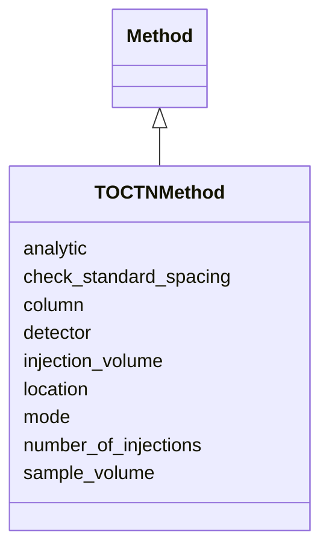

# Class: TOCTNMethod 


URI: [basalt_schema:TOCTNMethod](https://w3id.org/MONet/basalt-schema/TOCTNMethod)





## Inheritance
* [Method](Method.md)
    * **TOCTNMethod**


## Slots

| Name | Cardinality and Range | Description | Inheritance |
| ---  | --- | --- | --- |
| [location](location.md) | 1 <br/> [String](String.md) |  | direct |
| [column](column.md) | 0..1 <br/> [String](String.md) |  | direct |
| [mode](mode.md) | 0..1 <br/> [String](String.md) |  | direct |
| [detector](detector.md) | 1 <br/> [String](String.md) |  | direct |
| [injection_volume](injection_volume.md) | 1 <br/> [String](String.md) |  | direct |
| [sample_volume](sample_volume.md) | 1 <br/> [String](String.md) |  | direct |
| [number_of_injections](number_of_injections.md) | 1 <br/> [Double](Double.md) |  | direct |
| [check_standard_spacing](check_standard_spacing.md) | 0..1 <br/> [String](String.md) |  | direct |
| [analytic](analytic.md) | 1 <br/> [String](String.md) |  | [Method](Method.md) |


## Identifier and Mapping Information


### Schema Source


* from schema: https://w3id.org/MONet/basalt-schema


## Mappings

| Mapping Type | Mapped Value |
| ---  | ---  |
| self | basalt_schema:TOCTNMethod |
| native | basalt_schema:TOCTNMethod |


## LinkML Source

<!-- TODO: investigate https://stackoverflow.com/questions/37606292/how-to-create-tabbed-code-blocks-in-mkdocs-or-sphinx -->

### Direct

<details>
```yaml
name: TOC_TN_Method
from_schema: https://w3id.org/MONet/basalt-schema
is_a: Method
slots:
- location
attributes:
  column:
    name: column
    from_schema: https://w3id.org/MONet/basalt-schema/methods
    domain_of:
    - ChromatographyConfiguration
    - TOC_TN_Method
    range: string
  mode:
    name: mode
    from_schema: https://w3id.org/MONet/basalt-schema/methods
    domain_of:
    - MicrobialBiomassMethod
    - TOC_TN_Method
    range: string
  detector:
    name: detector
    from_schema: https://w3id.org/MONet/basalt-schema/methods
    domain_of:
    - MicrobialBiomassMethod
    - TOC_TN_Method
    range: string
    required: true
  injection_volume:
    name: injection_volume
    from_schema: https://w3id.org/MONet/basalt-schema/methods
    domain_of:
    - MicrobialBiomassMethod
    - TOC_TN_Method
    range: string
    required: true
  sample_volume:
    name: sample_volume
    from_schema: https://w3id.org/MONet/basalt-schema/methods
    domain_of:
    - MicrobialBiomassMethod
    - TOC_TN_Method
    range: string
    required: true
  number_of_injections:
    name: number_of_injections
    from_schema: https://w3id.org/MONet/basalt-schema/methods
    domain_of:
    - MicrobialBiomassMethod
    - TOC_TN_Method
    range: double
    required: true
  check_standard_spacing:
    name: check_standard_spacing
    from_schema: https://w3id.org/MONet/basalt-schema/methods
    domain_of:
    - MicrobialBiomassMethod
    - TOC_TN_Method
    range: string

```
</details>

### Induced

<details>
```yaml
name: TOC_TN_Method
from_schema: https://w3id.org/MONet/basalt-schema
is_a: Method
attributes:
  column:
    name: column
    from_schema: https://w3id.org/MONet/basalt-schema/methods
    alias: column
    owner: TOC_TN_Method
    domain_of:
    - ChromatographyConfiguration
    - TOC_TN_Method
    range: string
  mode:
    name: mode
    from_schema: https://w3id.org/MONet/basalt-schema/methods
    alias: mode
    owner: TOC_TN_Method
    domain_of:
    - MicrobialBiomassMethod
    - TOC_TN_Method
    range: string
  detector:
    name: detector
    from_schema: https://w3id.org/MONet/basalt-schema/methods
    alias: detector
    owner: TOC_TN_Method
    domain_of:
    - MicrobialBiomassMethod
    - TOC_TN_Method
    range: string
    required: true
  injection_volume:
    name: injection_volume
    from_schema: https://w3id.org/MONet/basalt-schema/methods
    alias: injection_volume
    owner: TOC_TN_Method
    domain_of:
    - MicrobialBiomassMethod
    - TOC_TN_Method
    range: string
    required: true
  sample_volume:
    name: sample_volume
    from_schema: https://w3id.org/MONet/basalt-schema/methods
    alias: sample_volume
    owner: TOC_TN_Method
    domain_of:
    - MicrobialBiomassMethod
    - TOC_TN_Method
    range: string
    required: true
  number_of_injections:
    name: number_of_injections
    from_schema: https://w3id.org/MONet/basalt-schema/methods
    alias: number_of_injections
    owner: TOC_TN_Method
    domain_of:
    - MicrobialBiomassMethod
    - TOC_TN_Method
    range: double
    required: true
  check_standard_spacing:
    name: check_standard_spacing
    from_schema: https://w3id.org/MONet/basalt-schema/methods
    alias: check_standard_spacing
    owner: TOC_TN_Method
    domain_of:
    - MicrobialBiomassMethod
    - TOC_TN_Method
    range: string
  location:
    name: location
    todos:
    - used on many method classes. no description. what was this meant to mean?
    from_schema: https://w3id.org/MONet/basalt-schema
    rank: 1000
    alias: location
    owner: TOC_TN_Method
    domain_of:
    - Instrument
    - EnzymeActivityMethod
    - GravimetricWaterContentMethod
    - HydraulicPropertiesMethod
    - KuoMethod
    - MicrobialBiomassMethod
    - PH_Method
    - TOC_TN_Method
    - TextureMethod
    - XrayComputedTomographyMethod
    range: string
    required: true
  analytic:
    name: analytic
    todos:
    - what does this mean
    from_schema: https://w3id.org/MONet/basalt-schema
    rank: 1000
    alias: analytic
    owner: TOC_TN_Method
    domain_of:
    - Method
    range: string
    required: true

```
</details>