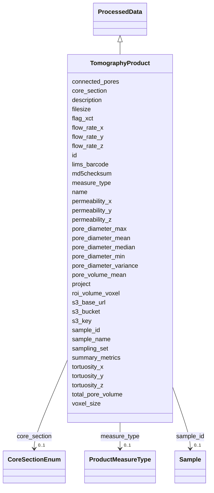

# Class: TomographyProduct 


_Soil tomography analysis product, typically derived via X-ray computed tomography (XCT) or similar instrument._

_One row per sample with columns for pore structure metrics and QC flag._


URI: [analysis_api_schema:TomographyProduct](https://w3id.org/MONet/analysis-api-schema/TomographyProduct)





## Inheritance
* [DataProduct](DataProduct.md)
    * [ProcessedData](ProcessedData.md)
        * **TomographyProduct**


## Slots

| Name | Cardinality and Range | Description | Inheritance |
| ---  | --- | --- | --- |
| [measure_type](measure_type.md) | 0..1 <br/> [ProductMeasureType](ProductMeasureType.md) | Whether the measurement recorded is a single measurement, one of a set of  re... | direct |
| [roi_volume_voxel](roi_volume_voxel.md) | 0..1 <br/> [Double](Double.md) |  | direct |
| [voxel_size](voxel_size.md) | 0..1 <br/> [Double](Double.md) |  | direct |
| [connected_pores](connected_pores.md) | 0..1 <br/> [Double](Double.md) |  | direct |
| [pore_diameter_min](pore_diameter_min.md) | 0..1 <br/> [Double](Double.md) |  | direct |
| [pore_diameter_max](pore_diameter_max.md) | 0..1 <br/> [Double](Double.md) |  | direct |
| [pore_diameter_mean](pore_diameter_mean.md) | 0..1 <br/> [Double](Double.md) |  | direct |
| [pore_diameter_median](pore_diameter_median.md) | 0..1 <br/> [Double](Double.md) |  | direct |
| [pore_diameter_variance](pore_diameter_variance.md) | 0..1 <br/> [Double](Double.md) |  | direct |
| [pore_volume_mean](pore_volume_mean.md) | 0..1 <br/> [Double](Double.md) |  | direct |
| [total_pore_volume](total_pore_volume.md) | 0..1 <br/> [Double](Double.md) |  | direct |
| [permeability_x](permeability_x.md) | 0..1 <br/> [Double](Double.md) |  | direct |
| [flow_rate_x](flow_rate_x.md) | 0..1 <br/> [Double](Double.md) |  | direct |
| [tortuosity_x](tortuosity_x.md) | 0..1 <br/> [Double](Double.md) |  | direct |
| [permeability_y](permeability_y.md) | 0..1 <br/> [Double](Double.md) |  | direct |
| [flow_rate_y](flow_rate_y.md) | 0..1 <br/> [Double](Double.md) |  | direct |
| [tortuosity_y](tortuosity_y.md) | 0..1 <br/> [Double](Double.md) |  | direct |
| [permeability_z](permeability_z.md) | 0..1 <br/> [Double](Double.md) |  | direct |
| [flow_rate_z](flow_rate_z.md) | 0..1 <br/> [Double](Double.md) |  | direct |
| [tortuosity_z](tortuosity_z.md) | 0..1 <br/> [Double](Double.md) |  | direct |
| [flag_xct](flag_xct.md) | 0..1 <br/> [String](String.md) |  | direct |
| [summary_metrics](summary_metrics.md) | 0..1 <br/> [String](String.md) | Lightweight per-product summary for common queries that avoid full file downl... | [ProcessedData](ProcessedData.md) |
| [lims_barcode](lims_barcode.md) | 0..1 <br/> [String](String.md) | LIMS barcode identifier | [ProcessedData](ProcessedData.md) |
| [sample_id](sample_id.md) | 0..1 <br/> [Sample](Sample.md) | Link back to the originating sample | [ProcessedData](ProcessedData.md) |
| [name](name.md) | 1 <br/> [String](String.md) | Human-readable name for the entity or activity | [DataProduct](DataProduct.md) |
| [description](description.md) | 0..1 <br/> [String](String.md) | Human-readable description for the entity or activity | [DataProduct](DataProduct.md) |
| [project](project.md) | 0..1 <br/> [Integer](Integer.md) | Identifier for the user project associated with the entity or activity | [DataProduct](DataProduct.md) |
| [sampling_set](sampling_set.md) | 0..1 <br/> [Integer](Integer.md) | Sampling set number for grouping related samples collected together | [DataProduct](DataProduct.md) |
| [core_section](core_section.md) | 0..1 <br/> [CoreSectionEnum](CoreSectionEnum.md) | The section of the core | [DataProduct](DataProduct.md) |
| [sample_name](sample_name.md) | 0..1 <br/> [String](String.md) | The name or label that is present on the shipped sample | [DataProduct](DataProduct.md) |
| [s3_base_url](s3_base_url.md) | 0..1 <br/> [String](String.md) |  | [DataProduct](DataProduct.md) |
| [s3_bucket](s3_bucket.md) | 0..1 <br/> [String](String.md) |  | [DataProduct](DataProduct.md) |
| [s3_key](s3_key.md) | 1 <br/> [String](String.md) | MinIO/S3 object key; required for all data products | [DataProduct](DataProduct.md) |
| [filesize](filesize.md) | 0..1 <br/> [Integer](Integer.md) | Size of the file in bytes | [DataProduct](DataProduct.md) |
| [md5checksum](md5checksum.md) | 0..1 <br/> [String](String.md) |  | [DataProduct](DataProduct.md) |
| [id](id.md) | 1 <br/> [Uuid](Uuid.md) |  | [DataProduct](DataProduct.md) |


## Identifier and Mapping Information


### Schema Source


* from schema: https://w3id.org/MONet/analysis-api-schema


## Mappings

| Mapping Type | Mapped Value |
| ---  | ---  |
| self | analysis_api_schema:TomographyProduct |
| native | analysis_api_schema:TomographyProduct |


## LinkML Source

<!-- TODO: investigate https://stackoverflow.com/questions/37606292/how-to-create-tabbed-code-blocks-in-mkdocs-or-sphinx -->

### Direct

<details>
```yaml
name: TomographyProduct
description: 'Soil tomography analysis product, typically derived via X-ray computed
  tomography (XCT) or similar instrument.

  One row per sample with columns for pore structure metrics and QC flag.'
from_schema: https://w3id.org/MONet/analysis-api-schema
is_a: ProcessedData
slots:
- measure_type
attributes:
  roi_volume_voxel:
    name: roi_volume_voxel
    from_schema: https://w3id.org/MONet/analysis-api-schema/products
    rank: 1000
    domain_of:
    - TomographyProduct
    range: double
  voxel_size:
    name: voxel_size
    from_schema: https://w3id.org/MONet/analysis-api-schema/products
    rank: 1000
    domain_of:
    - TomographyProduct
    range: double
  connected_pores:
    name: connected_pores
    from_schema: https://w3id.org/MONet/analysis-api-schema/products
    rank: 1000
    domain_of:
    - TomographyProduct
    range: double
  pore_diameter_min:
    name: pore_diameter_min
    from_schema: https://w3id.org/MONet/analysis-api-schema/products
    rank: 1000
    domain_of:
    - TomographyProduct
    range: double
  pore_diameter_max:
    name: pore_diameter_max
    from_schema: https://w3id.org/MONet/analysis-api-schema/products
    rank: 1000
    domain_of:
    - TomographyProduct
    range: double
  pore_diameter_mean:
    name: pore_diameter_mean
    from_schema: https://w3id.org/MONet/analysis-api-schema/products
    rank: 1000
    domain_of:
    - TomographyProduct
    range: double
  pore_diameter_median:
    name: pore_diameter_median
    from_schema: https://w3id.org/MONet/analysis-api-schema/products
    rank: 1000
    domain_of:
    - TomographyProduct
    range: double
  pore_diameter_variance:
    name: pore_diameter_variance
    from_schema: https://w3id.org/MONet/analysis-api-schema/products
    rank: 1000
    domain_of:
    - TomographyProduct
    range: double
  pore_volume_mean:
    name: pore_volume_mean
    from_schema: https://w3id.org/MONet/analysis-api-schema/products
    rank: 1000
    domain_of:
    - TomographyProduct
    range: double
  total_pore_volume:
    name: total_pore_volume
    from_schema: https://w3id.org/MONet/analysis-api-schema/products
    rank: 1000
    domain_of:
    - TomographyProduct
    range: double
  permeability_x:
    name: permeability_x
    from_schema: https://w3id.org/MONet/analysis-api-schema/products
    rank: 1000
    domain_of:
    - TomographyProduct
    range: double
  flow_rate_x:
    name: flow_rate_x
    from_schema: https://w3id.org/MONet/analysis-api-schema/products
    rank: 1000
    domain_of:
    - TomographyProduct
    range: double
  tortuosity_x:
    name: tortuosity_x
    from_schema: https://w3id.org/MONet/analysis-api-schema/products
    rank: 1000
    domain_of:
    - TomographyProduct
    range: double
  permeability_y:
    name: permeability_y
    from_schema: https://w3id.org/MONet/analysis-api-schema/products
    rank: 1000
    domain_of:
    - TomographyProduct
    range: double
  flow_rate_y:
    name: flow_rate_y
    from_schema: https://w3id.org/MONet/analysis-api-schema/products
    rank: 1000
    domain_of:
    - TomographyProduct
    range: double
  tortuosity_y:
    name: tortuosity_y
    from_schema: https://w3id.org/MONet/analysis-api-schema/products
    rank: 1000
    domain_of:
    - TomographyProduct
    range: double
  permeability_z:
    name: permeability_z
    from_schema: https://w3id.org/MONet/analysis-api-schema/products
    rank: 1000
    domain_of:
    - TomographyProduct
    range: double
  flow_rate_z:
    name: flow_rate_z
    from_schema: https://w3id.org/MONet/analysis-api-schema/products
    rank: 1000
    domain_of:
    - TomographyProduct
    range: double
  tortuosity_z:
    name: tortuosity_z
    from_schema: https://w3id.org/MONet/analysis-api-schema/products
    rank: 1000
    domain_of:
    - TomographyProduct
    range: double
  flag_xct:
    name: flag_xct
    from_schema: https://w3id.org/MONet/analysis-api-schema/products
    rank: 1000
    domain_of:
    - TomographyProduct
    range: string

```
</details>

### Induced

<details>
```yaml
name: TomographyProduct
description: 'Soil tomography analysis product, typically derived via X-ray computed
  tomography (XCT) or similar instrument.

  One row per sample with columns for pore structure metrics and QC flag.'
from_schema: https://w3id.org/MONet/analysis-api-schema
is_a: ProcessedData
attributes:
  roi_volume_voxel:
    name: roi_volume_voxel
    from_schema: https://w3id.org/MONet/analysis-api-schema/products
    rank: 1000
    alias: roi_volume_voxel
    owner: TomographyProduct
    domain_of:
    - TomographyProduct
    range: double
  voxel_size:
    name: voxel_size
    from_schema: https://w3id.org/MONet/analysis-api-schema/products
    rank: 1000
    alias: voxel_size
    owner: TomographyProduct
    domain_of:
    - TomographyProduct
    range: double
  connected_pores:
    name: connected_pores
    from_schema: https://w3id.org/MONet/analysis-api-schema/products
    rank: 1000
    alias: connected_pores
    owner: TomographyProduct
    domain_of:
    - TomographyProduct
    range: double
  pore_diameter_min:
    name: pore_diameter_min
    from_schema: https://w3id.org/MONet/analysis-api-schema/products
    rank: 1000
    alias: pore_diameter_min
    owner: TomographyProduct
    domain_of:
    - TomographyProduct
    range: double
  pore_diameter_max:
    name: pore_diameter_max
    from_schema: https://w3id.org/MONet/analysis-api-schema/products
    rank: 1000
    alias: pore_diameter_max
    owner: TomographyProduct
    domain_of:
    - TomographyProduct
    range: double
  pore_diameter_mean:
    name: pore_diameter_mean
    from_schema: https://w3id.org/MONet/analysis-api-schema/products
    rank: 1000
    alias: pore_diameter_mean
    owner: TomographyProduct
    domain_of:
    - TomographyProduct
    range: double
  pore_diameter_median:
    name: pore_diameter_median
    from_schema: https://w3id.org/MONet/analysis-api-schema/products
    rank: 1000
    alias: pore_diameter_median
    owner: TomographyProduct
    domain_of:
    - TomographyProduct
    range: double
  pore_diameter_variance:
    name: pore_diameter_variance
    from_schema: https://w3id.org/MONet/analysis-api-schema/products
    rank: 1000
    alias: pore_diameter_variance
    owner: TomographyProduct
    domain_of:
    - TomographyProduct
    range: double
  pore_volume_mean:
    name: pore_volume_mean
    from_schema: https://w3id.org/MONet/analysis-api-schema/products
    rank: 1000
    alias: pore_volume_mean
    owner: TomographyProduct
    domain_of:
    - TomographyProduct
    range: double
  total_pore_volume:
    name: total_pore_volume
    from_schema: https://w3id.org/MONet/analysis-api-schema/products
    rank: 1000
    alias: total_pore_volume
    owner: TomographyProduct
    domain_of:
    - TomographyProduct
    range: double
  permeability_x:
    name: permeability_x
    from_schema: https://w3id.org/MONet/analysis-api-schema/products
    rank: 1000
    alias: permeability_x
    owner: TomographyProduct
    domain_of:
    - TomographyProduct
    range: double
  flow_rate_x:
    name: flow_rate_x
    from_schema: https://w3id.org/MONet/analysis-api-schema/products
    rank: 1000
    alias: flow_rate_x
    owner: TomographyProduct
    domain_of:
    - TomographyProduct
    range: double
  tortuosity_x:
    name: tortuosity_x
    from_schema: https://w3id.org/MONet/analysis-api-schema/products
    rank: 1000
    alias: tortuosity_x
    owner: TomographyProduct
    domain_of:
    - TomographyProduct
    range: double
  permeability_y:
    name: permeability_y
    from_schema: https://w3id.org/MONet/analysis-api-schema/products
    rank: 1000
    alias: permeability_y
    owner: TomographyProduct
    domain_of:
    - TomographyProduct
    range: double
  flow_rate_y:
    name: flow_rate_y
    from_schema: https://w3id.org/MONet/analysis-api-schema/products
    rank: 1000
    alias: flow_rate_y
    owner: TomographyProduct
    domain_of:
    - TomographyProduct
    range: double
  tortuosity_y:
    name: tortuosity_y
    from_schema: https://w3id.org/MONet/analysis-api-schema/products
    rank: 1000
    alias: tortuosity_y
    owner: TomographyProduct
    domain_of:
    - TomographyProduct
    range: double
  permeability_z:
    name: permeability_z
    from_schema: https://w3id.org/MONet/analysis-api-schema/products
    rank: 1000
    alias: permeability_z
    owner: TomographyProduct
    domain_of:
    - TomographyProduct
    range: double
  flow_rate_z:
    name: flow_rate_z
    from_schema: https://w3id.org/MONet/analysis-api-schema/products
    rank: 1000
    alias: flow_rate_z
    owner: TomographyProduct
    domain_of:
    - TomographyProduct
    range: double
  tortuosity_z:
    name: tortuosity_z
    from_schema: https://w3id.org/MONet/analysis-api-schema/products
    rank: 1000
    alias: tortuosity_z
    owner: TomographyProduct
    domain_of:
    - TomographyProduct
    range: double
  flag_xct:
    name: flag_xct
    from_schema: https://w3id.org/MONet/analysis-api-schema/products
    rank: 1000
    alias: flag_xct
    owner: TomographyProduct
    domain_of:
    - TomographyProduct
    range: string
  measure_type:
    name: measure_type
    description: Whether the measurement recorded is a single measurement, one of
      a set of  replicate measurements, or an average of several replicate measurements.
    from_schema: https://w3id.org/MONet/analysis-api-schema
    rank: 1000
    alias: measure_type
    owner: TomographyProduct
    domain_of:
    - BulkDensityProduct
    - ElementalAnalysisProduct
    - EnzymeProduct
    - GWCMoistureProduct
    - HydraulicPropertiesProduct
    - IonsAnalysisProduct
    - MAOMProduct
    - MicrobialBiomassProduct
    - NitrogenAnalysisProduct
    - PhosphorusAnalysisProduct
    - RespirationProduct
    - TextureProduct
    - TomographyProduct
    - WEOMProduct
    - pHProduct
    - XRFElementalProduct
    - XRDPhaseProduct
    range: ProductMeasureType
  summary_metrics:
    name: summary_metrics
    description: "Lightweight per-product summary for common queries that avoid full\
      \ file download.\nDirection: structured key-value pairs; per-type schemas TBD:\n\
      \  ecoplate:  well-level absorbance summaries (position, timepoint, absorbance)\n\
      \  xrf:       per-element concentration results + QC flag\n  lcms:      feature\
      \ count, identification count, MSI-2 fraction\nInterim DB storage: JSONB column\
      \ retained until formal typed class exists."
    todos:
    - make this inined/multivalued?
    from_schema: https://w3id.org/MONet/analysis-api-schema
    rank: 1000
    alias: summary_metrics
    owner: TomographyProduct
    domain_of:
    - ProcessedData
    range: string
    required: false
  lims_barcode:
    name: lims_barcode
    description: LIMS barcode identifier
    from_schema: https://w3id.org/MONet/analysis-api-schema
    rank: 1000
    alias: lims_barcode
    owner: TomographyProduct
    domain_of:
    - ProcessedData
    - Sample
    range: string
    required: false
  sample_id:
    name: sample_id
    description: Link back to the originating sample
    from_schema: https://w3id.org/MONet/analysis-api-schema
    rank: 1000
    alias: sample_id
    owner: TomographyProduct
    domain_of:
    - ProcessedData
    - AMP2WellMetadata
    - MetagenomicsProduct
    range: Sample
    required: false
  name:
    name: name
    description: Human-readable name for the entity or activity.
    from_schema: https://w3id.org/MONet/analysis-api-schema
    rank: 1000
    alias: name
    owner: TomographyProduct
    domain_of:
    - Activity
    - Entity
    - DataProduct
    - DataGenerationActivity
    - Instrument
    - OntologyClass
    - ContainerAxis
    - Configuration
    - MobilePhaseSegment
    - MassSpectrometryStandardRun
    - PurchasedMaterial
    - LabProcessingActivity
    - organism
    - Site
    - Sample
    - SamplingActivity
    - SoilSamplingActivity
    - Study
    - SoftwareControlledTermValue
    range: string
    required: true
  description:
    name: description
    description: Human-readable description for the entity or activity
    title: description
    from_schema: https://w3id.org/MONet/analysis-api-schema
    rank: 1000
    alias: description
    owner: TomographyProduct
    domain_of:
    - Activity
    - Entity
    - DataProduct
    - DataGenerationActivity
    - DataProcessingActivity
    - OntologyClass
    - ContainerType
    - LabDevice
    - Configuration
    - MassSpectrometryStandardRun
    - PurchasedMaterial
    - LabProcessingActivity
    - organism
    - Site
    - Sample
    - SamplingActivity
    - SoilSamplingActivity
    - Study
    - TimestampValue
    - TextValue
    - SoftwareControlledTermValue
    - ControlledTermValue
    - QuantityValue
    range: string
  project:
    name: project
    description: 'Identifier for the user project associated with the entity or activity. '
    title: Project
    todos:
    - should this be an ID? CURIE can use the one NMDC has https://bioregistry.io/reference/emsl.project:60141
      where emsl.project is the CURIE prefix
    from_schema: https://w3id.org/MONet/analysis-api-schema
    aliases:
    - study
    - study_id
    - project_id
    - proposal
    - proposal_id
    rank: 1000
    alias: project
    owner: TomographyProduct
    domain_of:
    - DataProduct
    - AerosolArmSample
    - AerosolSample
    - CommerciallyPurchasedSample
    - CultureEnvironmentalSample
    - FieldDeployedTerraformSample
    - MixedCultureSample
    - MonetSoilSample
    - OtherUndescribedSample
    - PlantSample
    - PureCultureSample
    - SedimentSample
    - SoilSample
    - SynthesizedMaterialSample
    - TerraformSample
    - WaterSample
    - SamplingActivity
    range: integer
  sampling_set:
    name: sampling_set
    description: 'Sampling set number for grouping related samples collected together.

      This is a user-defined sequential integer that can be used to link samples collected

      in the same sampling event or campaign.'
    title: sampling set
    from_schema: https://w3id.org/MONet/analysis-api-schema
    rank: 1000
    alias: sampling_set
    owner: TomographyProduct
    domain_of:
    - DataProduct
    - MonetSoilSample
    range: integer
  core_section:
    name: core_section
    description: The section of the core.
    title: core section
    examples:
    - value: TOP
    - value: MID
    - value: BTM
    from_schema: https://w3id.org/MONet/analysis-api-schema
    rank: 1000
    alias: core_section
    owner: TomographyProduct
    domain_of:
    - DataProduct
    - CoreSection
    range: CoreSectionEnum
  sample_name:
    name: sample_name
    description: 'The name or label that is present on the shipped sample. This should

      be a human readable name.'
    title: sample name
    notes:
    - This is typically an alias for the inherited 'name' slot on Sample classes.
      Defined separately for compatibility with source data files using 'sample_name'
      column headers.
    from_schema: https://w3id.org/MONet/analysis-api-schema
    aliases:
    - samp_name
    rank: 1000
    alias: sample_name
    owner: TomographyProduct
    domain_of:
    - DataProduct
    - AerosolArmSample
    - AerosolSample
    - CommerciallyPurchasedSample
    - CultureEnvironmentalSample
    - FieldDeployedTerraformSample
    - MixedCultureSample
    - MonetSoilSample
    - OtherUndescribedSample
    - PlantSample
    - PureCultureSample
    - SedimentSample
    - SoilSample
    - SynthesizedMaterialSample
    - TerraformSample
    - WaterSample
    range: string
  s3_base_url:
    name: s3_base_url
    from_schema: https://w3id.org/MONet/analysis-api-schema
    rank: 1000
    alias: s3_base_url
    owner: TomographyProduct
    domain_of:
    - DataProduct
    range: string
  s3_bucket:
    name: s3_bucket
    from_schema: https://w3id.org/MONet/analysis-api-schema
    rank: 1000
    alias: s3_bucket
    owner: TomographyProduct
    domain_of:
    - DataProduct
    range: string
  s3_key:
    name: s3_key
    description: MinIO/S3 object key; required for all data products
    from_schema: https://w3id.org/MONet/analysis-api-schema
    rank: 1000
    alias: s3_key
    owner: TomographyProduct
    domain_of:
    - DataProduct
    range: string
    required: true
  filesize:
    name: filesize
    description: Size of the file in bytes
    from_schema: https://w3id.org/MONet/analysis-api-schema
    rank: 1000
    alias: filesize
    owner: TomographyProduct
    domain_of:
    - DataProduct
    range: integer
  md5checksum:
    name: md5checksum
    from_schema: https://w3id.org/MONet/analysis-api-schema
    rank: 1000
    alias: md5checksum
    owner: TomographyProduct
    domain_of:
    - DataProduct
    range: string
  id:
    name: id
    from_schema: https://w3id.org/MONet/analysis-api-schema
    identifier: true
    alias: id
    owner: TomographyProduct
    domain_of:
    - Activity
    - Entity
    - DataProduct
    - DataGenerationActivity
    - DataProcessingActivity
    - AlternativeIdentifier
    - FunctionalAnnotationIdentifier
    - Instrument
    - OntologyClass
    - ContainerType
    - Custodian
    - InstrumentAlternativeIdentifier
    - LabDevice
    - SampleProcessing
    - ProcessingSampleLink
    - Configuration
    - MobilePhaseSegment
    - MassSpectrometryStandardRun
    - PurchasedMaterial
    - LabProcessingActivity
    - organism
    - MAOMProduct
    - WEOMProduct
    - Site
    - Sample
    - AerosolArmSample
    - AerosolSample
    - AMP2UserSample
    - CommerciallyPurchasedSample
    - CultureEnvironmentalSample
    - EngineeredStrainSample
    - FieldDeployedTerraformSample
    - MixedCultureSample
    - MonetSoilSample
    - OtherUndescribedSample
    - PlantSample
    - PureCultureSample
    - SedimentSample
    - SoilSample
    - SynthesizedMaterialSample
    - TerraformSample
    - WaterSample
    - ProcessedSample
    - CoreSection
    - SamplingActivity
    - AerosolArmSamplingActivity
    - AerosolSamplingActivity
    - CommerciallyPurchasedSamplingActivity
    - CultureEnvironmentalSamplingActivity
    - EngineeredStrainSamplingActivity
    - FieldDeployedTerraformSamplingActivity
    - MixedCultureSamplingActivity
    - MonetSoilSamplingActivity
    - OtherUndescribedSamplingActivity
    - PlantSamplingActivity
    - PureCultureSamplingActivity
    - SedimentSamplingActivity
    - SoilSamplingActivity
    - SynthesizedMaterialSamplingActivity
    - TerraformSamplingActivity
    - WaterSamplingActivity
    - Study
    - ProjectParticipant
    - TimestampValue
    - TextValue
    - SoftwareControlledTermValue
    - ControlledTermValue
    - PersonValue
    - QuantityValue
    - ConditioningValue
    - zipDownload
    range: uuid
    required: true

```
</details>