# Class: WaterSample 


_A sample of water collected from the environment._


URI: [analysis_api_schema:WaterSample](https://w3id.org/MONet/analysis-api-schema/WaterSample)

```mermaid
 classDiagram
    class WaterSample
    click WaterSample href "../WaterSample/"
      Sample <|-- WaterSample
        click Sample href "../Sample/"
      
      WaterSample : air_temp_regm
        
      WaterSample : alkalinity
        
      WaterSample : alkalinity_method
        
      WaterSample : alkyl_diethers
        
      WaterSample : aminopept_act
        
      WaterSample : ammonium
        
      WaterSample : analysis_type
        
      WaterSample : bac_prod
        
      WaterSample : bac_resp
        
      WaterSample : bacteria_carb_prod
        
      WaterSample : biotic_regm
        
      WaterSample : bishomohopanol
        
      WaterSample : bromide
        
      WaterSample : calcium
        
      WaterSample : carb_nitro_ratio
        
      WaterSample : chem_administration
        
      WaterSample : chloride
        
      WaterSample : chlorophyll
        
      WaterSample : conduc
        
      WaterSample : density
        
      WaterSample : depth
        
      WaterSample : description
        
      WaterSample : diether_lipids
        
      WaterSample : diss_carb_dioxide
        
      WaterSample : diss_hydrogen
        
      WaterSample : diss_inorg_carb
        
      WaterSample : diss_inorg_nitro
        
      WaterSample : diss_inorg_phosp
        
      WaterSample : diss_org_carb
        
      WaterSample : diss_org_nitro
        
      WaterSample : diss_oxygen
        
      WaterSample : down_par
        
      WaterSample : emsl_activity
        
      WaterSample : env_broad_scale
        
      WaterSample : env_local_scale
        
      WaterSample : env_medium
        
      WaterSample : experimental_factor
        
      WaterSample : experimental_factor_other
        
      WaterSample : external_identifiers
        
      WaterSample : extraction_method
        
      WaterSample : filter_method
        
      WaterSample : fluor
        
      WaterSample : gaseous_environment
        
      WaterSample : glucosidase_act
        
      WaterSample : id
        
      WaterSample : isotope_exposure
        
      WaterSample : latitude
        
      WaterSample : light_intensity
        
      WaterSample : lims_barcode
        
      WaterSample : longitude
        
      WaterSample : magnesium
        
      WaterSample : mean_frict_vel
        
      WaterSample : mean_peak_frict_vel
        
      WaterSample : method_development
        
      WaterSample : misc_param
        
      WaterSample : n_alkanes
        
      WaterSample : name
        
      WaterSample : nitrate
        
      WaterSample : nitrite
        
      WaterSample : nitro
        
      WaterSample : non_microb_biomass
        
      WaterSample : non_microb_biomass_method
        
      WaterSample : org_carb
        
      WaterSample : org_matter
        
      WaterSample : org_nitro
        
      WaterSample : org_nitro_method
        
      WaterSample : other
        
      WaterSample : other_samp_store_temp
        
      WaterSample : other_storage_condt
        
      WaterSample : other_treatment
        
      WaterSample : oxygen_relationship
        
          
    
        
        
        WaterSample --> "0..1" OxygenStatusEnum : oxygen_relationship
        click OxygenStatusEnum href "../OxygenStatusEnum/"
    

        
      WaterSample : part_org_carb
        
      WaterSample : part_org_nitro
        
      WaterSample : perturbation
        
      WaterSample : petroleum_hydrocarb
        
      WaterSample : ph
        
      WaterSample : ph_meth
        
      WaterSample : phaeopigments
        
      WaterSample : phosphate
        
      WaterSample : phosplipid_fatt_acid
        
      WaterSample : photon_flux
        
      WaterSample : potassium
        
      WaterSample : pressure
        
      WaterSample : primary_prod
        
      WaterSample : project
        
      WaterSample : redox_potential
        
      WaterSample : replicate_number
        
      WaterSample : salinity
        
      WaterSample : salinity_method
        
      WaterSample : samp_store_temp
        
          
    
        
        
        WaterSample --> "0..1" SampleStoreTempEnum : samp_store_temp
        click SampleStoreTempEnum href "../SampleStoreTempEnum/"
    

        
      WaterSample : sample_link
        
      WaterSample : sample_name
        
      WaterSample : sampled_during
        
          
    
        
        
        WaterSample --> "0..1" SamplingActivity : sampled_during
        click SamplingActivity href "../SamplingActivity/"
    

        
      WaterSample : silicate
        
      WaterSample : size_frac_low
        
      WaterSample : size_frac_up
        
      WaterSample : sodium
        
      WaterSample : soluble_react_phosp
        
      WaterSample : source_mat_id
        
      WaterSample : start_date_inc
        
      WaterSample : storage_condition
        
          
    
        
        
        WaterSample --> "0..1" StorageConditionEnum : storage_condition
        click StorageConditionEnum href "../StorageConditionEnum/"
    

        
      WaterSample : storage_condition_other
        
      WaterSample : sulfate
        
      WaterSample : sulfide
        
      WaterSample : suspend_part_matter
        
      WaterSample : technical_reps
        
      WaterSample : temp
        
      WaterSample : tidal_stage
        
          
    
        
        
        WaterSample --> "0..1" TidalStageEnum : tidal_stage
        click TidalStageEnum href "../TidalStageEnum/"
    

        
      WaterSample : tot_depth_water_col
        
      WaterSample : tot_diss_nitro
        
      WaterSample : tot_inorg_nitro
        
      WaterSample : tot_nitro
        
      WaterSample : tot_part_carb
        
      WaterSample : tot_phosp
        
      WaterSample : turbidity
        
      WaterSample : water_current
        
      
```





## Inheritance
* [Sample](Sample.md)
    * **WaterSample**


## Slots

| Name | Cardinality and Range | Description | Inheritance |
| ---  | --- | --- | --- |
| [air_temp_regm](air_temp_regm.md) | 0..1 <br/> [String](String.md) | Information about treatment involving an exposure to varying temperatures; sh... | direct |
| [alkalinity](alkalinity.md) | 0..1 <br/> [String](String.md) | The ability of a solution to neutralize acids to the equivalence point of car... | direct |
| [alkalinity_method](alkalinity_method.md) | 0..1 <br/> [String](String.md) | Method used for alkalinity measurement | direct |
| [alkyl_diethers](alkyl_diethers.md) | 0..1 <br/> [String](String.md) | Concentration of alkyl diethers | direct |
| [aminopept_act](aminopept_act.md) | 0..1 <br/> [String](String.md) | Measurement of aminopeptidase activity (Unit: mol/L/h) | direct |
| [ammonium](ammonium.md) | 0..1 <br/> [String](String.md) | Concentration of ammonium in the sample | direct |
| [analysis_type](analysis_type.md) | 1 <br/> [String](String.md) | The type(s) of analysis planned for this sample | direct |
| [bac_prod](bac_prod.md) | 0..1 <br/> [String](String.md) | Bacterial production in the water column measured by isotope uptake | direct |
| [bac_resp](bac_resp.md) | 0..1 <br/> [String](String.md) | Measurement of bacterial respiration in the water column | direct |
| [bacteria_carb_prod](bacteria_carb_prod.md) | 0..1 <br/> [String](String.md) | Measurement of bacterial carbon production | direct |
| [biotic_regm](biotic_regm.md) | 0..1 <br/> [String](String.md) | Information about treatment(s) involving use of biotic factors such as bacter... | direct |
| [bishomohopanol](bishomohopanol.md) | 0..1 <br/> [String](String.md) | Concentration of bishomohopanol | direct |
| [bromide](bromide.md) | 0..1 <br/> [String](String.md) | Concentration of bromide (Unit: ppm) | direct |
| [calcium](calcium.md) | 0..1 <br/> [String](String.md) | Concentration of calcium in the sample (Unit: mg/L or umol/L or ppm) | direct |
| [carb_nitro_ratio](carb_nitro_ratio.md) | 0..1 <br/> [String](String.md) | Ratio of amount or concentrations of carbon to nitrogen | direct |
| [chem_administration](chem_administration.md) | 0..1 <br/> [String](String.md) | List of chemical compounds administered to the host or site where sampling oc... | direct |
| [chloride](chloride.md) | 0..1 <br/> [String](String.md) | Concentration of chloride in the sample (Unit: mg/L or ppm) | direct |
| [chlorophyll](chlorophyll.md) | 0..1 <br/> [String](String.md) | Concentration of chlorophyll (Unit: mg/m3 or ug/L) | direct |
| [conduc](conduc.md) | 0..1 <br/> [String](String.md) | Electrical conductivity of water | direct |
| [density](density.md) | 0..1 <br/> [String](String.md) | Density of the sample, which is its mass per unit volume (aka volumetric mass... | direct |
| [depth](depth.md) | 1 <br/> [String](String.md) | The vertical distance below local surface of the water | direct |
| [diether_lipids](diether_lipids.md) | 0..1 <br/> [String](String.md) | Concentration of diether lipids; can include multiple types of diether lipids... | direct |
| [diss_carb_dioxide](diss_carb_dioxide.md) | 0..1 <br/> [String](String.md) | Concentration of dissolved carbon dioxide in the sample or liquid portion of ... | direct |
| [diss_hydrogen](diss_hydrogen.md) | 0..1 <br/> [String](String.md) | Concentration of dissolved hydrogens (Unit: umol/L) | direct |
| [diss_inorg_carb](diss_inorg_carb.md) | 0..1 <br/> [String](String.md) | Dissolved inorganic carbon concentration in the sample, typically measured af... | direct |
| [diss_inorg_nitro](diss_inorg_nitro.md) | 0..1 <br/> [String](String.md) | Concentration of dissolved inorganic nitrogen | direct |
| [diss_inorg_phosp](diss_inorg_phosp.md) | 0..1 <br/> [String](String.md) | Concentration of dissolved inorganic phosphorus in the sample | direct |
| [diss_org_carb](diss_org_carb.md) | 0..1 <br/> [String](String.md) | Concentration of dissolved organic carbon in the sample, liquid portion of th... | direct |
| [diss_org_nitro](diss_org_nitro.md) | 0..1 <br/> [String](String.md) | Dissolved organic nitrogen concentration measured as: total dissolved nitroge... | direct |
| [diss_oxygen](diss_oxygen.md) | 0..1 <br/> [String](String.md) | Concentration of dissolved oxygen | direct |
| [down_par](down_par.md) | 0..1 <br/> [String](String.md) | Visible waveband radiance and irradiance measurements in the water column | direct |
| [env_broad_scale](env_broad_scale.md) | 0..1 <br/> [String](String.md) | 'Report the major environmental system the sample or specimen came from | direct |
| [env_local_scale](env_local_scale.md) | 0..1 <br/> [String](String.md) | 'Report the entity which are in your sample or specimens local vicinity and w... | direct |
| [env_medium](env_medium.md) | 0..1 <br/> [String](String.md) | 'Report the environmental material immediately surrounding the sample or spec... | direct |
| [experimental_factor](experimental_factor.md) | 0..1 <br/> [String](String.md) | Experimental factors are essentially the variable aspects of an experiment de... | direct |
| [experimental_factor_other](experimental_factor_other.md) | 0..1 <br/> [String](String.md) | Other details about your sample that you feel can't be accurately represented... | direct |
| [external_identifiers](external_identifiers.md) | * <br/> [Uriorcurie](Uriorcurie.md) | List of external identifiers associated with this entity or activity | direct |
| [extraction_method](extraction_method.md) | 0..1 <br/> [String](String.md) | If you (the user) performed an extraction preparation or processing before se... | direct |
| [filter_method](filter_method.md) | 1 <br/> [String](String.md) | Type of filter used or how the sample was filtered | direct |
| [fluor](fluor.md) | 0..1 <br/> [String](String.md) | Raw or converted fluorescence of water | direct |
| [gaseous_environment](gaseous_environment.md) | 0..1 <br/> [String](String.md) | Use of conditions with differing gaseous environments; should include the nam... | direct |
| [glucosidase_act](glucosidase_act.md) | 0..1 <br/> [String](String.md) | Measurement of glucosidase activity (Unit: mol/L/h) | direct |
| [isotope_exposure](isotope_exposure.md) | 0..1 <br/> [String](String.md) | List isotope exposure or addition applied to your sample | direct |
| [latitude](latitude.md) | 1 <br/> [Double](Double.md) | Latitude coordinate of the sampling site in WSG 84 format | direct |
| [longitude](longitude.md) | 1 <br/> [Double](Double.md) | Longitude coordinate of the sampling site in WSG 84 format | direct |
| [light_intensity](light_intensity.md) | 0..1 <br/> [String](String.md) | Measurement of light intensity | direct |
| [magnesium](magnesium.md) | 0..1 <br/> [String](String.md) | Concentration of magnesium in the sample (Unit: umol/kg or mol/L or mg/L or p... | direct |
| [mean_frict_vel](mean_frict_vel.md) | 0..1 <br/> [String](String.md) | Measurement of mean friction velocity (Unit: m/s) | direct |
| [mean_peak_frict_vel](mean_peak_frict_vel.md) | 0..1 <br/> [String](String.md) | Measurement of mean peak friction velocity (Unit: m/s) | direct |
| [method_development](method_development.md) | 0..1 <br/> [String](String.md) | If your samples are TEST sample ONLY, please provide information on what you'... | direct |
| [misc_param](misc_param.md) | 0..1 <br/> [String](String.md) | Any other measurement performed or parameter collected that is not listed her... | direct |
| [n_alkanes](n_alkanes.md) | 0..1 <br/> [String](String.md) | Concentration of n-alkanes; can include multiple n-alkanes (Unit: ug/mL) | direct |
| [nitrate](nitrate.md) | 0..1 <br/> [String](String.md) | Concentration of nitrate in the sample (Unit: umol/L or mg/L or ppm) | direct |
| [nitrite](nitrite.md) | 0..1 <br/> [String](String.md) | Concentration of nitrite in the sample (Unit: umol/L or mg/L or ppm) | direct |
| [nitro](nitro.md) | 0..1 <br/> [String](String.md) | Concentration of nitrogen (total) (Unit: umol/L) | direct |
| [non_microb_biomass](non_microb_biomass.md) | 0..1 <br/> [String](String.md) | Amount of non-microbial biomass measured | direct |
| [non_microb_biomass_method](non_microb_biomass_method.md) | 0..1 <br/> [String](String.md) | Reference or method used in determining biomass | direct |
| [org_carb](org_carb.md) | 0..1 <br/> [String](String.md) | Concentration of organic carbon | direct |
| [org_matter](org_matter.md) | 0..1 <br/> [String](String.md) | Concentration of organic matter (Unit: mg/L) | direct |
| [org_nitro](org_nitro.md) | 0..1 <br/> [String](String.md) | Concentration of organic nitrogen | direct |
| [org_nitro_method](org_nitro_method.md) | 0..1 <br/> [String](String.md) | Method used for obtaining organic nitrogen | direct |
| [other](other.md) | 0..1 <br/> [String](String.md) | Other/additional details about your sample that you feel can't be accurately ... | direct |
| [other_samp_store_temp](other_samp_store_temp.md) | 0..1 <br/> [String](String.md) | Please specify sample storage temperature if you selected 'other' | direct |
| [other_storage_condt](other_storage_condt.md) | 0..1 <br/> [String](String.md) | Please specify your storage conditions if you selected 'other' and the availa... | direct |
| [other_treatment](other_treatment.md) | 0..1 <br/> [String](String.md) | Many sample treatment descriptor columns are available | direct |
| [oxygen_relationship](oxygen_relationship.md) | 0..1 <br/> [OxygenStatusEnum](OxygenStatusEnum.md) | The relationship of the sample to oxygen, such as aerobic or anaerobic | direct |
| [part_org_carb](part_org_carb.md) | 0..1 <br/> [String](String.md) | Concentration of particulate organic carbon | direct |
| [part_org_nitro](part_org_nitro.md) | 0..1 <br/> [String](String.md) | Concentration of particulate organic nitrogen | direct |
| [perturbation](perturbation.md) | 0..1 <br/> [String](String.md) | Type of perturbation, e | direct |
| [petroleum_hydrocarb](petroleum_hydrocarb.md) | 0..1 <br/> [String](String.md) | Concentration of petroleum hydrocarbon (Unit: umol/L) | direct |
| [ph](ph.md) | 0..1 <br/> [Float](Float.md) | pH measurement of the sample or liquid portion of sample or aqueous phase of ... | direct |
| [ph_meth](ph_meth.md) | 0..1 <br/> [String](String.md) | Reference or method used in determining ph of the sample | direct |
| [phaeopigments](phaeopigments.md) | 0..1 <br/> [String](String.md) | Concentration of phaeopigments; can include multiple phaeopigments separated ... | direct |
| [phosphate](phosphate.md) | 0..1 <br/> [String](String.md) | Concentration of phosphate (Unit: umol/L) | direct |
| [phosplipid_fatt_acid](phosplipid_fatt_acid.md) | 0..1 <br/> [String](String.md) | Concentration of phospholipid fatty acids; can include multiple values separa... | direct |
| [photon_flux](photon_flux.md) | 0..1 <br/> [String](String.md) | Measurement of photon flux | direct |
| [potassium](potassium.md) | 0..1 <br/> [String](String.md) | Concentration of potassium in the sample (Unit: mg/L) | direct |
| [pressure](pressure.md) | 0..1 <br/> [String](String.md) | Pressure to which the sample is subject, in atmospheres (Unit: atm) | direct |
| [primary_prod](primary_prod.md) | 0..1 <br/> [String](String.md) | Measurement of primary production generally measured as isotope uptake | direct |
| [project](project.md) | 0..1 <br/> [Integer](Integer.md) | Identifier for the user project associated with the entity or activity | direct |
| [redox_potential](redox_potential.md) | 0..1 <br/> [String](String.md) | Redox potential measured relative to a hydrogen cell indicating oxidation or ... | direct |
| [replicate_number](replicate_number.md) | 0..1 <br/> [Integer](Integer.md) | The replicate number of the sample, if applicable | direct |
| [salinity](salinity.md) | 0..1 <br/> [String](String.md) | Salinity is the total concentration of all dissolved salts in a sample | direct |
| [salinity_method](salinity_method.md) | 0..1 <br/> [String](String.md) | Method used to determine sample salinity | direct |
| [sample_link](sample_link.md) | 0..1 <br/> [String](String.md) | 'A unique identifier to assign parent-child subsample or sibling samples | direct |
| [sample_name](sample_name.md) | 0..1 <br/> [String](String.md) | The name or label that is present on the shipped sample | direct |
| [sampled_during](sampled_during.md) | 0..1 <br/> [SamplingActivity](SamplingActivity.md) | Reference to the sampling activity during which this sample was collected | direct |
| [silicate](silicate.md) | 0..1 <br/> [String](String.md) | Concentration of silicate (Unit: umol/L) | direct |
| [size_frac_low](size_frac_low.md) | 1 <br/> [String](String.md) | Refers to the mesh/pore size used to retain the sample | direct |
| [size_frac_up](size_frac_up.md) | 1 <br/> [String](String.md) | Refers to the mesh/pore size used to pre-filter/pre-sort the sample | direct |
| [sodium](sodium.md) | 0..1 <br/> [String](String.md) | Sodium concentration in the sample (Unit: ug/mL) | direct |
| [soluble_react_phosp](soluble_react_phosp.md) | 0..1 <br/> [String](String.md) | Concentration of soluble reactive phosphorus | direct |
| [source_mat_id](source_mat_id.md) | 0..1 <br/> [String](String.md) | A unique identifier assigned to an original material sample collected or to a... | direct |
| [start_date_inc](start_date_inc.md) | 0..1 <br/> [String](String.md) | Date the incubation was started | direct |
| [storage_condition](storage_condition.md) | 0..1 <br/> [StorageConditionEnum](StorageConditionEnum.md) | The storage condition of the sample | direct |
| [storage_condition_other](storage_condition_other.md) | 0..1 <br/> [String](String.md) | Free-text field for storage conditions when 'storage_condition' is 'other' | direct |
| [sulfate](sulfate.md) | 0..1 <br/> [String](String.md) | Concentration of sulfate in the sample | direct |
| [sulfide](sulfide.md) | 0..1 <br/> [String](String.md) | Concentration of sulfide in the sample | direct |
| [samp_store_temp](samp_store_temp.md) | 0..1 <br/> [SampleStoreTempEnum](SampleStoreTempEnum.md) | The temperature at which your samples should be stored upon arrival | direct |
| [suspend_part_matter](suspend_part_matter.md) | 0..1 <br/> [String](String.md) | Concentration of suspended particulate matter | direct |
| [technical_reps](technical_reps.md) | 0..1 <br/> [Integer](Integer.md) | Number of technical replicates for the sample | direct |
| [temp](temp.md) | 0..1 <br/> [String](String.md) | Temperature of the sample at the time of sampling | direct |
| [tidal_stage](tidal_stage.md) | 0..1 <br/> [TidalStageEnum](TidalStageEnum.md) | Stage of tide | direct |
| [tot_depth_water_col](tot_depth_water_col.md) | 0..1 <br/> [String](String.md) | Measurement of total depth of water column (Unit: m) | direct |
| [tot_diss_nitro](tot_diss_nitro.md) | 0..1 <br/> [String](String.md) | Total dissolved nitrogen concentration reported as nitrogen measured by: tota... | direct |
| [tot_inorg_nitro](tot_inorg_nitro.md) | 0..1 <br/> [String](String.md) | Total inorganic nitrogen content | direct |
| [tot_nitro](tot_nitro.md) | 0..1 <br/> [String](String.md) | Total nitrogen concentration of water samples calculated by: total nitrogen =... | direct |
| [tot_part_carb](tot_part_carb.md) | 0..1 <br/> [String](String.md) | Total particulate carbon content | direct |
| [tot_phosp](tot_phosp.md) | 0..1 <br/> [String](String.md) | Total phosphorus concentration in the sample calculated by: total phosphorus ... | direct |
| [turbidity](turbidity.md) | 0..1 <br/> [String](String.md) | Measure of the amount of cloudiness or haziness in water caused by individual... | direct |
| [water_current](water_current.md) | 0..1 <br/> [String](String.md) | Measurement of magnitude and direction of flow within a fluid | direct |
| [id](id.md) | 1 <br/> [Uuid](Uuid.md) |  | direct |
| [name](name.md) | 1 <br/> [String](String.md) | Human-readable name for the entity or activity | [Sample](Sample.md) |
| [description](description.md) | 0..1 <br/> [String](String.md) | Human-readable description for the entity or activity | [Sample](Sample.md) |
| [emsl_activity](emsl_activity.md) | 0..1 <br/> [String](String.md) | Nullable string linking a Sample or SamplingActivity to a named EMSL activity... | [Sample](Sample.md) |
| [lims_barcode](lims_barcode.md) | 0..1 <br/> [String](String.md) | LIMS barcode identifier | [Sample](Sample.md) |


## Identifier and Mapping Information


### Schema Source


* from schema: https://w3id.org/MONet/analysis-api-schema


## Mappings

| Mapping Type | Mapped Value |
| ---  | ---  |
| self | analysis_api_schema:WaterSample |
| native | analysis_api_schema:WaterSample |


## LinkML Source

<!-- TODO: investigate https://stackoverflow.com/questions/37606292/how-to-create-tabbed-code-blocks-in-mkdocs-or-sphinx -->

### Direct

<details>
```yaml
name: WaterSample
description: A sample of water collected from the environment.
from_schema: https://w3id.org/MONet/analysis-api-schema
is_a: Sample
slots:
- air_temp_regm
- alkalinity
- alkalinity_method
- alkyl_diethers
- aminopept_act
- ammonium
- analysis_type
- bac_prod
- bac_resp
- bacteria_carb_prod
- biotic_regm
- bishomohopanol
- bromide
- calcium
- carb_nitro_ratio
- chem_administration
- chloride
- chlorophyll
- conduc
- density
- depth
- diether_lipids
- diss_carb_dioxide
- diss_hydrogen
- diss_inorg_carb
- diss_inorg_nitro
- diss_inorg_phosp
- diss_org_carb
- diss_org_nitro
- diss_oxygen
- down_par
- env_broad_scale
- env_local_scale
- env_medium
- experimental_factor
- experimental_factor_other
- external_identifiers
- extraction_method
- filter_method
- fluor
- gaseous_environment
- glucosidase_act
- isotope_exposure
- latitude
- longitude
- light_intensity
- magnesium
- mean_frict_vel
- mean_peak_frict_vel
- method_development
- misc_param
- n_alkanes
- nitrate
- nitrite
- nitro
- non_microb_biomass
- non_microb_biomass_method
- org_carb
- org_matter
- org_nitro
- org_nitro_method
- other
- other_samp_store_temp
- other_storage_condt
- other_treatment
- oxygen_relationship
- part_org_carb
- part_org_nitro
- perturbation
- petroleum_hydrocarb
- ph
- ph_meth
- phaeopigments
- phosphate
- phosplipid_fatt_acid
- photon_flux
- potassium
- pressure
- primary_prod
- project
- redox_potential
- replicate_number
- salinity
- salinity_method
- sample_link
- sample_name
- sampled_during
- silicate
- size_frac_low
- size_frac_up
- sodium
- soluble_react_phosp
- source_mat_id
- start_date_inc
- storage_condition
- storage_condition_other
- sulfate
- sulfide
- samp_store_temp
- suspend_part_matter
- technical_reps
- temp
- tidal_stage
- tot_depth_water_col
- tot_diss_nitro
- tot_inorg_nitro
- tot_nitro
- tot_part_carb
- tot_phosp
- turbidity
- water_current
slot_usage:
  analysis_type:
    name: analysis_type
    required: true
  depth:
    name: depth
    description: 'The vertical distance below local surface of the water. (Units:
      m)'
    required: true
  filter_method:
    name: filter_method
    required: true
  latitude:
    name: latitude
    required: true
  longitude:
    name: longitude
    required: true
  non_microb_biomass:
    name: non_microb_biomass
    description: 'Amount of non-microbial biomass measured. Include the name for the
      part of biomass measured, e.g. insect, plant, total. Provide value and unit,
      any unit is valid. (example: insect 5mg; plant 2ug/mL)'
    pattern: ^(\S+\s+\d+\s*\S+)(;\s*\S+\s+\d+\s*\S+)*$
  size_frac_low:
    name: size_frac_low
    description: 'Refers to the mesh/pore size used to retain the sample. Materials
      smaller than the size threshold are excluded from the sample (Unit: um)'
    required: true
    pattern: ^\d+(\.\d+)?\s*um$
  size_frac_up:
    name: size_frac_up
    description: 'Refers to the mesh/pore size used to pre-filter/pre-sort the sample.
      Materials larger than the size threshold are excluded from the sample (Unit:
      um)'
    required: true
    pattern: ^\d+(\.\d+)?\s*um$
attributes:
  id:
    name: id
    from_schema: https://w3id.org/MONet/analysis-api-schema/sample-classes
    identifier: true
    domain_of:
    - Activity
    - Entity
    - DataProduct
    - DataGenerationActivity
    - DataProcessingActivity
    - AlternativeIdentifier
    - FunctionalAnnotationIdentifier
    - Instrument
    - OntologyClass
    - ContainerType
    - Custodian
    - InstrumentAlternativeIdentifier
    - LabDevice
    - SampleProcessing
    - ProcessingSampleLink
    - Configuration
    - MobilePhaseSegment
    - MassSpectrometryStandardRun
    - PurchasedMaterial
    - LabProcessingActivity
    - MAOMProduct
    - WEOMProduct
    - Site
    - Sample
    - AerosolArmSample
    - AerosolSample
    - AMP2UserSample
    - CommerciallyPurchasedSample
    - CultureEnvironmentalSample
    - EngineeredStrainSample
    - FieldDeployedTerraformSample
    - MixedCultureSample
    - MonetSoilSample
    - OtherUndescribedSample
    - PlantSample
    - PureCultureSample
    - SedimentSample
    - SoilSample
    - SynthesizedMaterialSample
    - TerraformSample
    - WaterSample
    - ProcessedSample
    - CoreSection
    - SamplingActivity
    - AerosolArmSamplingActivity
    - AerosolSamplingActivity
    - CommerciallyPurchasedSamplingActivity
    - CultureEnvironmentalSamplingActivity
    - EngineeredStrainSamplingActivity
    - FieldDeployedTerraformSamplingActivity
    - MixedCultureSamplingActivity
    - MonetSoilSamplingActivity
    - OtherUndescribedSamplingActivity
    - PlantSamplingActivity
    - PureCultureSamplingActivity
    - SedimentSamplingActivity
    - SoilSamplingActivity
    - SynthesizedMaterialSamplingActivity
    - TerraformSamplingActivity
    - WaterSamplingActivity
    - biological_entity
    - Study
    - ProjectParticipant
    - TimestampValue
    - TextValue
    - SoftwareControlledTermValue
    - ControlledTermValue
    - PersonValue
    - QuantityValue
    - ConditioningValue
    - zipDownload
    range: uuid
    required: true

```
</details>

### Induced

<details>
```yaml
name: WaterSample
description: A sample of water collected from the environment.
from_schema: https://w3id.org/MONet/analysis-api-schema
is_a: Sample
slot_usage:
  analysis_type:
    name: analysis_type
    required: true
  depth:
    name: depth
    description: 'The vertical distance below local surface of the water. (Units:
      m)'
    required: true
  filter_method:
    name: filter_method
    required: true
  latitude:
    name: latitude
    required: true
  longitude:
    name: longitude
    required: true
  non_microb_biomass:
    name: non_microb_biomass
    description: 'Amount of non-microbial biomass measured. Include the name for the
      part of biomass measured, e.g. insect, plant, total. Provide value and unit,
      any unit is valid. (example: insect 5mg; plant 2ug/mL)'
    pattern: ^(\S+\s+\d+\s*\S+)(;\s*\S+\s+\d+\s*\S+)*$
  size_frac_low:
    name: size_frac_low
    description: 'Refers to the mesh/pore size used to retain the sample. Materials
      smaller than the size threshold are excluded from the sample (Unit: um)'
    required: true
    pattern: ^\d+(\.\d+)?\s*um$
  size_frac_up:
    name: size_frac_up
    description: 'Refers to the mesh/pore size used to pre-filter/pre-sort the sample.
      Materials larger than the size threshold are excluded from the sample (Unit:
      um)'
    required: true
    pattern: ^\d+(\.\d+)?\s*um$
attributes:
  id:
    name: id
    from_schema: https://w3id.org/MONet/analysis-api-schema/sample-classes
    identifier: true
    alias: id
    owner: WaterSample
    domain_of:
    - Activity
    - Entity
    - DataProduct
    - DataGenerationActivity
    - DataProcessingActivity
    - AlternativeIdentifier
    - FunctionalAnnotationIdentifier
    - Instrument
    - OntologyClass
    - ContainerType
    - Custodian
    - InstrumentAlternativeIdentifier
    - LabDevice
    - SampleProcessing
    - ProcessingSampleLink
    - Configuration
    - MobilePhaseSegment
    - MassSpectrometryStandardRun
    - PurchasedMaterial
    - LabProcessingActivity
    - MAOMProduct
    - WEOMProduct
    - Site
    - Sample
    - AerosolArmSample
    - AerosolSample
    - AMP2UserSample
    - CommerciallyPurchasedSample
    - CultureEnvironmentalSample
    - EngineeredStrainSample
    - FieldDeployedTerraformSample
    - MixedCultureSample
    - MonetSoilSample
    - OtherUndescribedSample
    - PlantSample
    - PureCultureSample
    - SedimentSample
    - SoilSample
    - SynthesizedMaterialSample
    - TerraformSample
    - WaterSample
    - ProcessedSample
    - CoreSection
    - SamplingActivity
    - AerosolArmSamplingActivity
    - AerosolSamplingActivity
    - CommerciallyPurchasedSamplingActivity
    - CultureEnvironmentalSamplingActivity
    - EngineeredStrainSamplingActivity
    - FieldDeployedTerraformSamplingActivity
    - MixedCultureSamplingActivity
    - MonetSoilSamplingActivity
    - OtherUndescribedSamplingActivity
    - PlantSamplingActivity
    - PureCultureSamplingActivity
    - SedimentSamplingActivity
    - SoilSamplingActivity
    - SynthesizedMaterialSamplingActivity
    - TerraformSamplingActivity
    - WaterSamplingActivity
    - biological_entity
    - Study
    - ProjectParticipant
    - TimestampValue
    - TextValue
    - SoftwareControlledTermValue
    - ControlledTermValue
    - PersonValue
    - QuantityValue
    - ConditioningValue
    - zipDownload
    range: uuid
    required: true
  air_temp_regm:
    name: air_temp_regm
    description: Information about treatment involving an exposure to varying temperatures;
      should include the temperature, treatment regimen including how many times the
      treatment was repeated, how long each treatment lasted, and the start and end
      time of the entire treatment; can include different temperature regimens
    title: air temperature regimen
    from_schema: https://w3id.org/MONet/analysis-api-schema
    exact_mappings:
    - MIXS:0000551
    rank: 1000
    alias: air_temp_regm
    owner: WaterSample
    domain_of:
    - AerosolArmSample
    - AerosolSample
    - CultureEnvironmentalSample
    - FieldDeployedTerraformSample
    - MixedCultureSample
    - OtherUndescribedSample
    - PlantSample
    - PureCultureSample
    - SedimentSample
    - SoilSample
    - TerraformSample
    - WaterSample
    range: string
  alkalinity:
    name: alkalinity
    description: 'The ability of a solution to neutralize acids to the equivalence
      point of carbonate or bicarbonate (Unit: mg/L or meq/L)'
    title: alkalinity
    from_schema: https://w3id.org/MONet/analysis-api-schema
    rank: 1000
    alias: alkalinity
    owner: WaterSample
    domain_of:
    - OtherUndescribedSample
    - SedimentSample
    - WaterSample
    range: string
    pattern: ^\d+(\.\d+)?\s*(mg|meq)/L$
  alkalinity_method:
    name: alkalinity_method
    description: Method used for alkalinity measurement
    title: alkalinity method
    from_schema: https://w3id.org/MONet/analysis-api-schema
    rank: 1000
    alias: alkalinity_method
    owner: WaterSample
    domain_of:
    - OtherUndescribedSample
    - SedimentSample
    - WaterSample
    range: string
  alkyl_diethers:
    name: alkyl_diethers
    description: Concentration of alkyl diethers. Provide value and unit, any unit
      is valid
    title: alkyl diethers
    from_schema: https://w3id.org/MONet/analysis-api-schema
    rank: 1000
    alias: alkyl_diethers
    owner: WaterSample
    domain_of:
    - OtherUndescribedSample
    - SedimentSample
    - WaterSample
    range: string
    pattern: ^\d+(\.\d+)?\s*[\w\s/]+$
  aminopept_act:
    name: aminopept_act
    description: 'Measurement of aminopeptidase activity (Unit: mol/L/h)'
    title: aminopeptidase activity
    from_schema: https://w3id.org/MONet/analysis-api-schema
    rank: 1000
    alias: aminopept_act
    owner: WaterSample
    domain_of:
    - OtherUndescribedSample
    - SedimentSample
    - WaterSample
    range: string
    pattern: ^\d+(\.\d+)?\s*mol/L/h$
  ammonium:
    name: ammonium
    description: 'Concentration of ammonium in the sample. (Units: umol/L or mg/Liter
      or ppm)'
    title: ammonium
    from_schema: https://w3id.org/MONet/analysis-api-schema
    rank: 1000
    alias: ammonium
    owner: WaterSample
    domain_of:
    - OtherUndescribedSample
    - SedimentSample
    - WaterSample
    range: string
    pattern: ^\d+(\.\d+)?\s*(umol/L|mg/L|ppm)$
  analysis_type:
    name: analysis_type
    description: The type(s) of analysis planned for this sample.
    from_schema: https://w3id.org/MONet/analysis-api-schema
    rank: 1000
    alias: analysis_type
    owner: WaterSample
    domain_of:
    - SampleProcessing
    - AerosolArmSample
    - AerosolSample
    - AMP2UserSample
    - CommerciallyPurchasedSample
    - CultureEnvironmentalSample
    - FieldDeployedTerraformSample
    - MixedCultureSample
    - OtherUndescribedSample
    - PlantSample
    - PureCultureSample
    - SedimentSample
    - SoilSample
    - SynthesizedMaterialSample
    - TerraformSample
    - WaterSample
    range: string
    required: true
  bac_prod:
    name: bac_prod
    description: Bacterial production in the water column measured by isotope uptake.
      Provide value and unit, any unit is valid.
    title: bacterial production
    from_schema: https://w3id.org/MONet/analysis-api-schema
    rank: 1000
    alias: bac_prod
    owner: WaterSample
    domain_of:
    - OtherUndescribedSample
    - WaterSample
    range: string
    pattern: ^\d+(\.\d+)?\s*[\w\s/]+$
  bac_resp:
    name: bac_resp
    description: Measurement of bacterial respiration in the water column. Provide
      value and unit,any unit is valid.
    title: bacterial respiration
    from_schema: https://w3id.org/MONet/analysis-api-schema
    rank: 1000
    alias: bac_resp
    owner: WaterSample
    domain_of:
    - OtherUndescribedSample
    - WaterSample
    range: string
    pattern: ^\d+(\.\d+)?\s*[\w\s/]+$
  bacteria_carb_prod:
    name: bacteria_carb_prod
    description: Measurement of bacterial carbon production. Provide value and unit,
      any unit is valid
    title: bacterial carbon production
    from_schema: https://w3id.org/MONet/analysis-api-schema
    rank: 1000
    alias: bacteria_carb_prod
    owner: WaterSample
    domain_of:
    - OtherUndescribedSample
    - SedimentSample
    - WaterSample
    range: string
    pattern: ^\d+(\.\d+)?\s*[\w\s/]+$
  biotic_regm:
    name: biotic_regm
    description: Information about treatment(s) involving use of biotic factors such
      as bacteria, viruses, or fungi.
    title: biotic regimen
    from_schema: https://w3id.org/MONet/analysis-api-schema
    rank: 1000
    alias: biotic_regm
    owner: WaterSample
    domain_of:
    - CultureEnvironmentalSample
    - FieldDeployedTerraformSample
    - MixedCultureSample
    - OtherUndescribedSample
    - PlantSample
    - PureCultureSample
    - SedimentSample
    - SoilSample
    - TerraformSample
    - WaterSample
    range: string
  bishomohopanol:
    name: bishomohopanol
    description: 'Concentration of bishomohopanol. (Unit: ug/L or ug/g)'
    title: bishomohopanol
    from_schema: https://w3id.org/MONet/analysis-api-schema
    rank: 1000
    alias: bishomohopanol
    owner: WaterSample
    domain_of:
    - OtherUndescribedSample
    - SedimentSample
    - WaterSample
    range: string
    pattern: ^\d+(\.\d+)?\s*(ug/L|ug/g)$
  bromide:
    name: bromide
    description: 'Concentration of bromide (Unit: ppm)'
    title: bromide
    from_schema: https://w3id.org/MONet/analysis-api-schema
    rank: 1000
    alias: bromide
    owner: WaterSample
    domain_of:
    - OtherUndescribedSample
    - SedimentSample
    - WaterSample
    range: string
    pattern: ^\d+(\.\d+)?\s*ppm$
  calcium:
    name: calcium
    description: 'Concentration of calcium in the sample (Unit: mg/L or umol/L or
      ppm)'
    title: calcium
    from_schema: https://w3id.org/MONet/analysis-api-schema
    rank: 1000
    alias: calcium
    owner: WaterSample
    domain_of:
    - OtherUndescribedSample
    - SedimentSample
    - WaterSample
    range: string
    pattern: ^\d+(\.\d+)?\s*(mg/L|umol/L|ppm)$
  carb_nitro_ratio:
    name: carb_nitro_ratio
    description: Ratio of amount or concentrations of carbon to nitrogen.
    title: carbon nitrogen ratio
    from_schema: https://w3id.org/MONet/analysis-api-schema
    rank: 1000
    alias: carb_nitro_ratio
    owner: WaterSample
    domain_of:
    - OtherUndescribedSample
    - SedimentSample
    - WaterSample
    range: string
  chem_administration:
    name: chem_administration
    description: List of chemical compounds administered to the host or site where
      sampling occurred, and when (e.g. Antibiotics, n fertilizer, air filter); can
      include multiple compounds. For chemical entities of biological interest ontology
      (chebi) (v 163), http://purl.bioontology.org/ontology/chebi
    title: chemical administration
    from_schema: https://w3id.org/MONet/analysis-api-schema
    exact_mappings:
    - MIXS:0000751
    rank: 1000
    alias: chem_administration
    owner: WaterSample
    domain_of:
    - AerosolArmSample
    - AerosolSample
    - CultureEnvironmentalSample
    - FieldDeployedTerraformSample
    - MixedCultureSample
    - MonetSoilSample
    - OtherUndescribedSample
    - PlantSample
    - PureCultureSample
    - SedimentSample
    - SoilSample
    - TerraformSample
    - WaterSample
    range: string
  chloride:
    name: chloride
    description: 'Concentration of chloride in the sample (Unit: mg/L or ppm)'
    title: chloride
    from_schema: https://w3id.org/MONet/analysis-api-schema
    rank: 1000
    alias: chloride
    owner: WaterSample
    domain_of:
    - OtherUndescribedSample
    - SedimentSample
    - WaterSample
    range: string
    pattern: ^\d+(\.\d+)?\s*(mg/L|ppm)$
  chlorophyll:
    name: chlorophyll
    description: 'Concentration of chlorophyll (Unit: mg/m3 or ug/L)'
    title: chlorophyll
    from_schema: https://w3id.org/MONet/analysis-api-schema
    rank: 1000
    alias: chlorophyll
    owner: WaterSample
    domain_of:
    - OtherUndescribedSample
    - SedimentSample
    - WaterSample
    range: string
    pattern: ^\d+(\.\d+)?\s*(mg/m3|ug/L)$
  conduc:
    name: conduc
    description: Electrical conductivity of water. Provide value and unit, any unit
      is valid.
    title: conductivity
    from_schema: https://w3id.org/MONet/analysis-api-schema
    rank: 1000
    alias: conduc
    owner: WaterSample
    domain_of:
    - OtherUndescribedSample
    - WaterSample
    range: string
    pattern: ^\d+(\.\d+)?\s*[\w\s/]+$
  density:
    name: density
    description: 'Density of the sample, which is its mass per unit volume (aka volumetric
      mass density) (Unit: g/m3 or g/cm3)'
    title: density
    from_schema: https://w3id.org/MONet/analysis-api-schema
    rank: 1000
    alias: density
    owner: WaterSample
    domain_of:
    - OtherUndescribedSample
    - SedimentSample
    - WaterSample
    range: string
    pattern: ^\d+(\.\d+)?\s*(g/m3|g/cm3)$
  depth:
    name: depth
    description: 'The vertical distance below local surface of the water. (Units:
      m)'
    title: depth
    from_schema: https://w3id.org/MONet/analysis-api-schema
    rank: 1000
    alias: depth
    owner: WaterSample
    domain_of:
    - FieldDeployedTerraformSample
    - MonetSoilSample
    - OtherUndescribedSample
    - SedimentSample
    - SoilSample
    - WaterSample
    range: string
    required: true
    pattern: ^\d+(\.\d+)?(-\d+(\.\d+)?)?\s*m$
  diether_lipids:
    name: diether_lipids
    description: 'Concentration of diether lipids; can include multiple types of diether
      lipids (Unit: ng/L)'
    title: diether lipids
    from_schema: https://w3id.org/MONet/analysis-api-schema
    rank: 1000
    alias: diether_lipids
    owner: WaterSample
    domain_of:
    - OtherUndescribedSample
    - SedimentSample
    - WaterSample
    range: string
    pattern: ^\d+(\.\d+)?\s*ng/L$
  diss_carb_dioxide:
    name: diss_carb_dioxide
    description: 'Concentration of dissolved carbon dioxide in the sample or liquid
      portion of the sample (Unit: umol/L or mg/L)'
    title: dissolved carbon dioxide
    from_schema: https://w3id.org/MONet/analysis-api-schema
    rank: 1000
    alias: diss_carb_dioxide
    owner: WaterSample
    domain_of:
    - OtherUndescribedSample
    - SedimentSample
    - WaterSample
    range: string
    pattern: ^\d+(\.\d+)?\s*(umol|mg)/L$
  diss_hydrogen:
    name: diss_hydrogen
    description: 'Concentration of dissolved hydrogens (Unit: umol/L)'
    title: dissolved hydrogen
    from_schema: https://w3id.org/MONet/analysis-api-schema
    rank: 1000
    alias: diss_hydrogen
    owner: WaterSample
    domain_of:
    - OtherUndescribedSample
    - SedimentSample
    - WaterSample
    range: string
    pattern: ^\d+(\.\d+)?\s*umol/L$
  diss_inorg_carb:
    name: diss_inorg_carb
    description: 'Dissolved inorganic carbon concentration in the sample, typically
      measured after filtering the sample using a 0.45 micrometer filter (Unit:  ug/L
      or mg/L or ppm)'
    title: dissolved inorganic carbon
    from_schema: https://w3id.org/MONet/analysis-api-schema
    rank: 1000
    alias: diss_inorg_carb
    owner: WaterSample
    domain_of:
    - OtherUndescribedSample
    - SedimentSample
    - WaterSample
    range: string
    pattern: ^\d+(\.\d+)?\s*(ug/L|mg/L|ppm)$
  diss_inorg_nitro:
    name: diss_inorg_nitro
    description: 'Concentration of dissolved inorganic nitrogen. (Unit: ug/L or umol/L)'
    title: dissolved inorganic nitrogen
    from_schema: https://w3id.org/MONet/analysis-api-schema
    rank: 1000
    alias: diss_inorg_nitro
    owner: WaterSample
    domain_of:
    - OtherUndescribedSample
    - WaterSample
    range: string
    pattern: ^\d+(\.\d+)?\s*(umol/L|ug/L)$
  diss_inorg_phosp:
    name: diss_inorg_phosp
    description: Concentration of dissolved inorganic phosphorus in the sample. Provide
      value and unit, any unit is valid.
    title: dissolved inorganic phosphate
    from_schema: https://w3id.org/MONet/analysis-api-schema
    rank: 1000
    alias: diss_inorg_phosp
    owner: WaterSample
    domain_of:
    - OtherUndescribedSample
    - WaterSample
    range: string
    pattern: ^\d+(\.\d+)?\s*[\w\s/]+$
  diss_org_carb:
    name: diss_org_carb
    description: 'Concentration of dissolved organic carbon in the sample, liquid
      portion of the sample, or aqueous phase of the fluid. (Unit:  umol/L or mg/L)'
    title: dissolved organic carbon
    from_schema: https://w3id.org/MONet/analysis-api-schema
    rank: 1000
    alias: diss_org_carb
    owner: WaterSample
    domain_of:
    - OtherUndescribedSample
    - SedimentSample
    - WaterSample
    range: string
    pattern: ^\d+(\.\d+)?\s*(umol/L|mg/L)$
  diss_org_nitro:
    name: diss_org_nitro
    description: 'Dissolved organic nitrogen concentration measured as: total dissolved
      nitrogen - NH4 - NO3 - NO2. Provide value and unit, any unit is valid'
    title: dissolved organic nitrogen
    from_schema: https://w3id.org/MONet/analysis-api-schema
    rank: 1000
    alias: diss_org_nitro
    owner: WaterSample
    domain_of:
    - OtherUndescribedSample
    - SedimentSample
    - WaterSample
    range: string
    pattern: ^\d+(\.\d+)?\s*[\w\s/]+$
  diss_oxygen:
    name: diss_oxygen
    description: 'Concentration of dissolved oxygen. (Unit: umol/kg or mg/L)'
    title: dissolved oxygen
    from_schema: https://w3id.org/MONet/analysis-api-schema
    rank: 1000
    alias: diss_oxygen
    owner: WaterSample
    domain_of:
    - OtherUndescribedSample
    - SedimentSample
    - WaterSample
    range: string
    pattern: ^\d+(\.\d+)?\s*(umol/kg|mg/L)$
  down_par:
    name: down_par
    description: Visible waveband radiance and irradiance measurements in the water
      column. Provide value and unit, any unit is valid.
    title: downward PAR
    from_schema: https://w3id.org/MONet/analysis-api-schema
    rank: 1000
    alias: down_par
    owner: WaterSample
    domain_of:
    - OtherUndescribedSample
    - WaterSample
    range: string
    pattern: ^\d+(\.\d+)?\s*[\w\s/]+$
  env_broad_scale:
    name: env_broad_scale
    description: '''Report the major environmental system the sample or specimen came
      from. The system identified should have a coarse spatial grain to provide the
      general environmental context of where the sampling was done (e.g. in the desert
      or a rainforest). We recommend using subclasses of EnvO''''s biome class: http://purl.obolibrary.org/obo/ENVO_00000428.
      EnvO documentation about how to use the field: https://github.com/EnvironmentOntology/envo/wiki/Using-ENVO-with-MIxS'''
    title: broad-scale environmental context
    from_schema: https://w3id.org/MONet/analysis-api-schema
    rank: 1000
    alias: env_broad_scale
    owner: WaterSample
    domain_of:
    - AerosolArmSample
    - AerosolSample
    - CultureEnvironmentalSample
    - FieldDeployedTerraformSample
    - MonetSoilSample
    - OtherUndescribedSample
    - PlantSample
    - PureCultureSample
    - SedimentSample
    - SoilSample
    - TerraformSample
    - WaterSample
    range: string
    pattern: ^_*\s*[a-zA-Z\s]+\[ENVO:\d+\]$
  env_local_scale:
    name: env_local_scale
    description: '''Report the entity which are in your sample or specimens local
      vicinity and which you believe have significant causal influences on your sample
      or specimen. Please use terms that are present in ENVO and which are of smaller
      spatial grain than your entry for env_broad_scale.If needed, request new terms
      on the ENVO tracker identified here: http://www.obofoundry.org/ontology/envo.html'''
    title: local environmental context
    from_schema: https://w3id.org/MONet/analysis-api-schema
    rank: 1000
    alias: env_local_scale
    owner: WaterSample
    domain_of:
    - AerosolArmSample
    - AerosolSample
    - CultureEnvironmentalSample
    - FieldDeployedTerraformSample
    - MonetSoilSample
    - OtherUndescribedSample
    - PlantSample
    - PureCultureSample
    - SedimentSample
    - SoilSample
    - TerraformSample
    - WaterSample
    range: string
    pattern: ^_*\s*[a-zA-Z\s]+\[ENVO:\d+\]$
  env_medium:
    name: env_medium
    description: '''Report the environmental material immediately surrounding the
      sample or specimen at the time of sampling. We recommend using subclasses of
      ''''environmental material'''' (http://purl.obolibrary.org/obo/ENVO_00010483).
      EnvO documentation about how to use the field: https://github.com/EnvironmentOntology/envo/wiki/Using-ENVO-with-MIxS.'''
    title: environmental medium
    from_schema: https://w3id.org/MONet/analysis-api-schema
    rank: 1000
    alias: env_medium
    owner: WaterSample
    domain_of:
    - AerosolArmSample
    - AerosolSample
    - CultureEnvironmentalSample
    - FieldDeployedTerraformSample
    - MonetSoilSample
    - OtherUndescribedSample
    - PlantSample
    - PureCultureSample
    - SedimentSample
    - SoilSample
    - TerraformSample
    - WaterSample
    range: string
    pattern: ^_*\s*[a-zA-Z\s]+\[ENVO:\d+\]$
  experimental_factor:
    name: experimental_factor
    description: Experimental factors are essentially the variable aspects of an experiment
      design which can be used to describe an experiment or set of experiments in
      an increasingly detailed manner. This field accepts ontology terms from Experimental
      Factor Ontology (EFO) and/or Ontology for Biomedical Investigations (OBI). For
      a browser of EFO (v 2.95) terms please see http://purl.bioontology.org/ontology/EFO;
      for a browser of OBI (v 2018-02-12) terms please see http://purl.bioontology.org/ontology/OBI
    title: experimental factor
    from_schema: https://w3id.org/MONet/analysis-api-schema
    rank: 1000
    alias: experimental_factor
    owner: WaterSample
    domain_of:
    - AerosolArmSample
    - AerosolSample
    - CommerciallyPurchasedSample
    - CultureEnvironmentalSample
    - MixedCultureSample
    - OtherUndescribedSample
    - PlantSample
    - PureCultureSample
    - SedimentSample
    - SoilSample
    - SynthesizedMaterialSample
    - WaterSample
    range: string
  experimental_factor_other:
    name: experimental_factor_other
    description: Other details about your sample that you feel can't be accurately
      represented in the available columns.
    title: other experimental factor
    from_schema: https://w3id.org/MONet/analysis-api-schema
    rank: 1000
    alias: experimental_factor_other
    owner: WaterSample
    domain_of:
    - AerosolArmSample
    - AerosolSample
    - CommerciallyPurchasedSample
    - CultureEnvironmentalSample
    - MixedCultureSample
    - OtherUndescribedSample
    - PlantSample
    - PureCultureSample
    - SedimentSample
    - SoilSample
    - SynthesizedMaterialSample
    - WaterSample
    range: string
  external_identifiers:
    name: external_identifiers
    description: List of external identifiers associated with this entity or activity.
    from_schema: https://w3id.org/MONet/analysis-api-schema
    rank: 1000
    alias: external_identifiers
    owner: WaterSample
    domain_of:
    - NucleotideSequencing
    - AerosolArmSample
    - AerosolSample
    - CommerciallyPurchasedSample
    - CultureEnvironmentalSample
    - EngineeredStrainSample
    - FieldDeployedTerraformSample
    - MixedCultureSample
    - MonetSoilSample
    - OtherUndescribedSample
    - PlantSample
    - PureCultureSample
    - SedimentSample
    - SoilSample
    - SynthesizedMaterialSample
    - TerraformSample
    - WaterSample
    - Study
    range: uriorcurie
    multivalued: true
  extraction_method:
    name: extraction_method
    description: If you (the user) performed an extraction preparation or processing
      before sending the sample to EMSL, what was it? This is only applicable when
      sending an 'analytical sample'. See README for more details on types of samples.
    title: extraction method
    from_schema: https://w3id.org/MONet/analysis-api-schema
    rank: 1000
    alias: extraction_method
    owner: WaterSample
    domain_of:
    - PhosphorusAnalysisProduct
    - AerosolArmSample
    - AerosolSample
    - CultureEnvironmentalSample
    - MixedCultureSample
    - OtherUndescribedSample
    - PlantSample
    - PureCultureSample
    - SedimentSample
    - SoilSample
    - WaterSample
    range: string
  filter_method:
    name: filter_method
    description: Type of filter used or how the sample was filtered
    title: filter method
    from_schema: https://w3id.org/MONet/analysis-api-schema
    rank: 1000
    alias: filter_method
    owner: WaterSample
    domain_of:
    - CultureEnvironmentalSample
    - OtherUndescribedSample
    - PureCultureSample
    - SoilSample
    - WaterSample
    range: string
    required: true
  fluor:
    name: fluor
    description: Raw or converted fluorescence of water. Provide value and unit, any
      unit is valid.
    title: fluorescence
    from_schema: https://w3id.org/MONet/analysis-api-schema
    rank: 1000
    alias: fluor
    owner: WaterSample
    domain_of:
    - OtherUndescribedSample
    - WaterSample
    range: string
    pattern: ^\d+(\.\d+)?\s*[\w\s/]+$
  gaseous_environment:
    name: gaseous_environment
    description: Use of conditions with differing gaseous environments; should include
      the name of gaseous compound, amount administered, treatment duration, interval,
      and total experimental duration; can include multiple gaseous environment regimens
    title: gaseous environment
    from_schema: https://w3id.org/MONet/analysis-api-schema
    rank: 1000
    alias: gaseous_environment
    owner: WaterSample
    domain_of:
    - CultureEnvironmentalSample
    - FieldDeployedTerraformSample
    - MixedCultureSample
    - OtherUndescribedSample
    - PlantSample
    - PureCultureSample
    - SedimentSample
    - SoilSample
    - TerraformSample
    - WaterSample
    range: string
  glucosidase_act:
    name: glucosidase_act
    description: 'Measurement of glucosidase activity (Unit: mol/L/h)'
    title: glucosidase activity
    from_schema: https://w3id.org/MONet/analysis-api-schema
    rank: 1000
    alias: glucosidase_act
    owner: WaterSample
    domain_of:
    - OtherUndescribedSample
    - SedimentSample
    - WaterSample
    range: string
    pattern: ^\d+(\.\d+)?\s*mol/L/h$
  isotope_exposure:
    name: isotope_exposure
    description: List isotope exposure or addition applied to your sample.
    title: isotope exposure
    from_schema: https://w3id.org/MONet/analysis-api-schema
    rank: 1000
    alias: isotope_exposure
    owner: WaterSample
    domain_of:
    - AerosolArmSample
    - AerosolSample
    - CultureEnvironmentalSample
    - FieldDeployedTerraformSample
    - MixedCultureSample
    - OtherUndescribedSample
    - PlantSample
    - PureCultureSample
    - SedimentSample
    - SoilSample
    - TerraformSample
    - WaterSample
    range: string
  latitude:
    name: latitude
    description: Latitude coordinate of the sampling site in WSG 84 format.
    title: latitude
    from_schema: https://w3id.org/MONet/analysis-api-schema
    broad_mappings:
    - MIXS:0000009
    rank: 1000
    alias: latitude
    owner: WaterSample
    domain_of:
    - Site
    - AerosolArmSample
    - AerosolSample
    - CultureEnvironmentalSample
    - FieldDeployedTerraformSample
    - MonetSoilSample
    - OtherUndescribedSample
    - PlantSample
    - SedimentSample
    - SoilSample
    - WaterSample
    range: double
    required: true
  longitude:
    name: longitude
    description: Longitude coordinate of the sampling site in WSG 84 format.
    title: longitude
    from_schema: https://w3id.org/MONet/analysis-api-schema
    broad_mappings:
    - MIXS:0000009
    rank: 1000
    alias: longitude
    owner: WaterSample
    domain_of:
    - Site
    - AerosolArmSample
    - AerosolSample
    - CultureEnvironmentalSample
    - FieldDeployedTerraformSample
    - MonetSoilSample
    - OtherUndescribedSample
    - PlantSample
    - SedimentSample
    - SoilSample
    - WaterSample
    range: double
    required: true
  light_intensity:
    name: light_intensity
    description: Measurement of light intensity. Provide value and unit, any unit
      is valid.
    title: light intensity
    from_schema: https://w3id.org/MONet/analysis-api-schema
    rank: 1000
    alias: light_intensity
    owner: WaterSample
    domain_of:
    - OtherUndescribedSample
    - WaterSample
    range: string
    pattern: ^\d+(\.\d+)?\s*[\w\s/]+$
  magnesium:
    name: magnesium
    description: 'Concentration of magnesium in the sample (Unit: umol/kg or mol/L
      or mg/L or ppm)'
    title: magnesium
    from_schema: https://w3id.org/MONet/analysis-api-schema
    rank: 1000
    alias: magnesium
    owner: WaterSample
    domain_of:
    - OtherUndescribedSample
    - SedimentSample
    - WaterSample
    range: string
    pattern: ^\d+(\.\d+)?\s*(umol/kg|mol/L|mg/L|ppm)$
  mean_frict_vel:
    name: mean_frict_vel
    description: 'Measurement of mean friction velocity (Unit: m/s)'
    title: mean friction velocity
    from_schema: https://w3id.org/MONet/analysis-api-schema
    rank: 1000
    alias: mean_frict_vel
    owner: WaterSample
    domain_of:
    - OtherUndescribedSample
    - SedimentSample
    - WaterSample
    range: string
    pattern: ^\d+(\.\d+)?\s*m/s$
  mean_peak_frict_vel:
    name: mean_peak_frict_vel
    description: 'Measurement of mean peak friction velocity (Unit: m/s)'
    title: mean peak friction velocity
    from_schema: https://w3id.org/MONet/analysis-api-schema
    rank: 1000
    alias: mean_peak_frict_vel
    owner: WaterSample
    domain_of:
    - OtherUndescribedSample
    - SedimentSample
    - WaterSample
    range: string
    pattern: ^\d+(\.\d+)?\s*m/s$
  method_development:
    name: method_development
    description: If your samples are TEST sample ONLY, please provide information
      on what you're hoping this test will resolve.
    title: method development
    from_schema: https://w3id.org/MONet/analysis-api-schema
    rank: 1000
    alias: method_development
    owner: WaterSample
    domain_of:
    - AerosolArmSample
    - AerosolSample
    - CommerciallyPurchasedSample
    - CultureEnvironmentalSample
    - FieldDeployedTerraformSample
    - MixedCultureSample
    - OtherUndescribedSample
    - PlantSample
    - PureCultureSample
    - SedimentSample
    - SoilSample
    - TerraformSample
    - WaterSample
    range: string
  misc_param:
    name: misc_param
    description: Any other measurement performed or parameter collected that is not
      listed here
    title: miscellaneous parameter
    from_schema: https://w3id.org/MONet/analysis-api-schema
    rank: 1000
    alias: misc_param
    owner: WaterSample
    domain_of:
    - AerosolArmSample
    - AerosolSample
    - FieldDeployedTerraformSample
    - MonetSoilSample
    - OtherUndescribedSample
    - PlantSample
    - SedimentSample
    - SoilSample
    - TerraformSample
    - WaterSample
    range: string
  n_alkanes:
    name: n_alkanes
    description: 'Concentration of n-alkanes; can include multiple n-alkanes (Unit:
      ug/mL)'
    title: n-alkanes
    from_schema: https://w3id.org/MONet/analysis-api-schema
    rank: 1000
    alias: n_alkanes
    owner: WaterSample
    domain_of:
    - OtherUndescribedSample
    - SedimentSample
    - WaterSample
    range: string
  nitrate:
    name: nitrate
    description: 'Concentration of nitrate in the sample (Unit: umol/L or mg/L or
      ppm)'
    title: nitrate
    from_schema: https://w3id.org/MONet/analysis-api-schema
    rank: 1000
    alias: nitrate
    owner: WaterSample
    domain_of:
    - OtherUndescribedSample
    - SedimentSample
    - WaterSample
    range: string
    pattern: ^\d+(\.\d+)?\s*(umol/L|mg/L|ppm)$
  nitrite:
    name: nitrite
    description: 'Concentration of nitrite in the sample (Unit: umol/L or mg/L or
      ppm)'
    title: nitrite
    from_schema: https://w3id.org/MONet/analysis-api-schema
    rank: 1000
    alias: nitrite
    owner: WaterSample
    domain_of:
    - OtherUndescribedSample
    - SedimentSample
    - WaterSample
    range: string
    pattern: ^\d+(\.\d+)?\s*(umol/L|mg/L|ppm)$
  nitro:
    name: nitro
    description: 'Concentration of nitrogen (total) (Unit: umol/L)'
    title: nitrogen
    from_schema: https://w3id.org/MONet/analysis-api-schema
    rank: 1000
    alias: nitro
    owner: WaterSample
    domain_of:
    - OtherUndescribedSample
    - SedimentSample
    - WaterSample
    range: string
    pattern: ^\d+(\.\d+)?\s*umol/L$
  non_microb_biomass:
    name: non_microb_biomass
    description: 'Amount of non-microbial biomass measured. Include the name for the
      part of biomass measured, e.g. insect, plant, total. Provide value and unit,
      any unit is valid. (example: insect 5mg; plant 2ug/mL)'
    title: non microbial biomass
    from_schema: https://w3id.org/MONet/analysis-api-schema
    rank: 1000
    alias: non_microb_biomass
    owner: WaterSample
    domain_of:
    - CultureEnvironmentalSample
    - MixedCultureSample
    - OtherUndescribedSample
    - PlantSample
    - PureCultureSample
    - SedimentSample
    - SoilSample
    - WaterSample
    range: string
    pattern: ^(\S+\s+\d+\s*\S+)(;\s*\S+\s+\d+\s*\S+)*$
  non_microb_biomass_method:
    name: non_microb_biomass_method
    description: Reference or method used in determining biomass
    title: non microbial biomass method
    from_schema: https://w3id.org/MONet/analysis-api-schema
    rank: 1000
    alias: non_microb_biomass_method
    owner: WaterSample
    domain_of:
    - CultureEnvironmentalSample
    - OtherUndescribedSample
    - PlantSample
    - PureCultureSample
    - SedimentSample
    - SoilSample
    - WaterSample
    range: string
  org_carb:
    name: org_carb
    description: Concentration of organic carbon. Provide value and unit any unit
      is valid
    title: organic carbon
    from_schema: https://w3id.org/MONet/analysis-api-schema
    rank: 1000
    alias: org_carb
    owner: WaterSample
    domain_of:
    - OtherUndescribedSample
    - SedimentSample
    - WaterSample
    range: string
    pattern: ^\d+(\.\d+)?\s*[\w\s/]+$
  org_matter:
    name: org_matter
    description: 'Concentration of organic matter (Unit: mg/L)'
    title: organic matter
    from_schema: https://w3id.org/MONet/analysis-api-schema
    rank: 1000
    alias: org_matter
    owner: WaterSample
    domain_of:
    - OtherUndescribedSample
    - SedimentSample
    - WaterSample
    range: string
    pattern: ^\d+(\.\d+)?\s*mg/L$
  org_nitro:
    name: org_nitro
    description: Concentration of organic nitrogen. Provide value and unit any unit
      is valid
    title: organic nitrogen
    from_schema: https://w3id.org/MONet/analysis-api-schema
    rank: 1000
    alias: org_nitro
    owner: WaterSample
    domain_of:
    - OtherUndescribedSample
    - SedimentSample
    - WaterSample
    range: string
    pattern: ^\d+(\.\d+)?\s*[\w\s/]+$
  org_nitro_method:
    name: org_nitro_method
    description: Method used for obtaining organic nitrogen
    title: organic nitrogen method
    from_schema: https://w3id.org/MONet/analysis-api-schema
    rank: 1000
    alias: org_nitro_method
    owner: WaterSample
    domain_of:
    - OtherUndescribedSample
    - SedimentSample
    - WaterSample
    range: string
  other:
    name: other
    description: Other/additional details about your sample that you feel can't be
      accurately represented in ANY of the available columns.
    title: other
    from_schema: https://w3id.org/MONet/analysis-api-schema
    rank: 1000
    alias: other
    owner: WaterSample
    domain_of:
    - AerosolArmSample
    - AerosolSample
    - CommerciallyPurchasedSample
    - CultureEnvironmentalSample
    - FieldDeployedTerraformSample
    - MixedCultureSample
    - MonetSoilSample
    - OtherUndescribedSample
    - PlantSample
    - PureCultureSample
    - SedimentSample
    - SoilSample
    - SynthesizedMaterialSample
    - TerraformSample
    - WaterSample
    range: string
  other_samp_store_temp:
    name: other_samp_store_temp
    description: Please specify sample storage temperature if you selected 'other'
    title: other sample storage temperature
    from_schema: https://w3id.org/MONet/analysis-api-schema
    rank: 1000
    alias: other_samp_store_temp
    owner: WaterSample
    domain_of:
    - AerosolArmSample
    - AerosolSample
    - CommerciallyPurchasedSample
    - CultureEnvironmentalSample
    - FieldDeployedTerraformSample
    - MixedCultureSample
    - MonetSoilSample
    - OtherUndescribedSample
    - PlantSample
    - PureCultureSample
    - SedimentSample
    - SoilSample
    - SynthesizedMaterialSample
    - TerraformSample
    - WaterSample
    range: string
  other_storage_condt:
    name: other_storage_condt
    description: Please specify your storage conditions if you selected 'other' and
      the available values are not appropriate
    title: other storage condition
    from_schema: https://w3id.org/MONet/analysis-api-schema
    rank: 1000
    alias: other_storage_condt
    owner: WaterSample
    domain_of:
    - AerosolSample
    - CommerciallyPurchasedSample
    - CultureEnvironmentalSample
    - FieldDeployedTerraformSample
    - MixedCultureSample
    - MonetSoilSample
    - PlantSample
    - PureCultureSample
    - SedimentSample
    - SoilSample
    - SynthesizedMaterialSample
    - TerraformSample
    - WaterSample
    range: string
  other_treatment:
    name: other_treatment
    description: Many sample treatment descriptor columns are available. If a treatment
      is applied to your samples and the provided treatment terms do not satisfy please
      add it here. Multiple treatments can be entered here separated by ;
    title: other treatment
    from_schema: https://w3id.org/MONet/analysis-api-schema
    rank: 1000
    alias: other_treatment
    owner: WaterSample
    domain_of:
    - AerosolArmSample
    - AerosolSample
    - CommerciallyPurchasedSample
    - CultureEnvironmentalSample
    - FieldDeployedTerraformSample
    - MixedCultureSample
    - MonetSoilSample
    - OtherUndescribedSample
    - PlantSample
    - PureCultureSample
    - SedimentSample
    - SoilSample
    - TerraformSample
    - WaterSample
    range: string
  oxygen_relationship:
    name: oxygen_relationship
    description: The relationship of the sample to oxygen, such as aerobic or anaerobic.
    title: oxygen relationship
    from_schema: https://w3id.org/MONet/analysis-api-schema
    exact_mappings:
    - MIXS:0000015
    rank: 1000
    alias: oxygen_status
    owner: WaterSample
    domain_of:
    - HasIncubationConditions
    - CommerciallyPurchasedSample
    - CultureEnvironmentalSample
    - FieldDeployedTerraformSample
    - MixedCultureSample
    - OtherUndescribedSample
    - PureCultureSample
    - SedimentSample
    - SoilSample
    - SynthesizedMaterialSample
    - TerraformSample
    - WaterSample
    range: OxygenStatusEnum
  part_org_carb:
    name: part_org_carb
    description: Concentration of particulate organic carbon. Provide value and unit,
      any unit is valid.
    title: particulate organic carbon
    from_schema: https://w3id.org/MONet/analysis-api-schema
    rank: 1000
    alias: part_org_carb
    owner: WaterSample
    domain_of:
    - OtherUndescribedSample
    - SedimentSample
    - WaterSample
    range: string
    pattern: ^\d+(\.\d+)?\s*[\w\s/]+$
  part_org_nitro:
    name: part_org_nitro
    description: 'Concentration of particulate organic nitrogen. (Unit: ug/L or umol/L)'
    title: particulate organic nitrogen
    from_schema: https://w3id.org/MONet/analysis-api-schema
    rank: 1000
    alias: part_org_nitro
    owner: WaterSample
    domain_of:
    - OtherUndescribedSample
    - WaterSample
    range: string
    pattern: ^\d+(\.\d+)?\s*(umol/L|ug/L)$
  perturbation:
    name: perturbation
    description: Type of perturbation, e.g. chemical administration, physical disturbance,
      etc.; coupled with perturbation regimen, including how many times the perturbation
      was repeated, how long each perturbation lasted, and the start and end time
      of the entire perturbation period; can include multiple perturbation types
    title: perturbation
    from_schema: https://w3id.org/MONet/analysis-api-schema
    rank: 1000
    alias: perturbation
    owner: WaterSample
    domain_of:
    - OtherUndescribedSample
    - SedimentSample
    - SoilSample
    - WaterSample
    range: string
  petroleum_hydrocarb:
    name: petroleum_hydrocarb
    description: 'Concentration of petroleum hydrocarbon (Unit: umol/L)'
    title: petroleum hydrocarbon
    from_schema: https://w3id.org/MONet/analysis-api-schema
    rank: 1000
    alias: petroleum_hydrocarb
    owner: WaterSample
    domain_of:
    - OtherUndescribedSample
    - SedimentSample
    - WaterSample
    range: string
    pattern: ^\d+(\.\d+)?\s*umol/L$
  ph:
    name: ph
    description: pH measurement of the sample or liquid portion of sample or aqueous
      phase of the fluid
    title: pH
    from_schema: https://w3id.org/MONet/analysis-api-schema
    rank: 1000
    alias: ph
    owner: WaterSample
    domain_of:
    - pHProduct
    - OtherUndescribedSample
    - SedimentSample
    - SoilSample
    - WaterSample
    range: float
  ph_meth:
    name: ph_meth
    description: Reference or method used in determining ph of the sample
    title: pH method
    from_schema: https://w3id.org/MONet/analysis-api-schema
    rank: 1000
    alias: ph_meth
    owner: WaterSample
    domain_of:
    - OtherUndescribedSample
    - SedimentSample
    - SoilSample
    - WaterSample
    range: string
  phaeopigments:
    name: phaeopigments
    description: 'Concentration of phaeopigments; can include multiple phaeopigments
      separated by a `;` (Unit: mg/cm3)'
    title: phaeopigments
    from_schema: https://w3id.org/MONet/analysis-api-schema
    rank: 1000
    alias: phaeopigments
    owner: WaterSample
    domain_of:
    - OtherUndescribedSample
    - SedimentSample
    - WaterSample
    range: string
    pattern: ^\d+(\.\d+)?\s*mg/cm3(;\s*\d+(\.\d+)?\s*mg/cm3)*$
  phosphate:
    name: phosphate
    description: 'Concentration of phosphate (Unit: umol/L)'
    title: phosphate
    from_schema: https://w3id.org/MONet/analysis-api-schema
    rank: 1000
    alias: phosphate
    owner: WaterSample
    domain_of:
    - OtherUndescribedSample
    - SedimentSample
    - WaterSample
    range: string
    pattern: ^\d+(\.\d+)?\s*umol/L$
  phosplipid_fatt_acid:
    name: phosplipid_fatt_acid
    description: Concentration of phospholipid fatty acids; can include multiple values
      separated by `;`. Provide the phospholipid fatty acids followed by the measurement
      value ({phospholipid fatty acid name}{value} {unit})
    title: phospholipid fatty acid
    from_schema: https://w3id.org/MONet/analysis-api-schema
    rank: 1000
    alias: phosplipid_fatt_acid
    owner: WaterSample
    domain_of:
    - OtherUndescribedSample
    - SedimentSample
    - WaterSample
    range: string
  photon_flux:
    name: photon_flux
    description: Measurement of photon flux. Provide value and unit, any unit is valid.
    title: photon flux
    from_schema: https://w3id.org/MONet/analysis-api-schema
    rank: 1000
    alias: photon_flux
    owner: WaterSample
    domain_of:
    - OtherUndescribedSample
    - WaterSample
    range: string
    pattern: ^\d+(\.\d+)?\s*[\w\s/]+$
  potassium:
    name: potassium
    description: 'Concentration of potassium in the sample (Unit: mg/L)'
    title: potassium
    from_schema: https://w3id.org/MONet/analysis-api-schema
    rank: 1000
    alias: potassium
    owner: WaterSample
    domain_of:
    - OtherUndescribedSample
    - SedimentSample
    - WaterSample
    range: string
    pattern: ^\d+(\.\d+)?\s*(mg/L|ppm)$
  pressure:
    name: pressure
    description: 'Pressure to which the sample is subject, in atmospheres (Unit: atm)'
    title: pressure
    from_schema: https://w3id.org/MONet/analysis-api-schema
    rank: 1000
    alias: pressure
    owner: WaterSample
    domain_of:
    - FieldDeployedTerraformSample
    - OtherUndescribedSample
    - SedimentSample
    - TerraformSample
    - WaterSample
    - ConditioningValue
    range: string
    pattern: ^\d+(\.\d+)?\s*atm$
  primary_prod:
    name: primary_prod
    description: Measurement of primary production generally measured as isotope uptake.
      Provide value and unit, any unit is valid.
    title: primary production
    from_schema: https://w3id.org/MONet/analysis-api-schema
    rank: 1000
    alias: primary_prod
    owner: WaterSample
    domain_of:
    - OtherUndescribedSample
    - WaterSample
    range: string
    pattern: ^\d+(\.\d+)?\s*[\w\s/]+$
  project:
    name: project
    description: 'Identifier for the user project associated with the entity or activity. '
    title: Project
    todos:
    - should this be an ID? CURIE can use the one NMDC has https://bioregistry.io/reference/emsl.project:60141
      where emsl.project is the CURIE prefix
    from_schema: https://w3id.org/MONet/analysis-api-schema
    aliases:
    - study
    - study_id
    - project_id
    - proposal
    - proposal_id
    rank: 1000
    alias: project
    owner: WaterSample
    domain_of:
    - DataProduct
    - AerosolArmSample
    - AerosolSample
    - CommerciallyPurchasedSample
    - CultureEnvironmentalSample
    - FieldDeployedTerraformSample
    - MixedCultureSample
    - MonetSoilSample
    - OtherUndescribedSample
    - PlantSample
    - PureCultureSample
    - SedimentSample
    - SoilSample
    - SynthesizedMaterialSample
    - TerraformSample
    - WaterSample
    - SamplingActivity
    range: integer
  redox_potential:
    name: redox_potential
    description: 'Redox potential measured relative to a hydrogen cell indicating
      oxidation or reduction potential (Unit: mV)'
    title: redox potential
    from_schema: https://w3id.org/MONet/analysis-api-schema
    rank: 1000
    alias: redox_potential
    owner: WaterSample
    domain_of:
    - FieldDeployedTerraformSample
    - OtherUndescribedSample
    - SedimentSample
    - TerraformSample
    - WaterSample
    range: string
    pattern: ^\d+(\.\d+)?\s*mV$
  replicate_number:
    name: replicate_number
    description: The replicate number of the sample, if applicable. Included for compatibility
      with submission schema.
    todos:
    - reconcile replicate modelling
    from_schema: https://w3id.org/MONet/analysis-api-schema
    rank: 1000
    alias: replicate_number
    owner: WaterSample
    domain_of:
    - AerosolArmSample
    - AerosolSample
    - CommerciallyPurchasedSample
    - CultureEnvironmentalSample
    - FieldDeployedTerraformSample
    - MixedCultureSample
    - OtherUndescribedSample
    - PlantSample
    - PureCultureSample
    - SedimentSample
    - SoilSample
    - SynthesizedMaterialSample
    - TerraformSample
    - WaterSample
    range: integer
  salinity:
    name: salinity
    description: 'Salinity is the total concentration of all dissolved salts in a
      sample. While salinity can be measured by a complete chemical analysis, this
      method is difficult and time consuming. More often it is instead derived from
      the conductivity measurement. This is known as practical salinity. These derivations
      compare the specific conductance of the sample to a salinity standard such as
      seawater (Unit: practical salinity unit or percent)'
    title: salinity
    from_schema: https://w3id.org/MONet/analysis-api-schema
    rank: 1000
    alias: salinity
    owner: WaterSample
    domain_of:
    - OtherUndescribedSample
    - PlantSample
    - SedimentSample
    - SoilSample
    - WaterSample
    range: string
    pattern: ^\d+(\.\d+)?\s*(practical salinity unit|percent)$
  salinity_method:
    name: salinity_method
    description: Method used to determine sample salinity
    title: salinity method
    from_schema: https://w3id.org/MONet/analysis-api-schema
    rank: 1000
    alias: salinity_method
    owner: WaterSample
    domain_of:
    - OtherUndescribedSample
    - PlantSample
    - SedimentSample
    - SoilSample
    - WaterSample
    range: string
  sample_link:
    name: sample_link
    description: '''A unique identifier to assign parent-child subsample or sibling
      samples. This is relevant when a sample or other material was used to generate
      the new sample. This field allows multiple entries separated by ; (Examples:
      Soil collected from the field will link with the soil used in an incubation.
      The soil a plant was grown in links to the plant sample. An original culture
      sample was transferred to a new vial and generated a new sample)'''
    todos:
    - EMSL and NMDC both need better modelling for this
    from_schema: https://w3id.org/MONet/analysis-api-schema
    rank: 1000
    alias: sample_link
    owner: WaterSample
    domain_of:
    - AerosolArmSample
    - AerosolSample
    - CommerciallyPurchasedSample
    - CultureEnvironmentalSample
    - FieldDeployedTerraformSample
    - MixedCultureSample
    - OtherUndescribedSample
    - PlantSample
    - PureCultureSample
    - SedimentSample
    - SoilSample
    - SynthesizedMaterialSample
    - TerraformSample
    - WaterSample
    range: string
  sample_name:
    name: sample_name
    description: 'The name or label that is present on the shipped sample. This should

      be a human readable name.'
    title: sample name
    notes:
    - This is typically an alias for the inherited 'name' slot on Sample classes.
      Defined separately for compatibility with source data files using 'sample_name'
      column headers.
    from_schema: https://w3id.org/MONet/analysis-api-schema
    aliases:
    - samp_name
    rank: 1000
    alias: sample_name
    owner: WaterSample
    domain_of:
    - DataProduct
    - AerosolArmSample
    - AerosolSample
    - CommerciallyPurchasedSample
    - CultureEnvironmentalSample
    - FieldDeployedTerraformSample
    - MixedCultureSample
    - MonetSoilSample
    - OtherUndescribedSample
    - PlantSample
    - PureCultureSample
    - SedimentSample
    - SoilSample
    - SynthesizedMaterialSample
    - TerraformSample
    - WaterSample
    range: string
  sampled_during:
    name: sampled_during
    description: Reference to the sampling activity during which this sample was collected.
      This is a FK to the SamplingActivity class, which contains metadata about the
      sampling event, such as date, device, method.
    from_schema: https://w3id.org/MONet/analysis-api-schema
    rank: 1000
    alias: sampled_during
    owner: WaterSample
    domain_of:
    - AerosolArmSample
    - AerosolSample
    - CommerciallyPurchasedSample
    - CultureEnvironmentalSample
    - FieldDeployedTerraformSample
    - MixedCultureSample
    - MonetSoilSample
    - OtherUndescribedSample
    - PlantSample
    - PureCultureSample
    - SedimentSample
    - SoilSample
    - SynthesizedMaterialSample
    - TerraformSample
    - WaterSample
    - ProcessedSample
    range: SamplingActivity
  silicate:
    name: silicate
    description: 'Concentration of silicate (Unit: umol/L)'
    title: silicate
    from_schema: https://w3id.org/MONet/analysis-api-schema
    rank: 1000
    alias: silicate
    owner: WaterSample
    domain_of:
    - OtherUndescribedSample
    - SedimentSample
    - WaterSample
    range: string
    pattern: ^\d+(\.\d+)?\s*umol/L$
  size_frac_low:
    name: size_frac_low
    description: 'Refers to the mesh/pore size used to retain the sample. Materials
      smaller than the size threshold are excluded from the sample (Unit: um)'
    title: size fraction lower threshold
    from_schema: https://w3id.org/MONet/analysis-api-schema
    rank: 1000
    alias: size_frac_low
    owner: WaterSample
    domain_of:
    - AerosolArmSample
    - AerosolSample
    - OtherUndescribedSample
    - SoilSample
    - WaterSample
    range: string
    required: true
    pattern: ^\d+(\.\d+)?\s*um$
  size_frac_up:
    name: size_frac_up
    description: 'Refers to the mesh/pore size used to pre-filter/pre-sort the sample.
      Materials larger than the size threshold are excluded from the sample (Unit:
      um)'
    title: size fraction upper threshold
    from_schema: https://w3id.org/MONet/analysis-api-schema
    rank: 1000
    alias: size_frac_up
    owner: WaterSample
    domain_of:
    - AerosolArmSample
    - AerosolSample
    - OtherUndescribedSample
    - SoilSample
    - WaterSample
    range: string
    required: true
    pattern: ^\d+(\.\d+)?\s*um$
  sodium:
    name: sodium
    description: 'Sodium concentration in the sample (Unit: ug/mL)'
    title: sodium
    from_schema: https://w3id.org/MONet/analysis-api-schema
    rank: 1000
    alias: sodium
    owner: WaterSample
    domain_of:
    - OtherUndescribedSample
    - SedimentSample
    - WaterSample
    range: string
    pattern: ^\d+(\.\d+)?\s*ug/mL$
  soluble_react_phosp:
    name: soluble_react_phosp
    description: 'Concentration of soluble reactive phosphorus. (Unit: umol/L or mg/L
      or ppm)'
    title: soluble reactive phosphorus
    from_schema: https://w3id.org/MONet/analysis-api-schema
    rank: 1000
    alias: soluble_react_phosp
    owner: WaterSample
    domain_of:
    - OtherUndescribedSample
    - WaterSample
    range: string
    pattern: ^\d+(\.\d+)?\s*(umol/L|mg/L|ppm)$
  source_mat_id:
    name: source_mat_id
    description: A unique identifier assigned to an original material sample collected
      or to any derived sub-samples. The source material should be listed as a sample
      to inform details about parent material relationship.
    title: source material identifier
    from_schema: https://w3id.org/MONet/analysis-api-schema
    rank: 1000
    alias: source_mat_id
    owner: WaterSample
    domain_of:
    - AerosolArmSample
    - AerosolSample
    - CommerciallyPurchasedSample
    - CultureEnvironmentalSample
    - FieldDeployedTerraformSample
    - MixedCultureSample
    - OtherUndescribedSample
    - PlantSample
    - PureCultureSample
    - SedimentSample
    - SoilSample
    - SynthesizedMaterialSample
    - TerraformSample
    - WaterSample
    range: string
  start_date_inc:
    name: start_date_inc
    description: 'Date the incubation was started. Only relevant for incubation samples.
      Format: YYYY-MM-DD'
    title: incubation start date
    from_schema: https://w3id.org/MONet/analysis-api-schema
    rank: 1000
    alias: start_date_inc
    owner: WaterSample
    domain_of:
    - AMP2UserSample
    - CultureEnvironmentalSample
    - FieldDeployedTerraformSample
    - MixedCultureSample
    - OtherUndescribedSample
    - PlantSample
    - PureCultureSample
    - SedimentSample
    - SoilSample
    - WaterSample
    range: string
    pattern: ^[12]\d{3}(?:(?:-(?:0[1-9]|1[0-2]))(?:-(?:0[1-9]|[12]\d|3[01]))?)?$
  storage_condition:
    name: storage_condition
    description: The storage condition of the sample. This field is NOT multivalued.
      If selecting other add the `other_storage_condt` attribute to provide additional
      detail.
    title: storage condition
    from_schema: https://w3id.org/MONet/analysis-api-schema
    aliases:
    - samp_store_cond
    - storage_cond
    - storage_condt
    exact_mappings:
    - MIXS:0000327
    rank: 1000
    alias: storage_condition
    owner: WaterSample
    domain_of:
    - AerosolArmSample
    - AerosolSample
    - AMP2UserSample
    - CommerciallyPurchasedSample
    - CultureEnvironmentalSample
    - EngineeredStrainSample
    - FieldDeployedTerraformSample
    - MixedCultureSample
    - MonetSoilSample
    - OtherUndescribedSample
    - PlantSample
    - PureCultureSample
    - SedimentSample
    - SoilSample
    - SynthesizedMaterialSample
    - TerraformSample
    - WaterSample
    range: StorageConditionEnum
  storage_condition_other:
    name: storage_condition_other
    description: Free-text field for storage conditions when 'storage_condition' is
      'other'
    from_schema: https://w3id.org/MONet/analysis-api-schema
    aliases:
    - other_storage_condt
    - storage_condt_other
    rank: 1000
    alias: storage_condition_other
    owner: WaterSample
    domain_of:
    - AerosolArmSample
    - AerosolSample
    - CommerciallyPurchasedSample
    - CultureEnvironmentalSample
    - FieldDeployedTerraformSample
    - MixedCultureSample
    - MonetSoilSample
    - OtherUndescribedSample
    - PlantSample
    - PureCultureSample
    - SedimentSample
    - SoilSample
    - SynthesizedMaterialSample
    - TerraformSample
    - WaterSample
    range: string
  sulfate:
    name: sulfate
    description: 'Concentration of sulfate in the sample. (Unit: umol/L or mg/L or
      ppm)'
    title: sulfate
    from_schema: https://w3id.org/MONet/analysis-api-schema
    rank: 1000
    alias: sulfate
    owner: WaterSample
    domain_of:
    - OtherUndescribedSample
    - SedimentSample
    - WaterSample
    range: string
    pattern: ^\d+(\.\d+)?\s*(umol/L|mg/L|ppm)$
  sulfide:
    name: sulfide
    description: 'Concentration of sulfide in the sample. (Unit: umol/L or mg/L or
      ppm)'
    title: sulfide
    from_schema: https://w3id.org/MONet/analysis-api-schema
    rank: 1000
    alias: sulfide
    owner: WaterSample
    domain_of:
    - OtherUndescribedSample
    - SedimentSample
    - WaterSample
    range: string
    pattern: ^\d+(\.\d+)?\s*(umol/L|mg/L|ppm)$
  samp_store_temp:
    name: samp_store_temp
    description: The temperature at which your samples should be stored upon arrival.
      This field is NOT multivalued. If selecting other add the `other_samp_store_temp`
      attribute to provide additional detail.
    title: sample storage temperature
    from_schema: https://w3id.org/MONet/analysis-api-schema
    aliases:
    - sample_storage_temperature
    - storage_temperature
    rank: 1000
    alias: samp_store_temp
    owner: WaterSample
    domain_of:
    - AerosolArmSample
    - AerosolSample
    - CommerciallyPurchasedSample
    - CultureEnvironmentalSample
    - FieldDeployedTerraformSample
    - MixedCultureSample
    - MonetSoilSample
    - OtherUndescribedSample
    - PlantSample
    - PureCultureSample
    - SedimentSample
    - SoilSample
    - SynthesizedMaterialSample
    - TerraformSample
    - WaterSample
    range: SampleStoreTempEnum
  suspend_part_matter:
    name: suspend_part_matter
    description: 'Concentration of suspended particulate matter. (Unit: mg/L)'
    title: suspended particulate matter
    from_schema: https://w3id.org/MONet/analysis-api-schema
    rank: 1000
    alias: suspend_part_matter
    owner: WaterSample
    domain_of:
    - OtherUndescribedSample
    - WaterSample
    range: string
    pattern: ^\d+(\.\d+)?\s*(mg/L)$
  technical_reps:
    name: technical_reps
    description: Number of technical replicates for the sample.
    title: technical replicates
    from_schema: https://w3id.org/MONet/analysis-api-schema
    rank: 1000
    alias: technical_reps
    owner: WaterSample
    domain_of:
    - AerosolArmSample
    - AerosolSample
    - CommerciallyPurchasedSample
    - CultureEnvironmentalSample
    - FieldDeployedTerraformSample
    - MixedCultureSample
    - OtherUndescribedSample
    - PlantSample
    - PureCultureSample
    - SedimentSample
    - SoilSample
    - SynthesizedMaterialSample
    - TerraformSample
    - WaterSample
    range: integer
  temp:
    name: temp
    description: 'Temperature of the sample at the time of sampling. (Units: C)'
    title: temperature
    from_schema: https://w3id.org/MONet/analysis-api-schema
    rank: 1000
    alias: temp
    owner: WaterSample
    domain_of:
    - CommerciallyPurchasedSample
    - FieldDeployedTerraformSample
    - MonetSoilSample
    - OtherUndescribedSample
    - PlantSample
    - SedimentSample
    - SoilSample
    - SynthesizedMaterialSample
    - TerraformSample
    - WaterSample
    range: string
    pattern: ^-?\d+(\.\d+)?\s*C$
  tidal_stage:
    name: tidal_stage
    description: Stage of tide
    title: tidal stage
    from_schema: https://w3id.org/MONet/analysis-api-schema
    rank: 1000
    alias: tidal_stage
    owner: WaterSample
    domain_of:
    - OtherUndescribedSample
    - SedimentSample
    - WaterSample
    range: TidalStageEnum
  tot_depth_water_col:
    name: tot_depth_water_col
    description: 'Measurement of total depth of water column (Unit: m)'
    title: total depth of water column
    from_schema: https://w3id.org/MONet/analysis-api-schema
    rank: 1000
    alias: tot_depth_water_col
    owner: WaterSample
    domain_of:
    - OtherUndescribedSample
    - SedimentSample
    - WaterSample
    range: string
    pattern: ^\d+(\.\d+)?\s*m$
  tot_diss_nitro:
    name: tot_diss_nitro
    description: 'Total dissolved nitrogen concentration reported as nitrogen measured
      by: total dissolved nitrogen = NH4 + NO3NO2 + dissolved organic nitrogen. (Unit:
      ug/L)'
    title: total dissolved nitrogen
    from_schema: https://w3id.org/MONet/analysis-api-schema
    rank: 1000
    alias: tot_diss_nitro
    owner: WaterSample
    domain_of:
    - OtherUndescribedSample
    - WaterSample
    range: string
    pattern: ^\d+(\.\d+)?\s*(ug/L)$
  tot_inorg_nitro:
    name: tot_inorg_nitro
    description: 'Total inorganic nitrogen content. (Unit: ug/L)'
    title: total inorganic nitrogen
    from_schema: https://w3id.org/MONet/analysis-api-schema
    rank: 1000
    alias: tot_inorg_nitro
    owner: WaterSample
    domain_of:
    - OtherUndescribedSample
    - WaterSample
    range: string
    pattern: ^\d+(\.\d+)?\s*(ug/L)$
  tot_nitro:
    name: tot_nitro
    description: 'Total nitrogen concentration of water samples calculated by: total
      nitrogen = total dissolved nitrogen + particulate nitrogen. Can also be measured
      without filtering reported as nitrogen. (Unit: ug/L or umol/L or mg/L)'
    title: total nitrogen
    from_schema: https://w3id.org/MONet/analysis-api-schema
    rank: 1000
    alias: tot_nitro
    owner: WaterSample
    domain_of:
    - OtherUndescribedSample
    - WaterSample
    range: string
    pattern: ^\d+(\.\d+)?\s*(ug/L|umol/L|mg/L)$
  tot_part_carb:
    name: tot_part_carb
    description: 'Total particulate carbon content. (Unit: ug/L or umol/L)'
    title: total particulate carbon
    from_schema: https://w3id.org/MONet/analysis-api-schema
    rank: 1000
    alias: tot_part_carb
    owner: WaterSample
    domain_of:
    - OtherUndescribedSample
    - WaterSample
    range: string
    pattern: ^\d+(\.\d+)?\s*(ug/L|umol/L)$
  tot_phosp:
    name: tot_phosp
    description: 'Total phosphorus concentration in the sample calculated by: total
      phosphorus = total dissolved phosphorus + particulate phosphorus. (Unit: ug/L
      or umol/L)'
    title: total phosphorus
    from_schema: https://w3id.org/MONet/analysis-api-schema
    rank: 1000
    alias: tot_phosp
    owner: WaterSample
    domain_of:
    - OtherUndescribedSample
    - WaterSample
    range: string
    pattern: ^\d+(\.\d+)?\s*(ug/L|umol/L)$
  turbidity:
    name: turbidity
    description: Measure of the amount of cloudiness or haziness in water caused by
      individual particles. Provide value and unit any unit is valid.
    title: turbidity
    todos:
    - decide how to represent in backend (normalized child table with FK to PlateSetupActivity,
      array column, or other)
    from_schema: https://w3id.org/MONet/analysis-api-schema
    rank: 1000
    alias: turbidity
    owner: WaterSample
    domain_of:
    - OtherUndescribedSample
    - SedimentSample
    - WaterSample
    range: string
    pattern: ^\d+(\.\d+)?\s*[\w\s/]+$
  water_current:
    name: water_current
    description: Measurement of magnitude and direction of flow within a fluid. Provide
      value and unit, any unit is valid.
    title: water current
    from_schema: https://w3id.org/MONet/analysis-api-schema
    rank: 1000
    alias: water_current
    owner: WaterSample
    domain_of:
    - OtherUndescribedSample
    - WaterSample
    range: string
    pattern: ^\d+(\.\d+)?\s*[\w\s/]+$
  name:
    name: name
    description: Human-readable name for the entity or activity.
    from_schema: https://w3id.org/MONet/analysis-api-schema
    rank: 1000
    alias: name
    owner: WaterSample
    domain_of:
    - Activity
    - Entity
    - DataProduct
    - DataGenerationActivity
    - Instrument
    - OntologyClass
    - ContainerAxis
    - Configuration
    - MobilePhaseSegment
    - MassSpectrometryStandardRun
    - PurchasedMaterial
    - LabProcessingActivity
    - Site
    - Sample
    - SamplingActivity
    - SoilSamplingActivity
    - biological_entity
    - Study
    - SoftwareControlledTermValue
    range: string
    required: true
  description:
    name: description
    description: Human-readable description for the entity or activity
    title: description
    from_schema: https://w3id.org/MONet/analysis-api-schema
    rank: 1000
    alias: description
    owner: WaterSample
    domain_of:
    - Activity
    - Entity
    - DataProduct
    - DataGenerationActivity
    - DataProcessingActivity
    - OntologyClass
    - ContainerType
    - LabDevice
    - Configuration
    - MassSpectrometryStandardRun
    - PurchasedMaterial
    - LabProcessingActivity
    - Site
    - Sample
    - SamplingActivity
    - SoilSamplingActivity
    - biological_entity
    - Study
    - TimestampValue
    - TextValue
    - SoftwareControlledTermValue
    - ControlledTermValue
    - QuantityValue
    range: string
  emsl_activity:
    name: emsl_activity
    description: 'Nullable string linking a Sample or SamplingActivity to a named
      EMSL activity or

      campaign (e.g., ''AMP2'', ''MONet_FY26''). Optional for historical records

      predating activity tracking.'
    todos:
    - Is sampling activity where we want to capture this?
    from_schema: https://w3id.org/MONet/analysis-api-schema
    rank: 1000
    alias: emsl_activity
    owner: WaterSample
    domain_of:
    - Sample
    - SamplingActivity
    range: string
    required: false
  lims_barcode:
    name: lims_barcode
    description: LIMS barcode identifier
    from_schema: https://w3id.org/MONet/analysis-api-schema
    rank: 1000
    alias: lims_barcode
    owner: WaterSample
    domain_of:
    - ProcessedData
    - Sample
    range: string
    required: false

```
</details>