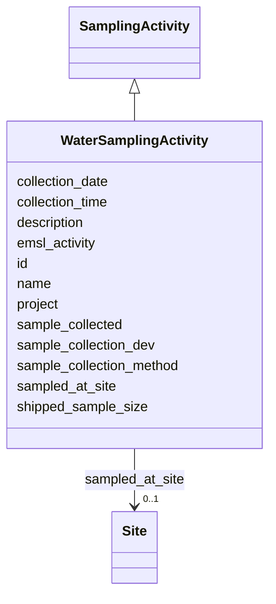

# Class: WaterSamplingActivity 


_Collection of water samples._


URI: [basalt_schema:WaterSamplingActivity](https://w3id.org/MONet/basalt-schema/WaterSamplingActivity)





## Inheritance
* [SamplingActivity](SamplingActivity.md)
    * **WaterSamplingActivity**


## Slots

| Name | Cardinality and Range | Description | Inheritance |
| ---  | --- | --- | --- |
| [collection_time](collection_time.md) | 0..1 <br/> [String](String.md) | The time of sampling as an instance (single point) | direct |
| [sample_collected](sample_collected.md) | 0..1 <br/> [String](String.md) | This refers to the TOTAL amount of sample collected from the experiment | direct |
| [sample_collection_dev](sample_collection_dev.md) | 1 <br/> [String](String.md) | The device used to collect an environmental sample | direct |
| [sample_collection_method](sample_collection_method.md) | 1 <br/> [String](String.md) | The method used to collect an environmental sample | direct |
| [id](id.md) | 1 <br/> [Uuid](Uuid.md) |  | direct |
| [name](name.md) | 1 <br/> [String](String.md) | Human-readable name for the entity or activity | [SamplingActivity](SamplingActivity.md) |
| [description](description.md) | 0..1 <br/> [String](String.md) | Human-readable description for the entity or activity | [SamplingActivity](SamplingActivity.md) |
| [project](project.md) | 0..1 <br/> [Integer](Integer.md) | Identifier for the user project associated with the entity or activity | [SamplingActivity](SamplingActivity.md) |
| [emsl_activity](emsl_activity.md) | 0..1 <br/> [String](String.md) | Nullable string linking a Sample or SamplingActivity to a named EMSL activity... | [SamplingActivity](SamplingActivity.md) |
| [collection_date](collection_date.md) | 0..1 <br/> [Date](Date.md) | 'The date of sampling as an instance | [SamplingActivity](SamplingActivity.md) |
| [shipped_sample_size](shipped_sample_size.md) | 0..1 <br/> [String](String.md) | Total amount of sample sent to EMSL | [SamplingActivity](SamplingActivity.md) |
| [sampled_at_site](sampled_at_site.md) | 0..1 <br/> [Site](Site.md) | Reference to the site where the sample was collected | [SamplingActivity](SamplingActivity.md) |


## Identifier and Mapping Information


### Schema Source


* from schema: https://w3id.org/MONet/basalt-schema


## Mappings

| Mapping Type | Mapped Value |
| ---  | ---  |
| self | basalt_schema:WaterSamplingActivity |
| native | basalt_schema:WaterSamplingActivity |


## LinkML Source

<!-- TODO: investigate https://stackoverflow.com/questions/37606292/how-to-create-tabbed-code-blocks-in-mkdocs-or-sphinx -->

### Direct

<details>
```yaml
name: WaterSamplingActivity
description: Collection of water samples.
from_schema: https://w3id.org/MONet/basalt-schema
is_a: SamplingActivity
slots:
- collection_time
- sample_collected
- sample_collection_dev
- sample_collection_method
slot_usage:
  sample_collection_dev:
    name: sample_collection_dev
    required: true
  sample_collection_method:
    name: sample_collection_method
    required: true
attributes:
  id:
    name: id
    from_schema: https://w3id.org/MONet/basalt-schema/sample-classes
    identifier: true
    domain_of:
    - Activity
    - Entity
    - DataProduct
    - DataGenerationActivity
    - DataProcessingActivity
    - AlternativeIdentifier
    - FunctionalAnnotationIdentifier
    - Instrument
    - OntologyClass
    - ContainerType
    - Custodian
    - InstrumentAlternativeIdentifier
    - LabDevice
    - SampleProcessing
    - ProcessingSampleLink
    - Configuration
    - MobilePhaseSegment
    - MassSpectrometryStandardRun
    - PurchasedMaterial
    - LabProcessingActivity
    - organism
    - MAOMProduct
    - WEOMProduct
    - Site
    - Sample
    - AerosolArmSample
    - AerosolSample
    - AMP2UserSample
    - CommerciallyPurchasedSample
    - CultureEnvironmentalSample
    - EngineeredStrainSample
    - FieldDeployedTerraformSample
    - MixedCultureSample
    - MonetSoilSample
    - OtherUndescribedSample
    - PlantSample
    - PureCultureSample
    - SedimentSample
    - SoilSample
    - SynthesizedMaterialSample
    - TerraformSample
    - WaterSample
    - ProcessedSample
    - CoreSection
    - SamplingActivity
    - AerosolArmSamplingActivity
    - AerosolSamplingActivity
    - CommerciallyPurchasedSamplingActivity
    - CultureEnvironmentalSamplingActivity
    - EngineeredStrainSamplingActivity
    - FieldDeployedTerraformSamplingActivity
    - MixedCultureSamplingActivity
    - MonetSoilSamplingActivity
    - OtherUndescribedSamplingActivity
    - PlantSamplingActivity
    - PureCultureSamplingActivity
    - SedimentSamplingActivity
    - SoilSamplingActivity
    - SynthesizedMaterialSamplingActivity
    - TerraformSamplingActivity
    - WaterSamplingActivity
    - Study
    - ProjectParticipant
    - TimestampValue
    - TextValue
    - SoftwareControlledTermValue
    - ControlledTermValue
    - PersonValue
    - QuantityValue
    - ConditioningValue
    - zipDownload
    range: uuid
    required: true

```
</details>

### Induced

<details>
```yaml
name: WaterSamplingActivity
description: Collection of water samples.
from_schema: https://w3id.org/MONet/basalt-schema
is_a: SamplingActivity
slot_usage:
  sample_collection_dev:
    name: sample_collection_dev
    required: true
  sample_collection_method:
    name: sample_collection_method
    required: true
attributes:
  id:
    name: id
    from_schema: https://w3id.org/MONet/basalt-schema/sample-classes
    identifier: true
    alias: id
    owner: WaterSamplingActivity
    domain_of:
    - Activity
    - Entity
    - DataProduct
    - DataGenerationActivity
    - DataProcessingActivity
    - AlternativeIdentifier
    - FunctionalAnnotationIdentifier
    - Instrument
    - OntologyClass
    - ContainerType
    - Custodian
    - InstrumentAlternativeIdentifier
    - LabDevice
    - SampleProcessing
    - ProcessingSampleLink
    - Configuration
    - MobilePhaseSegment
    - MassSpectrometryStandardRun
    - PurchasedMaterial
    - LabProcessingActivity
    - organism
    - MAOMProduct
    - WEOMProduct
    - Site
    - Sample
    - AerosolArmSample
    - AerosolSample
    - AMP2UserSample
    - CommerciallyPurchasedSample
    - CultureEnvironmentalSample
    - EngineeredStrainSample
    - FieldDeployedTerraformSample
    - MixedCultureSample
    - MonetSoilSample
    - OtherUndescribedSample
    - PlantSample
    - PureCultureSample
    - SedimentSample
    - SoilSample
    - SynthesizedMaterialSample
    - TerraformSample
    - WaterSample
    - ProcessedSample
    - CoreSection
    - SamplingActivity
    - AerosolArmSamplingActivity
    - AerosolSamplingActivity
    - CommerciallyPurchasedSamplingActivity
    - CultureEnvironmentalSamplingActivity
    - EngineeredStrainSamplingActivity
    - FieldDeployedTerraformSamplingActivity
    - MixedCultureSamplingActivity
    - MonetSoilSamplingActivity
    - OtherUndescribedSamplingActivity
    - PlantSamplingActivity
    - PureCultureSamplingActivity
    - SedimentSamplingActivity
    - SoilSamplingActivity
    - SynthesizedMaterialSamplingActivity
    - TerraformSamplingActivity
    - WaterSamplingActivity
    - Study
    - ProjectParticipant
    - TimestampValue
    - TextValue
    - SoftwareControlledTermValue
    - ControlledTermValue
    - PersonValue
    - QuantityValue
    - ConditioningValue
    - zipDownload
    range: uuid
    required: true
  collection_time:
    name: collection_time
    description: 'The time of sampling as an instance (single point). Required format:
      HH:MM:SS in 24-hour time format. Don''t forget the second! (Unit: hh:mm:ss or
      HH:MM:SS)'
    title: collection time
    from_schema: https://w3id.org/MONet/basalt-schema
    rank: 1000
    alias: collection_time
    owner: WaterSamplingActivity
    domain_of:
    - AerosolSamplingActivity
    - CultureEnvironmentalSamplingActivity
    - FieldDeployedTerraformSamplingActivity
    - MixedCultureSamplingActivity
    - MonetSoilSamplingActivity
    - OtherUndescribedSamplingActivity
    - PlantSamplingActivity
    - PureCultureSamplingActivity
    - SedimentSamplingActivity
    - SoilSamplingActivity
    - TerraformSamplingActivity
    - WaterSamplingActivity
    range: string
    pattern: ^(0[0-9]|1[0-9]|2[0-3]):([0-5][0-9]):([0-5][0-9])\s*(hh:mm:ss|HH:MM:SS)$
  sample_collected:
    name: sample_collected
    description: This refers to the TOTAL amount of sample collected from the experiment.
      NOT the amount sent to EMSL or collected for a specific analysis. Provide value
      and unit, any unit is valid
    title: sample collected
    from_schema: https://w3id.org/MONet/basalt-schema
    rank: 1000
    alias: sample_collected
    owner: WaterSamplingActivity
    domain_of:
    - AerosolSamplingActivity
    - CommerciallyPurchasedSamplingActivity
    - CultureEnvironmentalSamplingActivity
    - FieldDeployedTerraformSamplingActivity
    - MixedCultureSamplingActivity
    - OtherUndescribedSamplingActivity
    - PlantSamplingActivity
    - PureCultureSamplingActivity
    - SedimentSamplingActivity
    - SoilSamplingActivity
    - SynthesizedMaterialSamplingActivity
    - TerraformSamplingActivity
    - WaterSamplingActivity
    range: string
    pattern: ^\d+(\.\d+)?\s*[\w\s/]+$
  sample_collection_dev:
    name: sample_collection_dev
    description: The device used to collect an environmental sample. Include dimensions
      of device if applicable
    title: sample collection device
    from_schema: https://w3id.org/MONet/basalt-schema
    rank: 1000
    alias: sample_collection_dev
    owner: WaterSamplingActivity
    domain_of:
    - AerosolSamplingActivity
    - CommerciallyPurchasedSamplingActivity
    - CultureEnvironmentalSamplingActivity
    - MixedCultureSamplingActivity
    - MonetSoilSamplingActivity
    - OtherUndescribedSamplingActivity
    - PlantSamplingActivity
    - PureCultureSamplingActivity
    - SedimentSamplingActivity
    - SoilSamplingActivity
    - SynthesizedMaterialSamplingActivity
    - WaterSamplingActivity
    range: string
    required: true
  sample_collection_method:
    name: sample_collection_method
    description: The method used to collect an environmental sample. This can be a
      citation or description.
    title: sample collection method
    from_schema: https://w3id.org/MONet/basalt-schema
    rank: 1000
    alias: sample_collection_method
    owner: WaterSamplingActivity
    domain_of:
    - CultureEnvironmentalSamplingActivity
    - FieldDeployedTerraformSamplingActivity
    - MixedCultureSamplingActivity
    - OtherUndescribedSamplingActivity
    - PlantSamplingActivity
    - PureCultureSamplingActivity
    - SedimentSamplingActivity
    - SoilSamplingActivity
    - TerraformSamplingActivity
    - WaterSamplingActivity
    range: string
    required: true
  name:
    name: name
    description: Human-readable name for the entity or activity.
    from_schema: https://w3id.org/MONet/basalt-schema
    rank: 1000
    alias: name
    owner: WaterSamplingActivity
    domain_of:
    - Activity
    - Entity
    - DataProduct
    - DataGenerationActivity
    - Instrument
    - OntologyClass
    - ContainerAxis
    - Configuration
    - MobilePhaseSegment
    - MassSpectrometryStandardRun
    - PurchasedMaterial
    - LabProcessingActivity
    - organism
    - Site
    - Sample
    - SamplingActivity
    - SoilSamplingActivity
    - Study
    - SoftwareControlledTermValue
    range: string
    required: true
  description:
    name: description
    description: Human-readable description for the entity or activity
    title: description
    from_schema: https://w3id.org/MONet/basalt-schema
    rank: 1000
    alias: description
    owner: WaterSamplingActivity
    domain_of:
    - Activity
    - Entity
    - DataProduct
    - DataGenerationActivity
    - DataProcessingActivity
    - OntologyClass
    - ContainerType
    - LabDevice
    - Configuration
    - MassSpectrometryStandardRun
    - PurchasedMaterial
    - LabProcessingActivity
    - organism
    - Site
    - Sample
    - SamplingActivity
    - SoilSamplingActivity
    - Study
    - TimestampValue
    - TextValue
    - SoftwareControlledTermValue
    - ControlledTermValue
    - QuantityValue
    range: string
  project:
    name: project
    description: 'Identifier for the user project associated with the entity or activity. '
    title: Project
    todos:
    - should this be an ID? CURIE can use the one NMDC has https://bioregistry.io/reference/emsl.project:60141
      where emsl.project is the CURIE prefix
    from_schema: https://w3id.org/MONet/basalt-schema
    aliases:
    - study
    - study_id
    - project_id
    - proposal
    - proposal_id
    rank: 1000
    alias: project
    owner: WaterSamplingActivity
    domain_of:
    - DataProduct
    - AerosolArmSample
    - AerosolSample
    - CommerciallyPurchasedSample
    - CultureEnvironmentalSample
    - FieldDeployedTerraformSample
    - MixedCultureSample
    - MonetSoilSample
    - OtherUndescribedSample
    - PlantSample
    - PureCultureSample
    - SedimentSample
    - SoilSample
    - SynthesizedMaterialSample
    - TerraformSample
    - WaterSample
    - SamplingActivity
    range: integer
  emsl_activity:
    name: emsl_activity
    description: 'Nullable string linking a Sample or SamplingActivity to a named
      EMSL activity or

      campaign (e.g., ''AMP2'', ''MONet_FY26''). Optional for historical records

      predating activity tracking.'
    todos:
    - Is sampling activity where we want to capture this?
    from_schema: https://w3id.org/MONet/basalt-schema
    rank: 1000
    alias: emsl_activity
    owner: WaterSamplingActivity
    domain_of:
    - Sample
    - SamplingActivity
    range: string
    required: false
  collection_date:
    name: collection_date
    description: '''The date of sampling as an instance. Format: YYYY-MM-DD. Also
      valid if entire collection date is unknown is just year (YYYY) or just year
      and month

      (YYYY-MM)'''
    title: collection date
    from_schema: https://w3id.org/MONet/basalt-schema
    rank: 1000
    alias: collection_date
    owner: WaterSamplingActivity
    domain_of:
    - AMP2UserSample
    - SamplingActivity
    range: date
    pattern: ^[12]\d{3}(?:(?:-(?:0[1-9]|1[0-2]))(?:-(?:0[1-9]|[12]\d|3[01]))?)?$
  shipped_sample_size:
    name: shipped_sample_size
    description: Total amount of sample sent to EMSL. Must include units.
    title: shipped sample size
    from_schema: https://w3id.org/MONet/basalt-schema
    rank: 1000
    alias: shipped_sample_size
    owner: WaterSamplingActivity
    domain_of:
    - AMP2UserSample
    - SamplingActivity
    range: string
    pattern: ^\d+(\.\d+)?\s*[\w\s/]+$
  sampled_at_site:
    name: sampled_at_site
    description: Reference to the site where the sample was collected. This is a FK
      to the Site class, which contains detailed metadata about the sampling location.
    from_schema: https://w3id.org/MONet/basalt-schema
    rank: 1000
    alias: sampled_at_site
    owner: WaterSamplingActivity
    domain_of:
    - SamplingActivity
    range: Site

```
</details>