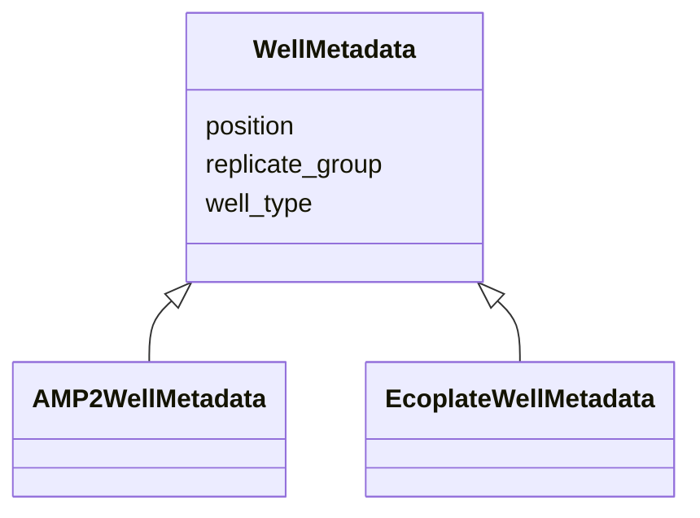

# Class: WellMetadata 


_Base structure for per-well metadata in plate setup._

_NOT a standalone database table; embedded structured entries under_

_PlateSetupActivity.well_metadata._

_Subclasses add type-specific fields._


URI: [basalt_schema:WellMetadata](https://emsl-computing.github.io/BASALT-Schema/elements/WellMetadata)





## Inheritance
* **WellMetadata**
    * [AMP2WellMetadata](AMP2WellMetadata.md)
    * [EcoplateWellMetadata](EcoplateWellMetadata.md)


## Slots

| Name | Cardinality and Range | Description | Inheritance |
| ---  | --- | --- | --- |
| [position](position.md) | 1 <br/> [String](String.md) | Well position (e | direct |
| [well_type](well_type.md) | 0..1 <br/> [String](String.md) | Role of this well   "sample", "blank", "uninoculated_control", "standard" | direct |
| [replicate_group](replicate_group.md) | 0..1 <br/> [String](String.md) | Identifier linking technical replicates (e | direct |


## Usages

| used by | used in | type | used |
| ---  | --- | --- | --- |
| [PlateSetupActivity](PlateSetupActivity.md) | [well_metadata](well_metadata.md) | range | [WellMetadata](WellMetadata.md) |
| [AMP2PlateSetupActivity](AMP2PlateSetupActivity.md) | [well_metadata](well_metadata.md) | range | [WellMetadata](WellMetadata.md) |
| [EcoplatePlateSetupActivity](EcoplatePlateSetupActivity.md) | [well_metadata](well_metadata.md) | range | [WellMetadata](WellMetadata.md) |


## Identifier and Mapping Information


### Schema Source


* from schema: https://emsl-computing.github.io/BASALT-Schema


## Mappings

| Mapping Type | Mapped Value |
| ---  | ---  |
| self | basalt_schema:WellMetadata |
| native | basalt_schema:WellMetadata |


## LinkML Source

<!-- TODO: investigate https://stackoverflow.com/questions/37606292/how-to-create-tabbed-code-blocks-in-mkdocs-or-sphinx -->

### Direct

<details>
```yaml
name: WellMetadata
description: 'Base structure for per-well metadata in plate setup.

  NOT a standalone database table; embedded structured entries under

  PlateSetupActivity.well_metadata.

  Subclasses add type-specific fields.'
from_schema: https://emsl-computing.github.io/BASALT-Schema
attributes:
  position:
    name: position
    description: Well position (e.g. "A01", "H12")
    from_schema: https://emsl-computing.github.io/BASALT-Schema/media-strain-culture-plate
    rank: 1000
    domain_of:
    - WellMetadata
    - WellReading
    range: string
    required: true
  well_type:
    name: well_type
    description: Role of this well   "sample", "blank", "uninoculated_control", "standard"
    from_schema: https://emsl-computing.github.io/BASALT-Schema/media-strain-culture-plate
    rank: 1000
    domain_of:
    - WellMetadata
    range: string
  replicate_group:
    name: replicate_group
    description: Identifier linking technical replicates (e.g. "rep1", "rep2")
    from_schema: https://emsl-computing.github.io/BASALT-Schema/media-strain-culture-plate
    rank: 1000
    domain_of:
    - WellMetadata
    range: string

```
</details>

### Induced

<details>
```yaml
name: WellMetadata
description: 'Base structure for per-well metadata in plate setup.

  NOT a standalone database table; embedded structured entries under

  PlateSetupActivity.well_metadata.

  Subclasses add type-specific fields.'
from_schema: https://emsl-computing.github.io/BASALT-Schema
attributes:
  position:
    name: position
    description: Well position (e.g. "A01", "H12")
    from_schema: https://emsl-computing.github.io/BASALT-Schema/media-strain-culture-plate
    rank: 1000
    alias: position
    owner: WellMetadata
    domain_of:
    - WellMetadata
    - WellReading
    range: string
    required: true
  well_type:
    name: well_type
    description: Role of this well   "sample", "blank", "uninoculated_control", "standard"
    from_schema: https://emsl-computing.github.io/BASALT-Schema/media-strain-culture-plate
    rank: 1000
    alias: well_type
    owner: WellMetadata
    domain_of:
    - WellMetadata
    range: string
  replicate_group:
    name: replicate_group
    description: Identifier linking technical replicates (e.g. "rep1", "rep2")
    from_schema: https://emsl-computing.github.io/BASALT-Schema/media-strain-culture-plate
    rank: 1000
    alias: replicate_group
    owner: WellMetadata
    domain_of:
    - WellMetadata
    range: string

```
</details>