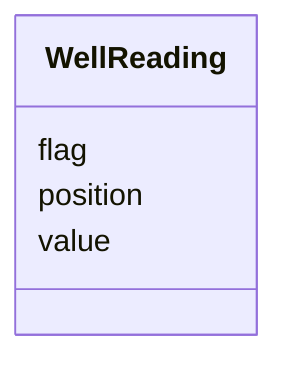

# Class: WellReading 


_Per-well measurement data. NOT a standalone database table; embedded structured entries under_

_PlateProduct.well_readings._


URI: [basalt_schema:WellReading](https://w3id.org/MONet/basalt-schema/WellReading)





<!-- no inheritance hierarchy -->

## Slots

| Name | Cardinality and Range | Description | Inheritance |
| ---  | --- | --- | --- |
| [position](position.md) | 1 <br/> [String](String.md) | Well position (e | direct |
| [value](value.md) | 1 <br/> [Float](Float.md) | Measured value (absorbance, OD, fluorescence) | direct |
| [flag](flag.md) | 0..1 <br/> [String](String.md) | QC flag   "ok", "blank", "outlier", "contaminated" | direct |


## Usages

| used by | used in | type | used |
| ---  | --- | --- | --- |
| [PlateProduct](PlateProduct.md) | [well_readings](well_readings.md) | range | [WellReading](WellReading.md) |
| [AMP2ODProduct](AMP2ODProduct.md) | [well_readings](well_readings.md) | range | [WellReading](WellReading.md) |
| [EcoplateAbsorbanceProduct](EcoplateAbsorbanceProduct.md) | [well_readings](well_readings.md) | range | [WellReading](WellReading.md) |


## TODOs

* add optical_density_method here to flag what value means if we have multiple OD methods (e.g. OD600 vs OD750)
* units for value slot


## Identifier and Mapping Information


### Schema Source


* from schema: https://w3id.org/MONet/basalt-schema


## Mappings

| Mapping Type | Mapped Value |
| ---  | ---  |
| self | basalt_schema:WellReading |
| native | basalt_schema:WellReading |


## LinkML Source

<!-- TODO: investigate https://stackoverflow.com/questions/37606292/how-to-create-tabbed-code-blocks-in-mkdocs-or-sphinx -->

### Direct

<details>
```yaml
name: WellReading
description: 'Per-well measurement data. NOT a standalone database table; embedded
  structured entries under

  PlateProduct.well_readings.'
todos:
- add optical_density_method here to flag what value means if we have multiple OD
  methods (e.g. OD600 vs OD750)
- units for value slot
from_schema: https://w3id.org/MONet/basalt-schema
attributes:
  position:
    name: position
    description: Well position (e.g. "A01")
    from_schema: https://w3id.org/MONet/basalt-schema/media-strain-culture-plate
    domain_of:
    - WellMetadata
    - WellReading
    range: string
    required: true
  value:
    name: value
    description: Measured value (absorbance, OD, fluorescence)
    from_schema: https://w3id.org/MONet/basalt-schema/media-strain-culture-plate
    rank: 1000
    domain_of:
    - WellReading
    range: float
    required: true
  flag:
    name: flag
    description: QC flag   "ok", "blank", "outlier", "contaminated"
    from_schema: https://w3id.org/MONet/basalt-schema/media-strain-culture-plate
    rank: 1000
    domain_of:
    - WellReading
    - BulkDensityProduct
    - EnzymeProduct
    - GWCMoistureProduct
    - HydraulicPropertiesProduct
    - PhosphorusAnalysisProduct
    - RespirationProduct
    - TextureProduct
    - pHProduct
    range: string

```
</details>

### Induced

<details>
```yaml
name: WellReading
description: 'Per-well measurement data. NOT a standalone database table; embedded
  structured entries under

  PlateProduct.well_readings.'
todos:
- add optical_density_method here to flag what value means if we have multiple OD
  methods (e.g. OD600 vs OD750)
- units for value slot
from_schema: https://w3id.org/MONet/basalt-schema
attributes:
  position:
    name: position
    description: Well position (e.g. "A01")
    from_schema: https://w3id.org/MONet/basalt-schema/media-strain-culture-plate
    alias: position
    owner: WellReading
    domain_of:
    - WellMetadata
    - WellReading
    range: string
    required: true
  value:
    name: value
    description: Measured value (absorbance, OD, fluorescence)
    from_schema: https://w3id.org/MONet/basalt-schema/media-strain-culture-plate
    rank: 1000
    alias: value
    owner: WellReading
    domain_of:
    - WellReading
    range: float
    required: true
  flag:
    name: flag
    description: QC flag   "ok", "blank", "outlier", "contaminated"
    from_schema: https://w3id.org/MONet/basalt-schema/media-strain-culture-plate
    rank: 1000
    alias: flag
    owner: WellReading
    domain_of:
    - WellReading
    - BulkDensityProduct
    - EnzymeProduct
    - GWCMoistureProduct
    - HydraulicPropertiesProduct
    - PhosphorusAnalysisProduct
    - RespirationProduct
    - TextureProduct
    - pHProduct
    range: string

```
</details>