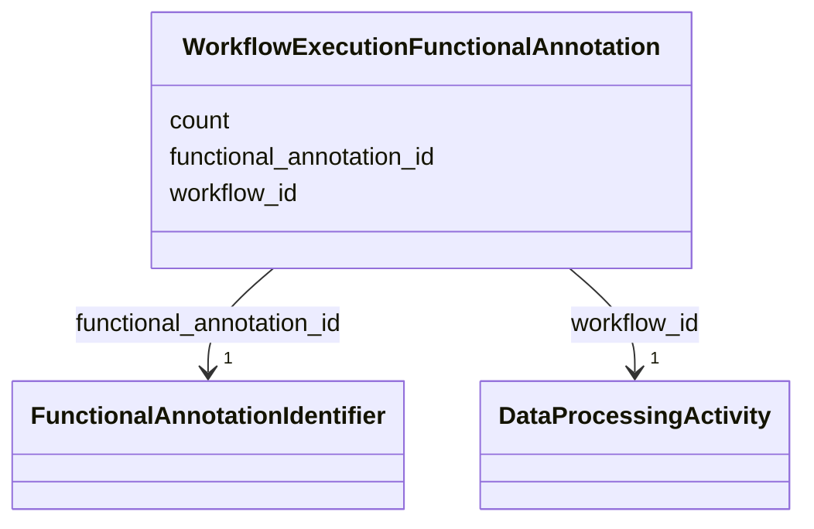

# Class: WorkflowExecutionFunctionalAnnotation 


_A link between a workflow execution and a functional annotation identifier._

_This class captures the relationship between a workflow execution and the_

_functional annotation identifier that was used in the analysis._


URI: [basalt_schema:WorkflowExecutionFunctionalAnnotation](https://w3id.org/MONet/basalt-schema/WorkflowExecutionFunctionalAnnotation)





<!-- no inheritance hierarchy -->

## Slots

| Name | Cardinality and Range | Description | Inheritance |
| ---  | --- | --- | --- |
| [workflow_id](workflow_id.md) | 1 <br/> [DataProcessingActivity](DataProcessingActivity.md) |  | direct |
| [functional_annotation_id](functional_annotation_id.md) | 1 <br/> [FunctionalAnnotationIdentifier](FunctionalAnnotationIdentifier.md) |  | direct |
| [count](count.md) | 0..1 <br/> [Double](Double.md) |  | direct |


## Identifier and Mapping Information


### Schema Source


* from schema: https://w3id.org/MONet/basalt-schema


## Mappings

| Mapping Type | Mapped Value |
| ---  | ---  |
| self | basalt_schema:WorkflowExecutionFunctionalAnnotation |
| native | basalt_schema:WorkflowExecutionFunctionalAnnotation |


## LinkML Source

<!-- TODO: investigate https://stackoverflow.com/questions/37606292/how-to-create-tabbed-code-blocks-in-mkdocs-or-sphinx -->

### Direct

<details>
```yaml
name: WorkflowExecutionFunctionalAnnotation
description: 'A link between a workflow execution and a functional annotation identifier.

  This class captures the relationship between a workflow execution and the

  functional annotation identifier that was used in the analysis.'
from_schema: https://w3id.org/MONet/basalt-schema
attributes:
  workflow_id:
    name: workflow_id
    from_schema: https://w3id.org/MONet/basalt-schema
    rank: 1000
    domain_of:
    - WorkflowExecutionFunctionalAnnotation
    range: DataProcessingActivity
    required: true
  functional_annotation_id:
    name: functional_annotation_id
    from_schema: https://w3id.org/MONet/basalt-schema
    rank: 1000
    domain_of:
    - WorkflowExecutionFunctionalAnnotation
    range: FunctionalAnnotationIdentifier
    required: true
  count:
    name: count
    from_schema: https://w3id.org/MONet/basalt-schema
    rank: 1000
    domain_of:
    - WorkflowExecutionFunctionalAnnotation
    range: double

```
</details>

### Induced

<details>
```yaml
name: WorkflowExecutionFunctionalAnnotation
description: 'A link between a workflow execution and a functional annotation identifier.

  This class captures the relationship between a workflow execution and the

  functional annotation identifier that was used in the analysis.'
from_schema: https://w3id.org/MONet/basalt-schema
attributes:
  workflow_id:
    name: workflow_id
    from_schema: https://w3id.org/MONet/basalt-schema
    rank: 1000
    alias: workflow_id
    owner: WorkflowExecutionFunctionalAnnotation
    domain_of:
    - WorkflowExecutionFunctionalAnnotation
    range: DataProcessingActivity
    required: true
  functional_annotation_id:
    name: functional_annotation_id
    from_schema: https://w3id.org/MONet/basalt-schema
    rank: 1000
    alias: functional_annotation_id
    owner: WorkflowExecutionFunctionalAnnotation
    domain_of:
    - WorkflowExecutionFunctionalAnnotation
    range: FunctionalAnnotationIdentifier
    required: true
  count:
    name: count
    from_schema: https://w3id.org/MONet/basalt-schema
    rank: 1000
    alias: count
    owner: WorkflowExecutionFunctionalAnnotation
    domain_of:
    - WorkflowExecutionFunctionalAnnotation
    range: double

```
</details>