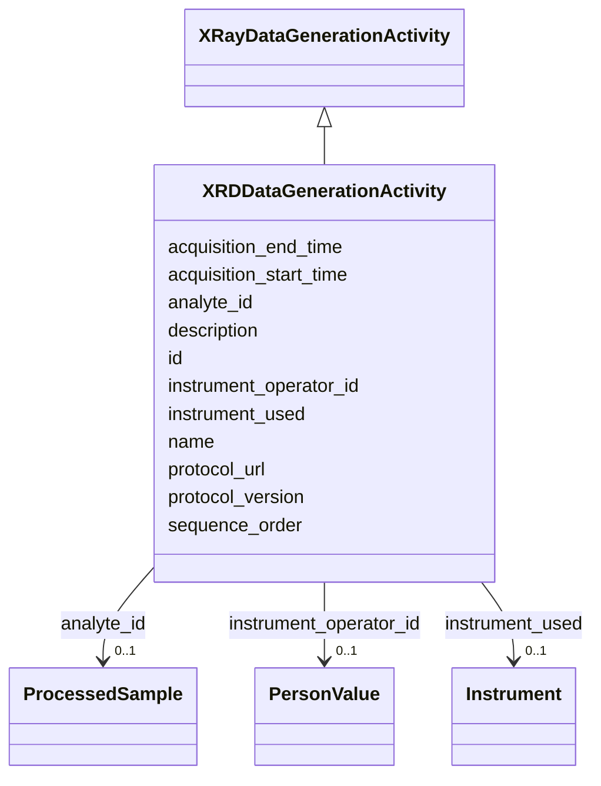

# Class: XRDDataGenerationActivity 


_X-ray Diffraction (XRD) mineralogical analysis activity._

__

_XRD identifies crystalline mineral phases by measuring diffraction patterns._

_Output: mineral phase names and quantitative abundances (weight %)._

__

_Data product: XRDPhaseProduct (one row per mineral phase per sample)_

__

_Workflow patterns:_

_  1. Direct/semi-quantitative: _

_       processedSample -> XRDDataGenerationActivity -> XRDPhaseProduct (workflow_id = NULL)_

_  2. With Rietveld refinement (computational):_

_       processedSample -> XRDDataGenerationActivity -> _

_       DataProcessingActivity(type='xrd_rietveld_refinement') -> _

_       XRDPhaseProduct (workflow_id = refinement WEA)_

__

_Protocol information: Stored externally; link via protocol_url attribute._

_Example protocol parameters (stored in external SOP or DataProcessingActivity):_

_  - Diffractometer geometry (Bragg-Brentano, Debye-Scherrer)_

_  - X-ray tube type (Cu, Co, Mo)_

_  - Scan range (2-theta degrees), step size_

_  - Refinement software (HighScore Plus, GSAS-II, FullProf)_

_  - R-factor, GOF (goodness of fit)_

__

_Required enum additions to enums.yaml:_

_  routemethod:_

_    xrd_analysis:  # Add to routemethod permissible_values_


URI: [analysis_api_schema:XRDDataGenerationActivity](https://w3id.org/MONet/analysis-api-schema/XRDDataGenerationActivity)





## Inheritance
* [DataGenerationActivity](DataGenerationActivity.md)
    * [XRayDataGenerationActivity](XRayDataGenerationActivity.md)
        * **XRDDataGenerationActivity**


## Slots

| Name | Cardinality and Range | Description | Inheritance |
| ---  | --- | --- | --- |
| [sequence_order](sequence_order.md) | 0..1 <br/> [Integer](Integer.md) | Integer ordering within a temporal series for the same analyte | [DataGenerationActivity](DataGenerationActivity.md) |
| [name](name.md) | 1 <br/> [String](String.md) | Human-readable name for the entity or activity | [DataGenerationActivity](DataGenerationActivity.md) |
| [description](description.md) | 0..1 <br/> [String](String.md) | Human-readable description for the entity or activity | [DataGenerationActivity](DataGenerationActivity.md) |
| [protocol_url](protocol_url.md) | 0..1 <br/> [String](String.md) | URL pointing to the protocol used in the activity, if applicable | [DataGenerationActivity](DataGenerationActivity.md) |
| [protocol_version](protocol_version.md) | 0..1 <br/> [String](String.md) | Version of the protocol used in the activity, if applicable | [DataGenerationActivity](DataGenerationActivity.md) |
| [id](id.md) | 1 <br/> [Uuid](Uuid.md) |  | [DataGenerationActivity](DataGenerationActivity.md) |
| [analyte_id](analyte_id.md) | 0..1 <br/> [ProcessedSample](ProcessedSample.md) |  | [DataGenerationActivity](DataGenerationActivity.md) |
| [acquisition_start_time](acquisition_start_time.md) | 1 <br/> [Datetime](Datetime.md) |  | [DataGenerationActivity](DataGenerationActivity.md) |
| [acquisition_end_time](acquisition_end_time.md) | 1 <br/> [Datetime](Datetime.md) |  | [DataGenerationActivity](DataGenerationActivity.md) |
| [instrument_used](instrument_used.md) | 0..1 <br/> [Instrument](Instrument.md) |  | [DataGenerationActivity](DataGenerationActivity.md) |
| [instrument_operator_id](instrument_operator_id.md) | 0..1 <br/> [PersonValue](PersonValue.md) |  | [DataGenerationActivity](DataGenerationActivity.md) |


## Identifier and Mapping Information


### Schema Source


* from schema: https://w3id.org/MONet/analysis-api-schema


## Mappings

| Mapping Type | Mapped Value |
| ---  | ---  |
| self | analysis_api_schema:XRDDataGenerationActivity |
| native | analysis_api_schema:XRDDataGenerationActivity |


## LinkML Source

<!-- TODO: investigate https://stackoverflow.com/questions/37606292/how-to-create-tabbed-code-blocks-in-mkdocs-or-sphinx -->

### Direct

<details>
```yaml
name: XRDDataGenerationActivity
description: "X-ray Diffraction (XRD) mineralogical analysis activity.\n\nXRD identifies\
  \ crystalline mineral phases by measuring diffraction patterns.\nOutput: mineral\
  \ phase names and quantitative abundances (weight %).\n\nData product: XRDPhaseProduct\
  \ (one row per mineral phase per sample)\n\nWorkflow patterns:\n  1. Direct/semi-quantitative:\
  \ \n       processedSample -> XRDDataGenerationActivity -> XRDPhaseProduct (workflow_id\
  \ = NULL)\n  2. With Rietveld refinement (computational):\n       processedSample\
  \ -> XRDDataGenerationActivity -> \n       DataProcessingActivity(type='xrd_rietveld_refinement')\
  \ -> \n       XRDPhaseProduct (workflow_id = refinement WEA)\n\nProtocol information:\
  \ Stored externally; link via protocol_url attribute.\nExample protocol parameters\
  \ (stored in external SOP or DataProcessingActivity):\n  - Diffractometer geometry\
  \ (Bragg-Brentano, Debye-Scherrer)\n  - X-ray tube type (Cu, Co, Mo)\n  - Scan range\
  \ (2-theta degrees), step size\n  - Refinement software (HighScore Plus, GSAS-II,\
  \ FullProf)\n  - R-factor, GOF (goodness of fit)\n\nRequired enum additions to enums.yaml:\n\
  \  routemethod:\n    xrd_analysis:  # Add to routemethod permissible_values"
from_schema: https://w3id.org/MONet/analysis-api-schema
is_a: XRayDataGenerationActivity

```
</details>

### Induced

<details>
```yaml
name: XRDDataGenerationActivity
description: "X-ray Diffraction (XRD) mineralogical analysis activity.\n\nXRD identifies\
  \ crystalline mineral phases by measuring diffraction patterns.\nOutput: mineral\
  \ phase names and quantitative abundances (weight %).\n\nData product: XRDPhaseProduct\
  \ (one row per mineral phase per sample)\n\nWorkflow patterns:\n  1. Direct/semi-quantitative:\
  \ \n       processedSample -> XRDDataGenerationActivity -> XRDPhaseProduct (workflow_id\
  \ = NULL)\n  2. With Rietveld refinement (computational):\n       processedSample\
  \ -> XRDDataGenerationActivity -> \n       DataProcessingActivity(type='xrd_rietveld_refinement')\
  \ -> \n       XRDPhaseProduct (workflow_id = refinement WEA)\n\nProtocol information:\
  \ Stored externally; link via protocol_url attribute.\nExample protocol parameters\
  \ (stored in external SOP or DataProcessingActivity):\n  - Diffractometer geometry\
  \ (Bragg-Brentano, Debye-Scherrer)\n  - X-ray tube type (Cu, Co, Mo)\n  - Scan range\
  \ (2-theta degrees), step size\n  - Refinement software (HighScore Plus, GSAS-II,\
  \ FullProf)\n  - R-factor, GOF (goodness of fit)\n\nRequired enum additions to enums.yaml:\n\
  \  routemethod:\n    xrd_analysis:  # Add to routemethod permissible_values"
from_schema: https://w3id.org/MONet/analysis-api-schema
is_a: XRayDataGenerationActivity
attributes:
  sequence_order:
    name: sequence_order
    description: "Integer ordering within a temporal series for the same analyte.\n\
      Lower = earlier in series. Use when acquisition_time alone is insufficient.\n\
      \nDDL: ALTER TABLE \"DataGenerationActivity\"\n       ADD COLUMN sequence_order\
      \ INTEGER;"
    from_schema: https://w3id.org/MONet/analysis-api-schema
    rank: 1000
    alias: sequence_order
    owner: XRDDataGenerationActivity
    domain_of:
    - DataGenerationActivity
    range: integer
    required: false
  name:
    name: name
    description: Human-readable name for the entity or activity.
    from_schema: https://w3id.org/MONet/analysis-api-schema
    rank: 1000
    alias: name
    owner: XRDDataGenerationActivity
    domain_of:
    - Activity
    - Entity
    - DataProduct
    - DataGenerationActivity
    - Instrument
    - OntologyClass
    - ContainerAxis
    - Configuration
    - MobilePhaseSegment
    - MassSpectrometryStandardRun
    - PurchasedMaterial
    - LabProcessingActivity
    - Site
    - Sample
    - SamplingActivity
    - SoilSamplingActivity
    - biological_entity
    - Study
    - SoftwareControlledTermValue
    range: string
    required: true
  description:
    name: description
    description: Human-readable description for the entity or activity
    title: description
    from_schema: https://w3id.org/MONet/analysis-api-schema
    rank: 1000
    alias: description
    owner: XRDDataGenerationActivity
    domain_of:
    - Activity
    - Entity
    - DataProduct
    - DataGenerationActivity
    - DataProcessingActivity
    - OntologyClass
    - ContainerType
    - LabDevice
    - Configuration
    - MassSpectrometryStandardRun
    - PurchasedMaterial
    - LabProcessingActivity
    - Site
    - Sample
    - SamplingActivity
    - SoilSamplingActivity
    - biological_entity
    - Study
    - TimestampValue
    - TextValue
    - SoftwareControlledTermValue
    - ControlledTermValue
    - QuantityValue
    range: string
  protocol_url:
    name: protocol_url
    description: URL pointing to the protocol used in the activity, if applicable.
    from_schema: https://w3id.org/MONet/analysis-api-schema
    rank: 1000
    alias: protocol_url
    owner: XRDDataGenerationActivity
    domain_of:
    - DataGenerationActivity
    - SampleProcessing
    range: string
  protocol_version:
    name: protocol_version
    description: Version of the protocol used in the activity, if applicable.
    from_schema: https://w3id.org/MONet/analysis-api-schema
    rank: 1000
    alias: protocol_version
    owner: XRDDataGenerationActivity
    domain_of:
    - DataGenerationActivity
    - SampleProcessing
    range: string
  id:
    name: id
    from_schema: https://w3id.org/MONet/analysis-api-schema
    identifier: true
    alias: id
    owner: XRDDataGenerationActivity
    domain_of:
    - Activity
    - Entity
    - DataProduct
    - DataGenerationActivity
    - DataProcessingActivity
    - AlternativeIdentifier
    - FunctionalAnnotationIdentifier
    - Instrument
    - OntologyClass
    - ContainerType
    - Custodian
    - InstrumentAlternativeIdentifier
    - LabDevice
    - SampleProcessing
    - ProcessingSampleLink
    - Configuration
    - MobilePhaseSegment
    - MassSpectrometryStandardRun
    - PurchasedMaterial
    - LabProcessingActivity
    - MAOMProduct
    - WEOMProduct
    - Site
    - Sample
    - AerosolArmSample
    - AerosolSample
    - AMP2UserSample
    - CommerciallyPurchasedSample
    - CultureEnvironmentalSample
    - EngineeredStrainSample
    - FieldDeployedTerraformSample
    - MixedCultureSample
    - MonetSoilSample
    - OtherUndescribedSample
    - PlantSample
    - PureCultureSample
    - SedimentSample
    - SoilSample
    - SynthesizedMaterialSample
    - TerraformSample
    - WaterSample
    - ProcessedSample
    - CoreSection
    - SamplingActivity
    - AerosolArmSamplingActivity
    - AerosolSamplingActivity
    - CommerciallyPurchasedSamplingActivity
    - CultureEnvironmentalSamplingActivity
    - EngineeredStrainSamplingActivity
    - FieldDeployedTerraformSamplingActivity
    - MixedCultureSamplingActivity
    - MonetSoilSamplingActivity
    - OtherUndescribedSamplingActivity
    - PlantSamplingActivity
    - PureCultureSamplingActivity
    - SedimentSamplingActivity
    - SoilSamplingActivity
    - SynthesizedMaterialSamplingActivity
    - TerraformSamplingActivity
    - WaterSamplingActivity
    - biological_entity
    - Study
    - ProjectParticipant
    - TimestampValue
    - TextValue
    - SoftwareControlledTermValue
    - ControlledTermValue
    - PersonValue
    - QuantityValue
    - ConditioningValue
    - zipDownload
    range: uuid
    required: true
  analyte_id:
    name: analyte_id
    from_schema: https://w3id.org/MONet/analysis-api-schema
    rank: 1000
    alias: analyte_id
    owner: XRDDataGenerationActivity
    domain_of:
    - DataGenerationActivity
    range: ProcessedSample
  acquisition_start_time:
    name: acquisition_start_time
    from_schema: https://w3id.org/MONet/analysis-api-schema
    rank: 1000
    alias: acquisition_start_time
    owner: XRDDataGenerationActivity
    domain_of:
    - DataGenerationActivity
    range: datetime
    required: true
  acquisition_end_time:
    name: acquisition_end_time
    from_schema: https://w3id.org/MONet/analysis-api-schema
    rank: 1000
    alias: acquisition_end_time
    owner: XRDDataGenerationActivity
    domain_of:
    - DataGenerationActivity
    range: datetime
    required: true
  instrument_used:
    name: instrument_used
    from_schema: https://w3id.org/MONet/analysis-api-schema
    rank: 1000
    alias: instrument_used
    owner: XRDDataGenerationActivity
    domain_of:
    - DataGenerationActivity
    range: Instrument
  instrument_operator_id:
    name: instrument_operator_id
    from_schema: https://w3id.org/MONet/analysis-api-schema
    rank: 1000
    alias: instrument_operator_id
    owner: XRDDataGenerationActivity
    domain_of:
    - DataGenerationActivity
    range: PersonValue

```
</details>