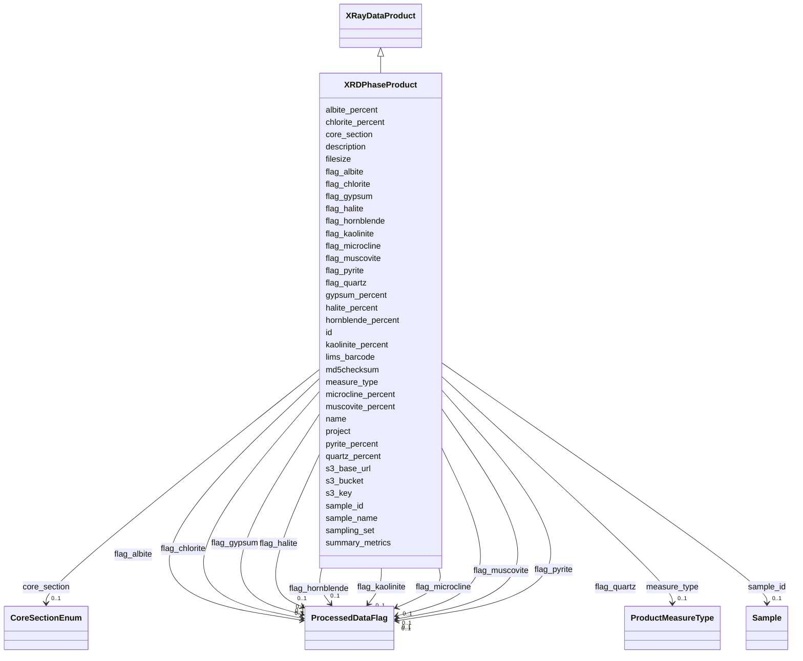

# Class: XRDPhaseProduct 


_X-ray Diffraction (XRD) mineral phase identification and quantification data._

_One row per sample with columns for each mineral phase identified._

__

_Follows the wide-format pattern with individual weight percent columns._

_Individual QC flags for each mineral using ProcessedDataFlag enum._

__

_Relationship to core tables:_

_  - id: FK -> processedData.id (1:1 linkage)_

_  - processedData.type = 'XRDPhaseProduct'_

_  - processedData.workflow_id -> DataProcessingActivity if Rietveld refinement_

_    is computational; NULL if manual/semi-quantitative_

_  - processedData.summary_metrics = {"quartz_percent":42, "albite_percent":18, ...}_

_  - processedData.s3_key = diffractogram .xy, .xrdml, or .raw file in MinIO_

__

_Standard soil mineral panel (10 major phases):_

_  Primary minerals: quartz, albite, microcline_

_  Phyllosilicates: muscovite, kaolinite, chlorite_

_  Amphiboles: hornblende_

_  Sulfides and evaporites: pyrite, halite, gypsum_

__

_Quantification methods:_

_  - Rietveld refinement (computational, most accurate)_

_  - Reference intensity ratio (RIR) method_

_  - Semi-quantitative (manual, less precise)_

__

_Computational processing workflow (if applicable):_

_  XRDDataGenerationActivity acquires raw diffractogram ->_

_  DataProcessingActivity (type='xrd_rietveld_refinement') processes with_

_  HighScore Plus, GSAS-II, or FullProf ->_

_  XRDPhaseProduct (workflow_id points to refinement WEA)_

_  _

_  workflow_steps JSONB example:_

_    {"software": "HighScore_Plus", "version": "5.1", "method": "Rietveld",_

_     "r_factor": 0.042, "gof": 1.8, "amorphous_content_pct": 12}_

__

_Required enum additions to enums.yaml:_

_  product:_

_    XRDPhaseProduct:  # Add to product permissible_values_


URI: [analysis_api_schema:XRDPhaseProduct](https://w3id.org/MONet/analysis-api-schema/XRDPhaseProduct)





## Inheritance
* [DataProduct](DataProduct.md)
    * [ProcessedData](ProcessedData.md)
        * [XRayDataProduct](XRayDataProduct.md)
            * **XRDPhaseProduct**


## Slots

| Name | Cardinality and Range | Description | Inheritance |
| ---  | --- | --- | --- |
| [measure_type](measure_type.md) | 0..1 <br/> [ProductMeasureType](ProductMeasureType.md) | Whether the measurement recorded is a single measurement, one of a set of  re... | direct |
| [quartz_percent](quartz_percent.md) | 0..1 <br/> [Float](Float.md) | Quartz (SiO2) weight percent | direct |
| [albite_percent](albite_percent.md) | 0..1 <br/> [Float](Float.md) | Albite (NaAlSi3O8) weight percent | direct |
| [microcline_percent](microcline_percent.md) | 0..1 <br/> [Float](Float.md) | Microcline (KAlSi3O8) weight percent | direct |
| [muscovite_percent](muscovite_percent.md) | 0..1 <br/> [Float](Float.md) | Muscovite (KAl2(AlSi3O10)(OH)2) weight percent | direct |
| [kaolinite_percent](kaolinite_percent.md) | 0..1 <br/> [Float](Float.md) | Kaolinite (Al2Si2O5(OH)4) weight percent | direct |
| [chlorite_percent](chlorite_percent.md) | 0..1 <br/> [Float](Float.md) | Chlorite ((Mg,Fe)3(Si,Al)4O10(OH)2 (Mg,Fe)3(OH)6) weight percent | direct |
| [hornblende_percent](hornblende_percent.md) | 0..1 <br/> [Float](Float.md) | Hornblende (Ca,Na)2-3(Mg,Fe,Al)5(Al,Si)8O22(OH)2 weight percent | direct |
| [pyrite_percent](pyrite_percent.md) | 0..1 <br/> [Float](Float.md) | Pyrite (FeS2) weight percent | direct |
| [halite_percent](halite_percent.md) | 0..1 <br/> [Float](Float.md) | Halite (NaCl) weight percent | direct |
| [gypsum_percent](gypsum_percent.md) | 0..1 <br/> [Float](Float.md) | Gypsum (CaSO4 2H2O) weight percent | direct |
| [flag_quartz](flag_quartz.md) | 0..1 <br/> [ProcessedDataFlag](ProcessedDataFlag.md) |  | direct |
| [flag_albite](flag_albite.md) | 0..1 <br/> [ProcessedDataFlag](ProcessedDataFlag.md) |  | direct |
| [flag_microcline](flag_microcline.md) | 0..1 <br/> [ProcessedDataFlag](ProcessedDataFlag.md) |  | direct |
| [flag_muscovite](flag_muscovite.md) | 0..1 <br/> [ProcessedDataFlag](ProcessedDataFlag.md) |  | direct |
| [flag_kaolinite](flag_kaolinite.md) | 0..1 <br/> [ProcessedDataFlag](ProcessedDataFlag.md) |  | direct |
| [flag_chlorite](flag_chlorite.md) | 0..1 <br/> [ProcessedDataFlag](ProcessedDataFlag.md) |  | direct |
| [flag_hornblende](flag_hornblende.md) | 0..1 <br/> [ProcessedDataFlag](ProcessedDataFlag.md) |  | direct |
| [flag_pyrite](flag_pyrite.md) | 0..1 <br/> [ProcessedDataFlag](ProcessedDataFlag.md) |  | direct |
| [flag_halite](flag_halite.md) | 0..1 <br/> [ProcessedDataFlag](ProcessedDataFlag.md) |  | direct |
| [flag_gypsum](flag_gypsum.md) | 0..1 <br/> [ProcessedDataFlag](ProcessedDataFlag.md) |  | direct |
| [summary_metrics](summary_metrics.md) | 0..1 <br/> [String](String.md) | Lightweight per-product summary for common queries that avoid full file downl... | [ProcessedData](ProcessedData.md) |
| [lims_barcode](lims_barcode.md) | 0..1 <br/> [String](String.md) | LIMS barcode identifier | [ProcessedData](ProcessedData.md) |
| [sample_id](sample_id.md) | 0..1 <br/> [Sample](Sample.md) | Link back to the originating sample | [ProcessedData](ProcessedData.md) |
| [name](name.md) | 1 <br/> [String](String.md) | Human-readable name for the entity or activity | [DataProduct](DataProduct.md) |
| [description](description.md) | 0..1 <br/> [String](String.md) | Human-readable description for the entity or activity | [DataProduct](DataProduct.md) |
| [project](project.md) | 0..1 <br/> [Integer](Integer.md) | Identifier for the user project associated with the entity or activity | [DataProduct](DataProduct.md) |
| [sampling_set](sampling_set.md) | 0..1 <br/> [Integer](Integer.md) | Sampling set number for grouping related samples collected together | [DataProduct](DataProduct.md) |
| [core_section](core_section.md) | 0..1 <br/> [CoreSectionEnum](CoreSectionEnum.md) | The section of the core | [DataProduct](DataProduct.md) |
| [sample_name](sample_name.md) | 0..1 <br/> [String](String.md) | The name or label that is present on the shipped sample | [DataProduct](DataProduct.md) |
| [s3_base_url](s3_base_url.md) | 0..1 <br/> [String](String.md) |  | [DataProduct](DataProduct.md) |
| [s3_bucket](s3_bucket.md) | 0..1 <br/> [String](String.md) |  | [DataProduct](DataProduct.md) |
| [s3_key](s3_key.md) | 1 <br/> [String](String.md) | MinIO/S3 object key; required for all data products | [DataProduct](DataProduct.md) |
| [filesize](filesize.md) | 0..1 <br/> [Integer](Integer.md) | Size of the file in bytes | [DataProduct](DataProduct.md) |
| [md5checksum](md5checksum.md) | 0..1 <br/> [String](String.md) |  | [DataProduct](DataProduct.md) |
| [id](id.md) | 1 <br/> [Uuid](Uuid.md) |  | [DataProduct](DataProduct.md) |


## Identifier and Mapping Information


### Schema Source


* from schema: https://w3id.org/MONet/analysis-api-schema


## Mappings

| Mapping Type | Mapped Value |
| ---  | ---  |
| self | analysis_api_schema:XRDPhaseProduct |
| native | analysis_api_schema:XRDPhaseProduct |


## LinkML Source

<!-- TODO: investigate https://stackoverflow.com/questions/37606292/how-to-create-tabbed-code-blocks-in-mkdocs-or-sphinx -->

### Direct

<details>
```yaml
name: XRDPhaseProduct
description: "X-ray Diffraction (XRD) mineral phase identification and quantification\
  \ data.\nOne row per sample with columns for each mineral phase identified.\n\n\
  Follows the wide-format pattern with individual weight percent columns.\nIndividual\
  \ QC flags for each mineral using ProcessedDataFlag enum.\n\nRelationship to core\
  \ tables:\n  - id: FK -> processedData.id (1:1 linkage)\n  - processedData.type\
  \ = 'XRDPhaseProduct'\n  - processedData.workflow_id -> DataProcessingActivity if\
  \ Rietveld refinement\n    is computational; NULL if manual/semi-quantitative\n\
  \  - processedData.summary_metrics = {\"quartz_percent\":42, \"albite_percent\"\
  :18, ...}\n  - processedData.s3_key = diffractogram .xy, .xrdml, or .raw file in\
  \ MinIO\n\nStandard soil mineral panel (10 major phases):\n  Primary minerals: quartz,\
  \ albite, microcline\n  Phyllosilicates: muscovite, kaolinite, chlorite\n  Amphiboles:\
  \ hornblende\n  Sulfides and evaporites: pyrite, halite, gypsum\n\nQuantification\
  \ methods:\n  - Rietveld refinement (computational, most accurate)\n  - Reference\
  \ intensity ratio (RIR) method\n  - Semi-quantitative (manual, less precise)\n\n\
  Computational processing workflow (if applicable):\n  XRDDataGenerationActivity\
  \ acquires raw diffractogram ->\n  DataProcessingActivity (type='xrd_rietveld_refinement')\
  \ processes with\n  HighScore Plus, GSAS-II, or FullProf ->\n  XRDPhaseProduct (workflow_id\
  \ points to refinement WEA)\n  \n  workflow_steps JSONB example:\n    {\"software\"\
  : \"HighScore_Plus\", \"version\": \"5.1\", \"method\": \"Rietveld\",\n     \"r_factor\"\
  : 0.042, \"gof\": 1.8, \"amorphous_content_pct\": 12}\n\nRequired enum additions\
  \ to enums.yaml:\n  product:\n    XRDPhaseProduct:  # Add to product permissible_values"
from_schema: https://w3id.org/MONet/analysis-api-schema
is_a: XRayDataProduct
slots:
- measure_type
attributes:
  quartz_percent:
    name: quartz_percent
    description: Quartz (SiO2) weight percent
    from_schema: https://w3id.org/MONet/analysis-api-schema/products
    rank: 1000
    domain_of:
    - XRDPhaseProduct
    range: float
  albite_percent:
    name: albite_percent
    description: Albite (NaAlSi3O8) weight percent
    from_schema: https://w3id.org/MONet/analysis-api-schema/products
    rank: 1000
    domain_of:
    - XRDPhaseProduct
    range: float
  microcline_percent:
    name: microcline_percent
    description: Microcline (KAlSi3O8) weight percent
    from_schema: https://w3id.org/MONet/analysis-api-schema/products
    rank: 1000
    domain_of:
    - XRDPhaseProduct
    range: float
  muscovite_percent:
    name: muscovite_percent
    description: Muscovite (KAl2(AlSi3O10)(OH)2) weight percent
    from_schema: https://w3id.org/MONet/analysis-api-schema/products
    rank: 1000
    domain_of:
    - XRDPhaseProduct
    range: float
  kaolinite_percent:
    name: kaolinite_percent
    description: Kaolinite (Al2Si2O5(OH)4) weight percent
    from_schema: https://w3id.org/MONet/analysis-api-schema/products
    rank: 1000
    domain_of:
    - XRDPhaseProduct
    range: float
  chlorite_percent:
    name: chlorite_percent
    description: Chlorite ((Mg,Fe)3(Si,Al)4O10(OH)2 (Mg,Fe)3(OH)6) weight percent
    from_schema: https://w3id.org/MONet/analysis-api-schema/products
    rank: 1000
    domain_of:
    - XRDPhaseProduct
    range: float
  hornblende_percent:
    name: hornblende_percent
    description: Hornblende (Ca,Na)2-3(Mg,Fe,Al)5(Al,Si)8O22(OH)2 weight percent
    from_schema: https://w3id.org/MONet/analysis-api-schema/products
    rank: 1000
    domain_of:
    - XRDPhaseProduct
    range: float
  pyrite_percent:
    name: pyrite_percent
    description: Pyrite (FeS2) weight percent
    from_schema: https://w3id.org/MONet/analysis-api-schema/products
    rank: 1000
    domain_of:
    - XRDPhaseProduct
    range: float
  halite_percent:
    name: halite_percent
    description: Halite (NaCl) weight percent
    from_schema: https://w3id.org/MONet/analysis-api-schema/products
    rank: 1000
    domain_of:
    - XRDPhaseProduct
    range: float
  gypsum_percent:
    name: gypsum_percent
    description: Gypsum (CaSO4 2H2O) weight percent
    from_schema: https://w3id.org/MONet/analysis-api-schema/products
    rank: 1000
    domain_of:
    - XRDPhaseProduct
    range: float
  flag_quartz:
    name: flag_quartz
    from_schema: https://w3id.org/MONet/analysis-api-schema/products
    rank: 1000
    domain_of:
    - XRDPhaseProduct
    range: ProcessedDataFlag
  flag_albite:
    name: flag_albite
    from_schema: https://w3id.org/MONet/analysis-api-schema/products
    rank: 1000
    domain_of:
    - XRDPhaseProduct
    range: ProcessedDataFlag
  flag_microcline:
    name: flag_microcline
    from_schema: https://w3id.org/MONet/analysis-api-schema/products
    rank: 1000
    domain_of:
    - XRDPhaseProduct
    range: ProcessedDataFlag
  flag_muscovite:
    name: flag_muscovite
    from_schema: https://w3id.org/MONet/analysis-api-schema/products
    rank: 1000
    domain_of:
    - XRDPhaseProduct
    range: ProcessedDataFlag
  flag_kaolinite:
    name: flag_kaolinite
    from_schema: https://w3id.org/MONet/analysis-api-schema/products
    rank: 1000
    domain_of:
    - XRDPhaseProduct
    range: ProcessedDataFlag
  flag_chlorite:
    name: flag_chlorite
    from_schema: https://w3id.org/MONet/analysis-api-schema/products
    rank: 1000
    domain_of:
    - XRDPhaseProduct
    range: ProcessedDataFlag
  flag_hornblende:
    name: flag_hornblende
    from_schema: https://w3id.org/MONet/analysis-api-schema/products
    rank: 1000
    domain_of:
    - XRDPhaseProduct
    range: ProcessedDataFlag
  flag_pyrite:
    name: flag_pyrite
    from_schema: https://w3id.org/MONet/analysis-api-schema/products
    rank: 1000
    domain_of:
    - XRDPhaseProduct
    range: ProcessedDataFlag
  flag_halite:
    name: flag_halite
    from_schema: https://w3id.org/MONet/analysis-api-schema/products
    rank: 1000
    domain_of:
    - XRDPhaseProduct
    range: ProcessedDataFlag
  flag_gypsum:
    name: flag_gypsum
    from_schema: https://w3id.org/MONet/analysis-api-schema/products
    rank: 1000
    domain_of:
    - XRDPhaseProduct
    range: ProcessedDataFlag

```
</details>

### Induced

<details>
```yaml
name: XRDPhaseProduct
description: "X-ray Diffraction (XRD) mineral phase identification and quantification\
  \ data.\nOne row per sample with columns for each mineral phase identified.\n\n\
  Follows the wide-format pattern with individual weight percent columns.\nIndividual\
  \ QC flags for each mineral using ProcessedDataFlag enum.\n\nRelationship to core\
  \ tables:\n  - id: FK -> processedData.id (1:1 linkage)\n  - processedData.type\
  \ = 'XRDPhaseProduct'\n  - processedData.workflow_id -> DataProcessingActivity if\
  \ Rietveld refinement\n    is computational; NULL if manual/semi-quantitative\n\
  \  - processedData.summary_metrics = {\"quartz_percent\":42, \"albite_percent\"\
  :18, ...}\n  - processedData.s3_key = diffractogram .xy, .xrdml, or .raw file in\
  \ MinIO\n\nStandard soil mineral panel (10 major phases):\n  Primary minerals: quartz,\
  \ albite, microcline\n  Phyllosilicates: muscovite, kaolinite, chlorite\n  Amphiboles:\
  \ hornblende\n  Sulfides and evaporites: pyrite, halite, gypsum\n\nQuantification\
  \ methods:\n  - Rietveld refinement (computational, most accurate)\n  - Reference\
  \ intensity ratio (RIR) method\n  - Semi-quantitative (manual, less precise)\n\n\
  Computational processing workflow (if applicable):\n  XRDDataGenerationActivity\
  \ acquires raw diffractogram ->\n  DataProcessingActivity (type='xrd_rietveld_refinement')\
  \ processes with\n  HighScore Plus, GSAS-II, or FullProf ->\n  XRDPhaseProduct (workflow_id\
  \ points to refinement WEA)\n  \n  workflow_steps JSONB example:\n    {\"software\"\
  : \"HighScore_Plus\", \"version\": \"5.1\", \"method\": \"Rietveld\",\n     \"r_factor\"\
  : 0.042, \"gof\": 1.8, \"amorphous_content_pct\": 12}\n\nRequired enum additions\
  \ to enums.yaml:\n  product:\n    XRDPhaseProduct:  # Add to product permissible_values"
from_schema: https://w3id.org/MONet/analysis-api-schema
is_a: XRayDataProduct
attributes:
  quartz_percent:
    name: quartz_percent
    description: Quartz (SiO2) weight percent
    from_schema: https://w3id.org/MONet/analysis-api-schema/products
    rank: 1000
    alias: quartz_percent
    owner: XRDPhaseProduct
    domain_of:
    - XRDPhaseProduct
    range: float
  albite_percent:
    name: albite_percent
    description: Albite (NaAlSi3O8) weight percent
    from_schema: https://w3id.org/MONet/analysis-api-schema/products
    rank: 1000
    alias: albite_percent
    owner: XRDPhaseProduct
    domain_of:
    - XRDPhaseProduct
    range: float
  microcline_percent:
    name: microcline_percent
    description: Microcline (KAlSi3O8) weight percent
    from_schema: https://w3id.org/MONet/analysis-api-schema/products
    rank: 1000
    alias: microcline_percent
    owner: XRDPhaseProduct
    domain_of:
    - XRDPhaseProduct
    range: float
  muscovite_percent:
    name: muscovite_percent
    description: Muscovite (KAl2(AlSi3O10)(OH)2) weight percent
    from_schema: https://w3id.org/MONet/analysis-api-schema/products
    rank: 1000
    alias: muscovite_percent
    owner: XRDPhaseProduct
    domain_of:
    - XRDPhaseProduct
    range: float
  kaolinite_percent:
    name: kaolinite_percent
    description: Kaolinite (Al2Si2O5(OH)4) weight percent
    from_schema: https://w3id.org/MONet/analysis-api-schema/products
    rank: 1000
    alias: kaolinite_percent
    owner: XRDPhaseProduct
    domain_of:
    - XRDPhaseProduct
    range: float
  chlorite_percent:
    name: chlorite_percent
    description: Chlorite ((Mg,Fe)3(Si,Al)4O10(OH)2 (Mg,Fe)3(OH)6) weight percent
    from_schema: https://w3id.org/MONet/analysis-api-schema/products
    rank: 1000
    alias: chlorite_percent
    owner: XRDPhaseProduct
    domain_of:
    - XRDPhaseProduct
    range: float
  hornblende_percent:
    name: hornblende_percent
    description: Hornblende (Ca,Na)2-3(Mg,Fe,Al)5(Al,Si)8O22(OH)2 weight percent
    from_schema: https://w3id.org/MONet/analysis-api-schema/products
    rank: 1000
    alias: hornblende_percent
    owner: XRDPhaseProduct
    domain_of:
    - XRDPhaseProduct
    range: float
  pyrite_percent:
    name: pyrite_percent
    description: Pyrite (FeS2) weight percent
    from_schema: https://w3id.org/MONet/analysis-api-schema/products
    rank: 1000
    alias: pyrite_percent
    owner: XRDPhaseProduct
    domain_of:
    - XRDPhaseProduct
    range: float
  halite_percent:
    name: halite_percent
    description: Halite (NaCl) weight percent
    from_schema: https://w3id.org/MONet/analysis-api-schema/products
    rank: 1000
    alias: halite_percent
    owner: XRDPhaseProduct
    domain_of:
    - XRDPhaseProduct
    range: float
  gypsum_percent:
    name: gypsum_percent
    description: Gypsum (CaSO4 2H2O) weight percent
    from_schema: https://w3id.org/MONet/analysis-api-schema/products
    rank: 1000
    alias: gypsum_percent
    owner: XRDPhaseProduct
    domain_of:
    - XRDPhaseProduct
    range: float
  flag_quartz:
    name: flag_quartz
    from_schema: https://w3id.org/MONet/analysis-api-schema/products
    rank: 1000
    alias: flag_quartz
    owner: XRDPhaseProduct
    domain_of:
    - XRDPhaseProduct
    range: ProcessedDataFlag
  flag_albite:
    name: flag_albite
    from_schema: https://w3id.org/MONet/analysis-api-schema/products
    rank: 1000
    alias: flag_albite
    owner: XRDPhaseProduct
    domain_of:
    - XRDPhaseProduct
    range: ProcessedDataFlag
  flag_microcline:
    name: flag_microcline
    from_schema: https://w3id.org/MONet/analysis-api-schema/products
    rank: 1000
    alias: flag_microcline
    owner: XRDPhaseProduct
    domain_of:
    - XRDPhaseProduct
    range: ProcessedDataFlag
  flag_muscovite:
    name: flag_muscovite
    from_schema: https://w3id.org/MONet/analysis-api-schema/products
    rank: 1000
    alias: flag_muscovite
    owner: XRDPhaseProduct
    domain_of:
    - XRDPhaseProduct
    range: ProcessedDataFlag
  flag_kaolinite:
    name: flag_kaolinite
    from_schema: https://w3id.org/MONet/analysis-api-schema/products
    rank: 1000
    alias: flag_kaolinite
    owner: XRDPhaseProduct
    domain_of:
    - XRDPhaseProduct
    range: ProcessedDataFlag
  flag_chlorite:
    name: flag_chlorite
    from_schema: https://w3id.org/MONet/analysis-api-schema/products
    rank: 1000
    alias: flag_chlorite
    owner: XRDPhaseProduct
    domain_of:
    - XRDPhaseProduct
    range: ProcessedDataFlag
  flag_hornblende:
    name: flag_hornblende
    from_schema: https://w3id.org/MONet/analysis-api-schema/products
    rank: 1000
    alias: flag_hornblende
    owner: XRDPhaseProduct
    domain_of:
    - XRDPhaseProduct
    range: ProcessedDataFlag
  flag_pyrite:
    name: flag_pyrite
    from_schema: https://w3id.org/MONet/analysis-api-schema/products
    rank: 1000
    alias: flag_pyrite
    owner: XRDPhaseProduct
    domain_of:
    - XRDPhaseProduct
    range: ProcessedDataFlag
  flag_halite:
    name: flag_halite
    from_schema: https://w3id.org/MONet/analysis-api-schema/products
    rank: 1000
    alias: flag_halite
    owner: XRDPhaseProduct
    domain_of:
    - XRDPhaseProduct
    range: ProcessedDataFlag
  flag_gypsum:
    name: flag_gypsum
    from_schema: https://w3id.org/MONet/analysis-api-schema/products
    rank: 1000
    alias: flag_gypsum
    owner: XRDPhaseProduct
    domain_of:
    - XRDPhaseProduct
    range: ProcessedDataFlag
  measure_type:
    name: measure_type
    description: Whether the measurement recorded is a single measurement, one of
      a set of  replicate measurements, or an average of several replicate measurements.
    from_schema: https://w3id.org/MONet/analysis-api-schema
    rank: 1000
    alias: measure_type
    owner: XRDPhaseProduct
    domain_of:
    - BulkDensityProduct
    - ElementalAnalysisProduct
    - EnzymeProduct
    - GWCMoistureProduct
    - HydraulicPropertiesProduct
    - IonsAnalysisProduct
    - MAOMProduct
    - MicrobialBiomassProduct
    - NitrogenAnalysisProduct
    - PhosphorusAnalysisProduct
    - RespirationProduct
    - TextureProduct
    - TomographyProduct
    - WEOMProduct
    - pHProduct
    - XRFElementalProduct
    - XRDPhaseProduct
    range: ProductMeasureType
  summary_metrics:
    name: summary_metrics
    description: "Lightweight per-product summary for common queries that avoid full\
      \ file download.\nDirection: structured key-value pairs; per-type schemas TBD:\n\
      \  ecoplate:  well-level absorbance summaries (position, timepoint, absorbance)\n\
      \  xrf:       per-element concentration results + QC flag\n  lcms:      feature\
      \ count, identification count, MSI-2 fraction\nInterim DB storage: JSONB column\
      \ retained until formal typed class exists."
    todos:
    - make this inined/multivalued?
    from_schema: https://w3id.org/MONet/analysis-api-schema
    rank: 1000
    alias: summary_metrics
    owner: XRDPhaseProduct
    domain_of:
    - ProcessedData
    range: string
    required: false
  lims_barcode:
    name: lims_barcode
    description: LIMS barcode identifier
    from_schema: https://w3id.org/MONet/analysis-api-schema
    rank: 1000
    alias: lims_barcode
    owner: XRDPhaseProduct
    domain_of:
    - ProcessedData
    - Sample
    range: string
    required: false
  sample_id:
    name: sample_id
    description: Link back to the originating sample
    from_schema: https://w3id.org/MONet/analysis-api-schema
    rank: 1000
    alias: sample_id
    owner: XRDPhaseProduct
    domain_of:
    - ProcessedData
    - AMP2WellMetadata
    - MetagenomicsProduct
    range: Sample
    required: false
  name:
    name: name
    description: Human-readable name for the entity or activity.
    from_schema: https://w3id.org/MONet/analysis-api-schema
    rank: 1000
    alias: name
    owner: XRDPhaseProduct
    domain_of:
    - Activity
    - Entity
    - DataProduct
    - DataGenerationActivity
    - Instrument
    - OntologyClass
    - ContainerAxis
    - Configuration
    - MobilePhaseSegment
    - MassSpectrometryStandardRun
    - PurchasedMaterial
    - LabProcessingActivity
    - Site
    - Sample
    - SamplingActivity
    - SoilSamplingActivity
    - biological_entity
    - Study
    - SoftwareControlledTermValue
    range: string
    required: true
  description:
    name: description
    description: Human-readable description for the entity or activity
    title: description
    from_schema: https://w3id.org/MONet/analysis-api-schema
    rank: 1000
    alias: description
    owner: XRDPhaseProduct
    domain_of:
    - Activity
    - Entity
    - DataProduct
    - DataGenerationActivity
    - DataProcessingActivity
    - OntologyClass
    - ContainerType
    - LabDevice
    - Configuration
    - MassSpectrometryStandardRun
    - PurchasedMaterial
    - LabProcessingActivity
    - Site
    - Sample
    - SamplingActivity
    - SoilSamplingActivity
    - biological_entity
    - Study
    - TimestampValue
    - TextValue
    - SoftwareControlledTermValue
    - ControlledTermValue
    - QuantityValue
    range: string
  project:
    name: project
    description: 'Identifier for the user project associated with the entity or activity. '
    title: Project
    todos:
    - should this be an ID? CURIE can use the one NMDC has https://bioregistry.io/reference/emsl.project:60141
      where emsl.project is the CURIE prefix
    from_schema: https://w3id.org/MONet/analysis-api-schema
    aliases:
    - study
    - study_id
    - project_id
    - proposal
    - proposal_id
    rank: 1000
    alias: project
    owner: XRDPhaseProduct
    domain_of:
    - DataProduct
    - AerosolArmSample
    - AerosolSample
    - CommerciallyPurchasedSample
    - CultureEnvironmentalSample
    - FieldDeployedTerraformSample
    - MixedCultureSample
    - MonetSoilSample
    - OtherUndescribedSample
    - PlantSample
    - PureCultureSample
    - SedimentSample
    - SoilSample
    - SynthesizedMaterialSample
    - TerraformSample
    - WaterSample
    - SamplingActivity
    range: integer
  sampling_set:
    name: sampling_set
    description: 'Sampling set number for grouping related samples collected together.

      This is a user-defined sequential integer that can be used to link samples collected

      in the same sampling event or campaign.'
    title: sampling set
    from_schema: https://w3id.org/MONet/analysis-api-schema
    rank: 1000
    alias: sampling_set
    owner: XRDPhaseProduct
    domain_of:
    - DataProduct
    - MonetSoilSample
    range: integer
  core_section:
    name: core_section
    description: The section of the core.
    title: core section
    examples:
    - value: TOP
    - value: MID
    - value: BTM
    from_schema: https://w3id.org/MONet/analysis-api-schema
    rank: 1000
    alias: core_section
    owner: XRDPhaseProduct
    domain_of:
    - DataProduct
    - CoreSection
    range: CoreSectionEnum
  sample_name:
    name: sample_name
    description: 'The name or label that is present on the shipped sample. This should

      be a human readable name.'
    title: sample name
    notes:
    - This is typically an alias for the inherited 'name' slot on Sample classes.
      Defined separately for compatibility with source data files using 'sample_name'
      column headers.
    from_schema: https://w3id.org/MONet/analysis-api-schema
    aliases:
    - samp_name
    rank: 1000
    alias: sample_name
    owner: XRDPhaseProduct
    domain_of:
    - DataProduct
    - AerosolArmSample
    - AerosolSample
    - CommerciallyPurchasedSample
    - CultureEnvironmentalSample
    - FieldDeployedTerraformSample
    - MixedCultureSample
    - MonetSoilSample
    - OtherUndescribedSample
    - PlantSample
    - PureCultureSample
    - SedimentSample
    - SoilSample
    - SynthesizedMaterialSample
    - TerraformSample
    - WaterSample
    range: string
  s3_base_url:
    name: s3_base_url
    from_schema: https://w3id.org/MONet/analysis-api-schema
    rank: 1000
    alias: s3_base_url
    owner: XRDPhaseProduct
    domain_of:
    - DataProduct
    range: string
  s3_bucket:
    name: s3_bucket
    from_schema: https://w3id.org/MONet/analysis-api-schema
    rank: 1000
    alias: s3_bucket
    owner: XRDPhaseProduct
    domain_of:
    - DataProduct
    range: string
  s3_key:
    name: s3_key
    description: MinIO/S3 object key; required for all data products
    from_schema: https://w3id.org/MONet/analysis-api-schema
    rank: 1000
    alias: s3_key
    owner: XRDPhaseProduct
    domain_of:
    - DataProduct
    range: string
    required: true
  filesize:
    name: filesize
    description: Size of the file in bytes
    from_schema: https://w3id.org/MONet/analysis-api-schema
    rank: 1000
    alias: filesize
    owner: XRDPhaseProduct
    domain_of:
    - DataProduct
    range: integer
  md5checksum:
    name: md5checksum
    from_schema: https://w3id.org/MONet/analysis-api-schema
    rank: 1000
    alias: md5checksum
    owner: XRDPhaseProduct
    domain_of:
    - DataProduct
    range: string
  id:
    name: id
    from_schema: https://w3id.org/MONet/analysis-api-schema
    identifier: true
    alias: id
    owner: XRDPhaseProduct
    domain_of:
    - Activity
    - Entity
    - DataProduct
    - DataGenerationActivity
    - DataProcessingActivity
    - AlternativeIdentifier
    - FunctionalAnnotationIdentifier
    - Instrument
    - OntologyClass
    - ContainerType
    - Custodian
    - InstrumentAlternativeIdentifier
    - LabDevice
    - SampleProcessing
    - ProcessingSampleLink
    - Configuration
    - MobilePhaseSegment
    - MassSpectrometryStandardRun
    - PurchasedMaterial
    - LabProcessingActivity
    - MAOMProduct
    - WEOMProduct
    - Site
    - Sample
    - AerosolArmSample
    - AerosolSample
    - AMP2UserSample
    - CommerciallyPurchasedSample
    - CultureEnvironmentalSample
    - EngineeredStrainSample
    - FieldDeployedTerraformSample
    - MixedCultureSample
    - MonetSoilSample
    - OtherUndescribedSample
    - PlantSample
    - PureCultureSample
    - SedimentSample
    - SoilSample
    - SynthesizedMaterialSample
    - TerraformSample
    - WaterSample
    - ProcessedSample
    - CoreSection
    - SamplingActivity
    - AerosolArmSamplingActivity
    - AerosolSamplingActivity
    - CommerciallyPurchasedSamplingActivity
    - CultureEnvironmentalSamplingActivity
    - EngineeredStrainSamplingActivity
    - FieldDeployedTerraformSamplingActivity
    - MixedCultureSamplingActivity
    - MonetSoilSamplingActivity
    - OtherUndescribedSamplingActivity
    - PlantSamplingActivity
    - PureCultureSamplingActivity
    - SedimentSamplingActivity
    - SoilSamplingActivity
    - SynthesizedMaterialSamplingActivity
    - TerraformSamplingActivity
    - WaterSamplingActivity
    - biological_entity
    - Study
    - ProjectParticipant
    - TimestampValue
    - TextValue
    - SoftwareControlledTermValue
    - ControlledTermValue
    - PersonValue
    - QuantityValue
    - ConditioningValue
    - zipDownload
    range: uuid
    required: true

```
</details>