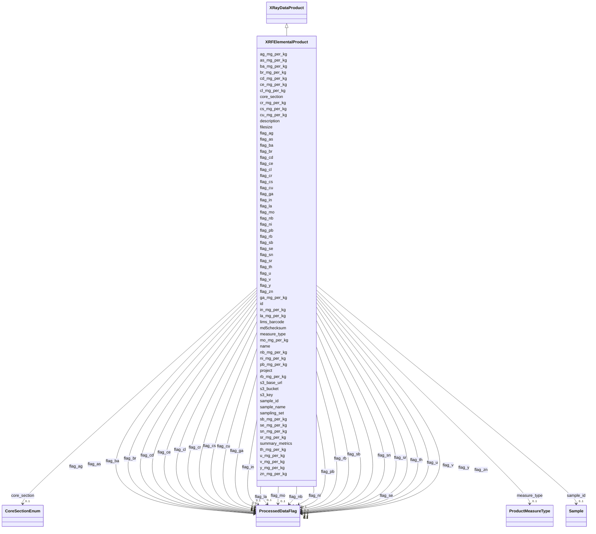

# Class: XRFElementalProduct 


_X-ray Fluorescence (XRF) elemental concentration data._

_One row per sample with columns for each element measured._

__

_Follows the wide-format pattern established by IonsAnalysisProduct._

_Element concentrations in mg/kg (parts per million dry weight basis) as float values._

_Individual QC flags for each element using ProcessedDataFlag enum._

__

_Relationship to core tables:_

_  - id: FK -> processedData.id (1:1 linkage)_

_  - processedData.type = 'XRFElementalProduct'_

_  - processedData.workflow_id = NULL (direct acquisition; no computational WEA)_

_  - processedData.summary_metrics = {"Ni_mg_kg":45.3, "Pb_mg_kg":8.2, ...}_

_  - processedData.s3_key = path to raw spectrum or calibrated CSV in MinIO_

__

_Standard XRF element panel (27 elements):_

_  Trace metals: Cl, V, Cr, Ni, Cu, Zn, Ga, As, Se, Br, Rb, Sr, Y, Nb, Mo,_

_                Ag, Cd, In, Sn, Sb, Cs, Ba, La, Ce, Pb, Th, U_

__

_Required enum additions to enums.yaml:_

_  product:_

_    XRFElementalProduct:  # Add to product permissible_values_


URI: [analysis_api_schema:XRFElementalProduct](https://w3id.org/MONet/analysis-api-schema/XRFElementalProduct)





## Inheritance
* [DataProduct](DataProduct.md)
    * [ProcessedData](ProcessedData.md)
        * [XRayDataProduct](XRayDataProduct.md)
            * **XRFElementalProduct**


## Slots

| Name | Cardinality and Range | Description | Inheritance |
| ---  | --- | --- | --- |
| [measure_type](measure_type.md) | 0..1 <br/> [ProductMeasureType](ProductMeasureType.md) | Whether the measurement recorded is a single measurement, one of a set of  re... | direct |
| [cl_mg_per_kg](cl_mg_per_kg.md) | 0..1 <br/> [Float](Float.md) | Chlorine concentration in mg/kg | direct |
| [v_mg_per_kg](v_mg_per_kg.md) | 0..1 <br/> [Float](Float.md) | Vanadium concentration in mg/kg | direct |
| [cr_mg_per_kg](cr_mg_per_kg.md) | 0..1 <br/> [Float](Float.md) | Chromium concentration in mg/kg | direct |
| [ni_mg_per_kg](ni_mg_per_kg.md) | 0..1 <br/> [Float](Float.md) | Nickel concentration in mg/kg | direct |
| [cu_mg_per_kg](cu_mg_per_kg.md) | 0..1 <br/> [Float](Float.md) | Copper concentration in mg/kg | direct |
| [zn_mg_per_kg](zn_mg_per_kg.md) | 0..1 <br/> [Float](Float.md) | Zinc concentration in mg/kg | direct |
| [ga_mg_per_kg](ga_mg_per_kg.md) | 0..1 <br/> [Float](Float.md) | Gallium concentration in mg/kg | direct |
| [as_mg_per_kg](as_mg_per_kg.md) | 0..1 <br/> [Float](Float.md) | Arsenic concentration in mg/kg | direct |
| [se_mg_per_kg](se_mg_per_kg.md) | 0..1 <br/> [Float](Float.md) | Selenium concentration in mg/kg | direct |
| [br_mg_per_kg](br_mg_per_kg.md) | 0..1 <br/> [Float](Float.md) | Bromine concentration in mg/kg | direct |
| [rb_mg_per_kg](rb_mg_per_kg.md) | 0..1 <br/> [Float](Float.md) | Rubidium concentration in mg/kg | direct |
| [sr_mg_per_kg](sr_mg_per_kg.md) | 0..1 <br/> [Float](Float.md) | Strontium concentration in mg/kg | direct |
| [y_mg_per_kg](y_mg_per_kg.md) | 0..1 <br/> [Float](Float.md) | Yttrium concentration in mg/kg | direct |
| [nb_mg_per_kg](nb_mg_per_kg.md) | 0..1 <br/> [Float](Float.md) | Niobium concentration in mg/kg | direct |
| [mo_mg_per_kg](mo_mg_per_kg.md) | 0..1 <br/> [Float](Float.md) | Molybdenum concentration in mg/kg | direct |
| [ag_mg_per_kg](ag_mg_per_kg.md) | 0..1 <br/> [Float](Float.md) | Silver concentration in mg/kg | direct |
| [cd_mg_per_kg](cd_mg_per_kg.md) | 0..1 <br/> [Float](Float.md) | Cadmium concentration in mg/kg | direct |
| [in_mg_per_kg](in_mg_per_kg.md) | 0..1 <br/> [Float](Float.md) | Indium concentration in mg/kg | direct |
| [sn_mg_per_kg](sn_mg_per_kg.md) | 0..1 <br/> [Float](Float.md) | Tin concentration in mg/kg | direct |
| [sb_mg_per_kg](sb_mg_per_kg.md) | 0..1 <br/> [Float](Float.md) | Antimony concentration in mg/kg | direct |
| [cs_mg_per_kg](cs_mg_per_kg.md) | 0..1 <br/> [Float](Float.md) | Cesium concentration in mg/kg | direct |
| [ba_mg_per_kg](ba_mg_per_kg.md) | 0..1 <br/> [Float](Float.md) | Barium concentration in mg/kg | direct |
| [la_mg_per_kg](la_mg_per_kg.md) | 0..1 <br/> [Float](Float.md) | Lanthanum concentration in mg/kg | direct |
| [ce_mg_per_kg](ce_mg_per_kg.md) | 0..1 <br/> [Float](Float.md) | Cerium concentration in mg/kg | direct |
| [pb_mg_per_kg](pb_mg_per_kg.md) | 0..1 <br/> [Float](Float.md) | Lead concentration in mg/kg | direct |
| [th_mg_per_kg](th_mg_per_kg.md) | 0..1 <br/> [Float](Float.md) | Thorium concentration in mg/kg | direct |
| [u_mg_per_kg](u_mg_per_kg.md) | 0..1 <br/> [Float](Float.md) | Uranium concentration in mg/kg | direct |
| [flag_cl](flag_cl.md) | 0..1 <br/> [ProcessedDataFlag](ProcessedDataFlag.md) |  | direct |
| [flag_v](flag_v.md) | 0..1 <br/> [ProcessedDataFlag](ProcessedDataFlag.md) |  | direct |
| [flag_cr](flag_cr.md) | 0..1 <br/> [ProcessedDataFlag](ProcessedDataFlag.md) |  | direct |
| [flag_ni](flag_ni.md) | 0..1 <br/> [ProcessedDataFlag](ProcessedDataFlag.md) |  | direct |
| [flag_cu](flag_cu.md) | 0..1 <br/> [ProcessedDataFlag](ProcessedDataFlag.md) |  | direct |
| [flag_zn](flag_zn.md) | 0..1 <br/> [ProcessedDataFlag](ProcessedDataFlag.md) |  | direct |
| [flag_ga](flag_ga.md) | 0..1 <br/> [ProcessedDataFlag](ProcessedDataFlag.md) |  | direct |
| [flag_as](flag_as.md) | 0..1 <br/> [ProcessedDataFlag](ProcessedDataFlag.md) |  | direct |
| [flag_se](flag_se.md) | 0..1 <br/> [ProcessedDataFlag](ProcessedDataFlag.md) |  | direct |
| [flag_br](flag_br.md) | 0..1 <br/> [ProcessedDataFlag](ProcessedDataFlag.md) |  | direct |
| [flag_rb](flag_rb.md) | 0..1 <br/> [ProcessedDataFlag](ProcessedDataFlag.md) |  | direct |
| [flag_sr](flag_sr.md) | 0..1 <br/> [ProcessedDataFlag](ProcessedDataFlag.md) |  | direct |
| [flag_y](flag_y.md) | 0..1 <br/> [ProcessedDataFlag](ProcessedDataFlag.md) |  | direct |
| [flag_nb](flag_nb.md) | 0..1 <br/> [ProcessedDataFlag](ProcessedDataFlag.md) |  | direct |
| [flag_mo](flag_mo.md) | 0..1 <br/> [ProcessedDataFlag](ProcessedDataFlag.md) |  | direct |
| [flag_ag](flag_ag.md) | 0..1 <br/> [ProcessedDataFlag](ProcessedDataFlag.md) |  | direct |
| [flag_cd](flag_cd.md) | 0..1 <br/> [ProcessedDataFlag](ProcessedDataFlag.md) |  | direct |
| [flag_in](flag_in.md) | 0..1 <br/> [ProcessedDataFlag](ProcessedDataFlag.md) |  | direct |
| [flag_sn](flag_sn.md) | 0..1 <br/> [ProcessedDataFlag](ProcessedDataFlag.md) |  | direct |
| [flag_sb](flag_sb.md) | 0..1 <br/> [ProcessedDataFlag](ProcessedDataFlag.md) |  | direct |
| [flag_cs](flag_cs.md) | 0..1 <br/> [ProcessedDataFlag](ProcessedDataFlag.md) |  | direct |
| [flag_ba](flag_ba.md) | 0..1 <br/> [ProcessedDataFlag](ProcessedDataFlag.md) |  | direct |
| [flag_la](flag_la.md) | 0..1 <br/> [ProcessedDataFlag](ProcessedDataFlag.md) |  | direct |
| [flag_ce](flag_ce.md) | 0..1 <br/> [ProcessedDataFlag](ProcessedDataFlag.md) |  | direct |
| [flag_pb](flag_pb.md) | 0..1 <br/> [ProcessedDataFlag](ProcessedDataFlag.md) |  | direct |
| [flag_th](flag_th.md) | 0..1 <br/> [ProcessedDataFlag](ProcessedDataFlag.md) |  | direct |
| [flag_u](flag_u.md) | 0..1 <br/> [ProcessedDataFlag](ProcessedDataFlag.md) |  | direct |
| [summary_metrics](summary_metrics.md) | 0..1 <br/> [String](String.md) | Lightweight per-product summary for common queries that avoid full file downl... | [ProcessedData](ProcessedData.md) |
| [lims_barcode](lims_barcode.md) | 0..1 <br/> [String](String.md) | LIMS barcode identifier | [ProcessedData](ProcessedData.md) |
| [sample_id](sample_id.md) | 0..1 <br/> [Sample](Sample.md) | Link back to the originating sample | [ProcessedData](ProcessedData.md) |
| [name](name.md) | 1 <br/> [String](String.md) | Human-readable name for the entity or activity | [DataProduct](DataProduct.md) |
| [description](description.md) | 0..1 <br/> [String](String.md) | Human-readable description for the entity or activity | [DataProduct](DataProduct.md) |
| [project](project.md) | 0..1 <br/> [Integer](Integer.md) | Identifier for the user project associated with the entity or activity | [DataProduct](DataProduct.md) |
| [sampling_set](sampling_set.md) | 0..1 <br/> [Integer](Integer.md) | Sampling set number for grouping related samples collected together | [DataProduct](DataProduct.md) |
| [core_section](core_section.md) | 0..1 <br/> [CoreSectionEnum](CoreSectionEnum.md) | The section of the core | [DataProduct](DataProduct.md) |
| [sample_name](sample_name.md) | 0..1 <br/> [String](String.md) | The name or label that is present on the shipped sample | [DataProduct](DataProduct.md) |
| [s3_base_url](s3_base_url.md) | 0..1 <br/> [String](String.md) |  | [DataProduct](DataProduct.md) |
| [s3_bucket](s3_bucket.md) | 0..1 <br/> [String](String.md) |  | [DataProduct](DataProduct.md) |
| [s3_key](s3_key.md) | 1 <br/> [String](String.md) | MinIO/S3 object key; required for all data products | [DataProduct](DataProduct.md) |
| [filesize](filesize.md) | 0..1 <br/> [Integer](Integer.md) | Size of the file in bytes | [DataProduct](DataProduct.md) |
| [md5checksum](md5checksum.md) | 0..1 <br/> [String](String.md) |  | [DataProduct](DataProduct.md) |
| [id](id.md) | 1 <br/> [Uuid](Uuid.md) |  | [DataProduct](DataProduct.md) |


## Identifier and Mapping Information


### Schema Source


* from schema: https://w3id.org/MONet/analysis-api-schema


## Mappings

| Mapping Type | Mapped Value |
| ---  | ---  |
| self | analysis_api_schema:XRFElementalProduct |
| native | analysis_api_schema:XRFElementalProduct |


## LinkML Source

<!-- TODO: investigate https://stackoverflow.com/questions/37606292/how-to-create-tabbed-code-blocks-in-mkdocs-or-sphinx -->

### Direct

<details>
```yaml
name: XRFElementalProduct
description: "X-ray Fluorescence (XRF) elemental concentration data.\nOne row per\
  \ sample with columns for each element measured.\n\nFollows the wide-format pattern\
  \ established by IonsAnalysisProduct.\nElement concentrations in mg/kg (parts per\
  \ million dry weight basis) as float values.\nIndividual QC flags for each element\
  \ using ProcessedDataFlag enum.\n\nRelationship to core tables:\n  - id: FK -> processedData.id\
  \ (1:1 linkage)\n  - processedData.type = 'XRFElementalProduct'\n  - processedData.workflow_id\
  \ = NULL (direct acquisition; no computational WEA)\n  - processedData.summary_metrics\
  \ = {\"Ni_mg_kg\":45.3, \"Pb_mg_kg\":8.2, ...}\n  - processedData.s3_key = path\
  \ to raw spectrum or calibrated CSV in MinIO\n\nStandard XRF element panel (27 elements):\n\
  \  Trace metals: Cl, V, Cr, Ni, Cu, Zn, Ga, As, Se, Br, Rb, Sr, Y, Nb, Mo,\n   \
  \             Ag, Cd, In, Sn, Sb, Cs, Ba, La, Ce, Pb, Th, U\n\nRequired enum additions\
  \ to enums.yaml:\n  product:\n    XRFElementalProduct:  # Add to product permissible_values"
from_schema: https://w3id.org/MONet/analysis-api-schema
is_a: XRayDataProduct
slots:
- measure_type
attributes:
  cl_mg_per_kg:
    name: cl_mg_per_kg
    description: Chlorine concentration in mg/kg
    from_schema: https://w3id.org/MONet/analysis-api-schema/products
    rank: 1000
    domain_of:
    - XRFElementalProduct
    range: float
  v_mg_per_kg:
    name: v_mg_per_kg
    description: Vanadium concentration in mg/kg
    from_schema: https://w3id.org/MONet/analysis-api-schema/products
    rank: 1000
    domain_of:
    - XRFElementalProduct
    range: float
  cr_mg_per_kg:
    name: cr_mg_per_kg
    description: Chromium concentration in mg/kg
    from_schema: https://w3id.org/MONet/analysis-api-schema/products
    rank: 1000
    domain_of:
    - XRFElementalProduct
    range: float
  ni_mg_per_kg:
    name: ni_mg_per_kg
    description: Nickel concentration in mg/kg
    from_schema: https://w3id.org/MONet/analysis-api-schema/products
    rank: 1000
    domain_of:
    - XRFElementalProduct
    range: float
  cu_mg_per_kg:
    name: cu_mg_per_kg
    description: Copper concentration in mg/kg
    from_schema: https://w3id.org/MONet/analysis-api-schema/products
    rank: 1000
    domain_of:
    - XRFElementalProduct
    range: float
  zn_mg_per_kg:
    name: zn_mg_per_kg
    description: Zinc concentration in mg/kg
    from_schema: https://w3id.org/MONet/analysis-api-schema/products
    rank: 1000
    domain_of:
    - XRFElementalProduct
    range: float
  ga_mg_per_kg:
    name: ga_mg_per_kg
    description: Gallium concentration in mg/kg
    from_schema: https://w3id.org/MONet/analysis-api-schema/products
    rank: 1000
    domain_of:
    - XRFElementalProduct
    range: float
  as_mg_per_kg:
    name: as_mg_per_kg
    description: Arsenic concentration in mg/kg
    from_schema: https://w3id.org/MONet/analysis-api-schema/products
    rank: 1000
    domain_of:
    - XRFElementalProduct
    range: float
  se_mg_per_kg:
    name: se_mg_per_kg
    description: Selenium concentration in mg/kg
    from_schema: https://w3id.org/MONet/analysis-api-schema/products
    rank: 1000
    domain_of:
    - XRFElementalProduct
    range: float
  br_mg_per_kg:
    name: br_mg_per_kg
    description: Bromine concentration in mg/kg
    from_schema: https://w3id.org/MONet/analysis-api-schema/products
    rank: 1000
    domain_of:
    - XRFElementalProduct
    range: float
  rb_mg_per_kg:
    name: rb_mg_per_kg
    description: Rubidium concentration in mg/kg
    from_schema: https://w3id.org/MONet/analysis-api-schema/products
    rank: 1000
    domain_of:
    - XRFElementalProduct
    range: float
  sr_mg_per_kg:
    name: sr_mg_per_kg
    description: Strontium concentration in mg/kg
    from_schema: https://w3id.org/MONet/analysis-api-schema/products
    rank: 1000
    domain_of:
    - XRFElementalProduct
    range: float
  y_mg_per_kg:
    name: y_mg_per_kg
    description: Yttrium concentration in mg/kg
    from_schema: https://w3id.org/MONet/analysis-api-schema/products
    rank: 1000
    domain_of:
    - XRFElementalProduct
    range: float
  nb_mg_per_kg:
    name: nb_mg_per_kg
    description: Niobium concentration in mg/kg
    from_schema: https://w3id.org/MONet/analysis-api-schema/products
    rank: 1000
    domain_of:
    - XRFElementalProduct
    range: float
  mo_mg_per_kg:
    name: mo_mg_per_kg
    description: Molybdenum concentration in mg/kg
    from_schema: https://w3id.org/MONet/analysis-api-schema/products
    rank: 1000
    domain_of:
    - XRFElementalProduct
    range: float
  ag_mg_per_kg:
    name: ag_mg_per_kg
    description: Silver concentration in mg/kg
    from_schema: https://w3id.org/MONet/analysis-api-schema/products
    rank: 1000
    domain_of:
    - XRFElementalProduct
    range: float
  cd_mg_per_kg:
    name: cd_mg_per_kg
    description: Cadmium concentration in mg/kg
    from_schema: https://w3id.org/MONet/analysis-api-schema/products
    rank: 1000
    domain_of:
    - XRFElementalProduct
    range: float
  in_mg_per_kg:
    name: in_mg_per_kg
    description: Indium concentration in mg/kg
    from_schema: https://w3id.org/MONet/analysis-api-schema/products
    rank: 1000
    domain_of:
    - XRFElementalProduct
    range: float
  sn_mg_per_kg:
    name: sn_mg_per_kg
    description: Tin concentration in mg/kg
    from_schema: https://w3id.org/MONet/analysis-api-schema/products
    rank: 1000
    domain_of:
    - XRFElementalProduct
    range: float
  sb_mg_per_kg:
    name: sb_mg_per_kg
    description: Antimony concentration in mg/kg
    from_schema: https://w3id.org/MONet/analysis-api-schema/products
    rank: 1000
    domain_of:
    - XRFElementalProduct
    range: float
  cs_mg_per_kg:
    name: cs_mg_per_kg
    description: Cesium concentration in mg/kg
    from_schema: https://w3id.org/MONet/analysis-api-schema/products
    rank: 1000
    domain_of:
    - XRFElementalProduct
    range: float
  ba_mg_per_kg:
    name: ba_mg_per_kg
    description: Barium concentration in mg/kg
    from_schema: https://w3id.org/MONet/analysis-api-schema/products
    rank: 1000
    domain_of:
    - XRFElementalProduct
    range: float
  la_mg_per_kg:
    name: la_mg_per_kg
    description: Lanthanum concentration in mg/kg
    from_schema: https://w3id.org/MONet/analysis-api-schema/products
    rank: 1000
    domain_of:
    - XRFElementalProduct
    range: float
  ce_mg_per_kg:
    name: ce_mg_per_kg
    description: Cerium concentration in mg/kg
    from_schema: https://w3id.org/MONet/analysis-api-schema/products
    rank: 1000
    domain_of:
    - XRFElementalProduct
    range: float
  pb_mg_per_kg:
    name: pb_mg_per_kg
    description: Lead concentration in mg/kg
    from_schema: https://w3id.org/MONet/analysis-api-schema/products
    rank: 1000
    domain_of:
    - XRFElementalProduct
    range: float
  th_mg_per_kg:
    name: th_mg_per_kg
    description: Thorium concentration in mg/kg
    from_schema: https://w3id.org/MONet/analysis-api-schema/products
    rank: 1000
    domain_of:
    - XRFElementalProduct
    range: float
  u_mg_per_kg:
    name: u_mg_per_kg
    description: Uranium concentration in mg/kg
    from_schema: https://w3id.org/MONet/analysis-api-schema/products
    rank: 1000
    domain_of:
    - XRFElementalProduct
    range: float
  flag_cl:
    name: flag_cl
    from_schema: https://w3id.org/MONet/analysis-api-schema/products
    rank: 1000
    domain_of:
    - XRFElementalProduct
    range: ProcessedDataFlag
  flag_v:
    name: flag_v
    from_schema: https://w3id.org/MONet/analysis-api-schema/products
    rank: 1000
    domain_of:
    - XRFElementalProduct
    range: ProcessedDataFlag
  flag_cr:
    name: flag_cr
    from_schema: https://w3id.org/MONet/analysis-api-schema/products
    rank: 1000
    domain_of:
    - XRFElementalProduct
    range: ProcessedDataFlag
  flag_ni:
    name: flag_ni
    from_schema: https://w3id.org/MONet/analysis-api-schema/products
    rank: 1000
    domain_of:
    - XRFElementalProduct
    range: ProcessedDataFlag
  flag_cu:
    name: flag_cu
    from_schema: https://w3id.org/MONet/analysis-api-schema/products
    rank: 1000
    domain_of:
    - XRFElementalProduct
    range: ProcessedDataFlag
  flag_zn:
    name: flag_zn
    from_schema: https://w3id.org/MONet/analysis-api-schema/products
    rank: 1000
    domain_of:
    - XRFElementalProduct
    range: ProcessedDataFlag
  flag_ga:
    name: flag_ga
    from_schema: https://w3id.org/MONet/analysis-api-schema/products
    rank: 1000
    domain_of:
    - XRFElementalProduct
    range: ProcessedDataFlag
  flag_as:
    name: flag_as
    from_schema: https://w3id.org/MONet/analysis-api-schema/products
    rank: 1000
    domain_of:
    - XRFElementalProduct
    range: ProcessedDataFlag
  flag_se:
    name: flag_se
    from_schema: https://w3id.org/MONet/analysis-api-schema/products
    rank: 1000
    domain_of:
    - XRFElementalProduct
    range: ProcessedDataFlag
  flag_br:
    name: flag_br
    from_schema: https://w3id.org/MONet/analysis-api-schema/products
    rank: 1000
    domain_of:
    - XRFElementalProduct
    range: ProcessedDataFlag
  flag_rb:
    name: flag_rb
    from_schema: https://w3id.org/MONet/analysis-api-schema/products
    rank: 1000
    domain_of:
    - XRFElementalProduct
    range: ProcessedDataFlag
  flag_sr:
    name: flag_sr
    from_schema: https://w3id.org/MONet/analysis-api-schema/products
    rank: 1000
    domain_of:
    - XRFElementalProduct
    range: ProcessedDataFlag
  flag_y:
    name: flag_y
    from_schema: https://w3id.org/MONet/analysis-api-schema/products
    rank: 1000
    domain_of:
    - XRFElementalProduct
    range: ProcessedDataFlag
  flag_nb:
    name: flag_nb
    from_schema: https://w3id.org/MONet/analysis-api-schema/products
    rank: 1000
    domain_of:
    - XRFElementalProduct
    range: ProcessedDataFlag
  flag_mo:
    name: flag_mo
    from_schema: https://w3id.org/MONet/analysis-api-schema/products
    rank: 1000
    domain_of:
    - XRFElementalProduct
    range: ProcessedDataFlag
  flag_ag:
    name: flag_ag
    from_schema: https://w3id.org/MONet/analysis-api-schema/products
    rank: 1000
    domain_of:
    - XRFElementalProduct
    range: ProcessedDataFlag
  flag_cd:
    name: flag_cd
    from_schema: https://w3id.org/MONet/analysis-api-schema/products
    rank: 1000
    domain_of:
    - XRFElementalProduct
    range: ProcessedDataFlag
  flag_in:
    name: flag_in
    from_schema: https://w3id.org/MONet/analysis-api-schema/products
    rank: 1000
    domain_of:
    - XRFElementalProduct
    range: ProcessedDataFlag
  flag_sn:
    name: flag_sn
    from_schema: https://w3id.org/MONet/analysis-api-schema/products
    rank: 1000
    domain_of:
    - XRFElementalProduct
    range: ProcessedDataFlag
  flag_sb:
    name: flag_sb
    from_schema: https://w3id.org/MONet/analysis-api-schema/products
    rank: 1000
    domain_of:
    - XRFElementalProduct
    range: ProcessedDataFlag
  flag_cs:
    name: flag_cs
    from_schema: https://w3id.org/MONet/analysis-api-schema/products
    rank: 1000
    domain_of:
    - XRFElementalProduct
    range: ProcessedDataFlag
  flag_ba:
    name: flag_ba
    from_schema: https://w3id.org/MONet/analysis-api-schema/products
    rank: 1000
    domain_of:
    - XRFElementalProduct
    range: ProcessedDataFlag
  flag_la:
    name: flag_la
    from_schema: https://w3id.org/MONet/analysis-api-schema/products
    rank: 1000
    domain_of:
    - XRFElementalProduct
    range: ProcessedDataFlag
  flag_ce:
    name: flag_ce
    from_schema: https://w3id.org/MONet/analysis-api-schema/products
    rank: 1000
    domain_of:
    - XRFElementalProduct
    range: ProcessedDataFlag
  flag_pb:
    name: flag_pb
    from_schema: https://w3id.org/MONet/analysis-api-schema/products
    rank: 1000
    domain_of:
    - XRFElementalProduct
    range: ProcessedDataFlag
  flag_th:
    name: flag_th
    from_schema: https://w3id.org/MONet/analysis-api-schema/products
    rank: 1000
    domain_of:
    - XRFElementalProduct
    range: ProcessedDataFlag
  flag_u:
    name: flag_u
    from_schema: https://w3id.org/MONet/analysis-api-schema/products
    rank: 1000
    domain_of:
    - XRFElementalProduct
    range: ProcessedDataFlag

```
</details>

### Induced

<details>
```yaml
name: XRFElementalProduct
description: "X-ray Fluorescence (XRF) elemental concentration data.\nOne row per\
  \ sample with columns for each element measured.\n\nFollows the wide-format pattern\
  \ established by IonsAnalysisProduct.\nElement concentrations in mg/kg (parts per\
  \ million dry weight basis) as float values.\nIndividual QC flags for each element\
  \ using ProcessedDataFlag enum.\n\nRelationship to core tables:\n  - id: FK -> processedData.id\
  \ (1:1 linkage)\n  - processedData.type = 'XRFElementalProduct'\n  - processedData.workflow_id\
  \ = NULL (direct acquisition; no computational WEA)\n  - processedData.summary_metrics\
  \ = {\"Ni_mg_kg\":45.3, \"Pb_mg_kg\":8.2, ...}\n  - processedData.s3_key = path\
  \ to raw spectrum or calibrated CSV in MinIO\n\nStandard XRF element panel (27 elements):\n\
  \  Trace metals: Cl, V, Cr, Ni, Cu, Zn, Ga, As, Se, Br, Rb, Sr, Y, Nb, Mo,\n   \
  \             Ag, Cd, In, Sn, Sb, Cs, Ba, La, Ce, Pb, Th, U\n\nRequired enum additions\
  \ to enums.yaml:\n  product:\n    XRFElementalProduct:  # Add to product permissible_values"
from_schema: https://w3id.org/MONet/analysis-api-schema
is_a: XRayDataProduct
attributes:
  cl_mg_per_kg:
    name: cl_mg_per_kg
    description: Chlorine concentration in mg/kg
    from_schema: https://w3id.org/MONet/analysis-api-schema/products
    rank: 1000
    alias: cl_mg_per_kg
    owner: XRFElementalProduct
    domain_of:
    - XRFElementalProduct
    range: float
  v_mg_per_kg:
    name: v_mg_per_kg
    description: Vanadium concentration in mg/kg
    from_schema: https://w3id.org/MONet/analysis-api-schema/products
    rank: 1000
    alias: v_mg_per_kg
    owner: XRFElementalProduct
    domain_of:
    - XRFElementalProduct
    range: float
  cr_mg_per_kg:
    name: cr_mg_per_kg
    description: Chromium concentration in mg/kg
    from_schema: https://w3id.org/MONet/analysis-api-schema/products
    rank: 1000
    alias: cr_mg_per_kg
    owner: XRFElementalProduct
    domain_of:
    - XRFElementalProduct
    range: float
  ni_mg_per_kg:
    name: ni_mg_per_kg
    description: Nickel concentration in mg/kg
    from_schema: https://w3id.org/MONet/analysis-api-schema/products
    rank: 1000
    alias: ni_mg_per_kg
    owner: XRFElementalProduct
    domain_of:
    - XRFElementalProduct
    range: float
  cu_mg_per_kg:
    name: cu_mg_per_kg
    description: Copper concentration in mg/kg
    from_schema: https://w3id.org/MONet/analysis-api-schema/products
    rank: 1000
    alias: cu_mg_per_kg
    owner: XRFElementalProduct
    domain_of:
    - XRFElementalProduct
    range: float
  zn_mg_per_kg:
    name: zn_mg_per_kg
    description: Zinc concentration in mg/kg
    from_schema: https://w3id.org/MONet/analysis-api-schema/products
    rank: 1000
    alias: zn_mg_per_kg
    owner: XRFElementalProduct
    domain_of:
    - XRFElementalProduct
    range: float
  ga_mg_per_kg:
    name: ga_mg_per_kg
    description: Gallium concentration in mg/kg
    from_schema: https://w3id.org/MONet/analysis-api-schema/products
    rank: 1000
    alias: ga_mg_per_kg
    owner: XRFElementalProduct
    domain_of:
    - XRFElementalProduct
    range: float
  as_mg_per_kg:
    name: as_mg_per_kg
    description: Arsenic concentration in mg/kg
    from_schema: https://w3id.org/MONet/analysis-api-schema/products
    rank: 1000
    alias: as_mg_per_kg
    owner: XRFElementalProduct
    domain_of:
    - XRFElementalProduct
    range: float
  se_mg_per_kg:
    name: se_mg_per_kg
    description: Selenium concentration in mg/kg
    from_schema: https://w3id.org/MONet/analysis-api-schema/products
    rank: 1000
    alias: se_mg_per_kg
    owner: XRFElementalProduct
    domain_of:
    - XRFElementalProduct
    range: float
  br_mg_per_kg:
    name: br_mg_per_kg
    description: Bromine concentration in mg/kg
    from_schema: https://w3id.org/MONet/analysis-api-schema/products
    rank: 1000
    alias: br_mg_per_kg
    owner: XRFElementalProduct
    domain_of:
    - XRFElementalProduct
    range: float
  rb_mg_per_kg:
    name: rb_mg_per_kg
    description: Rubidium concentration in mg/kg
    from_schema: https://w3id.org/MONet/analysis-api-schema/products
    rank: 1000
    alias: rb_mg_per_kg
    owner: XRFElementalProduct
    domain_of:
    - XRFElementalProduct
    range: float
  sr_mg_per_kg:
    name: sr_mg_per_kg
    description: Strontium concentration in mg/kg
    from_schema: https://w3id.org/MONet/analysis-api-schema/products
    rank: 1000
    alias: sr_mg_per_kg
    owner: XRFElementalProduct
    domain_of:
    - XRFElementalProduct
    range: float
  y_mg_per_kg:
    name: y_mg_per_kg
    description: Yttrium concentration in mg/kg
    from_schema: https://w3id.org/MONet/analysis-api-schema/products
    rank: 1000
    alias: y_mg_per_kg
    owner: XRFElementalProduct
    domain_of:
    - XRFElementalProduct
    range: float
  nb_mg_per_kg:
    name: nb_mg_per_kg
    description: Niobium concentration in mg/kg
    from_schema: https://w3id.org/MONet/analysis-api-schema/products
    rank: 1000
    alias: nb_mg_per_kg
    owner: XRFElementalProduct
    domain_of:
    - XRFElementalProduct
    range: float
  mo_mg_per_kg:
    name: mo_mg_per_kg
    description: Molybdenum concentration in mg/kg
    from_schema: https://w3id.org/MONet/analysis-api-schema/products
    rank: 1000
    alias: mo_mg_per_kg
    owner: XRFElementalProduct
    domain_of:
    - XRFElementalProduct
    range: float
  ag_mg_per_kg:
    name: ag_mg_per_kg
    description: Silver concentration in mg/kg
    from_schema: https://w3id.org/MONet/analysis-api-schema/products
    rank: 1000
    alias: ag_mg_per_kg
    owner: XRFElementalProduct
    domain_of:
    - XRFElementalProduct
    range: float
  cd_mg_per_kg:
    name: cd_mg_per_kg
    description: Cadmium concentration in mg/kg
    from_schema: https://w3id.org/MONet/analysis-api-schema/products
    rank: 1000
    alias: cd_mg_per_kg
    owner: XRFElementalProduct
    domain_of:
    - XRFElementalProduct
    range: float
  in_mg_per_kg:
    name: in_mg_per_kg
    description: Indium concentration in mg/kg
    from_schema: https://w3id.org/MONet/analysis-api-schema/products
    rank: 1000
    alias: in_mg_per_kg
    owner: XRFElementalProduct
    domain_of:
    - XRFElementalProduct
    range: float
  sn_mg_per_kg:
    name: sn_mg_per_kg
    description: Tin concentration in mg/kg
    from_schema: https://w3id.org/MONet/analysis-api-schema/products
    rank: 1000
    alias: sn_mg_per_kg
    owner: XRFElementalProduct
    domain_of:
    - XRFElementalProduct
    range: float
  sb_mg_per_kg:
    name: sb_mg_per_kg
    description: Antimony concentration in mg/kg
    from_schema: https://w3id.org/MONet/analysis-api-schema/products
    rank: 1000
    alias: sb_mg_per_kg
    owner: XRFElementalProduct
    domain_of:
    - XRFElementalProduct
    range: float
  cs_mg_per_kg:
    name: cs_mg_per_kg
    description: Cesium concentration in mg/kg
    from_schema: https://w3id.org/MONet/analysis-api-schema/products
    rank: 1000
    alias: cs_mg_per_kg
    owner: XRFElementalProduct
    domain_of:
    - XRFElementalProduct
    range: float
  ba_mg_per_kg:
    name: ba_mg_per_kg
    description: Barium concentration in mg/kg
    from_schema: https://w3id.org/MONet/analysis-api-schema/products
    rank: 1000
    alias: ba_mg_per_kg
    owner: XRFElementalProduct
    domain_of:
    - XRFElementalProduct
    range: float
  la_mg_per_kg:
    name: la_mg_per_kg
    description: Lanthanum concentration in mg/kg
    from_schema: https://w3id.org/MONet/analysis-api-schema/products
    rank: 1000
    alias: la_mg_per_kg
    owner: XRFElementalProduct
    domain_of:
    - XRFElementalProduct
    range: float
  ce_mg_per_kg:
    name: ce_mg_per_kg
    description: Cerium concentration in mg/kg
    from_schema: https://w3id.org/MONet/analysis-api-schema/products
    rank: 1000
    alias: ce_mg_per_kg
    owner: XRFElementalProduct
    domain_of:
    - XRFElementalProduct
    range: float
  pb_mg_per_kg:
    name: pb_mg_per_kg
    description: Lead concentration in mg/kg
    from_schema: https://w3id.org/MONet/analysis-api-schema/products
    rank: 1000
    alias: pb_mg_per_kg
    owner: XRFElementalProduct
    domain_of:
    - XRFElementalProduct
    range: float
  th_mg_per_kg:
    name: th_mg_per_kg
    description: Thorium concentration in mg/kg
    from_schema: https://w3id.org/MONet/analysis-api-schema/products
    rank: 1000
    alias: th_mg_per_kg
    owner: XRFElementalProduct
    domain_of:
    - XRFElementalProduct
    range: float
  u_mg_per_kg:
    name: u_mg_per_kg
    description: Uranium concentration in mg/kg
    from_schema: https://w3id.org/MONet/analysis-api-schema/products
    rank: 1000
    alias: u_mg_per_kg
    owner: XRFElementalProduct
    domain_of:
    - XRFElementalProduct
    range: float
  flag_cl:
    name: flag_cl
    from_schema: https://w3id.org/MONet/analysis-api-schema/products
    rank: 1000
    alias: flag_cl
    owner: XRFElementalProduct
    domain_of:
    - XRFElementalProduct
    range: ProcessedDataFlag
  flag_v:
    name: flag_v
    from_schema: https://w3id.org/MONet/analysis-api-schema/products
    rank: 1000
    alias: flag_v
    owner: XRFElementalProduct
    domain_of:
    - XRFElementalProduct
    range: ProcessedDataFlag
  flag_cr:
    name: flag_cr
    from_schema: https://w3id.org/MONet/analysis-api-schema/products
    rank: 1000
    alias: flag_cr
    owner: XRFElementalProduct
    domain_of:
    - XRFElementalProduct
    range: ProcessedDataFlag
  flag_ni:
    name: flag_ni
    from_schema: https://w3id.org/MONet/analysis-api-schema/products
    rank: 1000
    alias: flag_ni
    owner: XRFElementalProduct
    domain_of:
    - XRFElementalProduct
    range: ProcessedDataFlag
  flag_cu:
    name: flag_cu
    from_schema: https://w3id.org/MONet/analysis-api-schema/products
    rank: 1000
    alias: flag_cu
    owner: XRFElementalProduct
    domain_of:
    - XRFElementalProduct
    range: ProcessedDataFlag
  flag_zn:
    name: flag_zn
    from_schema: https://w3id.org/MONet/analysis-api-schema/products
    rank: 1000
    alias: flag_zn
    owner: XRFElementalProduct
    domain_of:
    - XRFElementalProduct
    range: ProcessedDataFlag
  flag_ga:
    name: flag_ga
    from_schema: https://w3id.org/MONet/analysis-api-schema/products
    rank: 1000
    alias: flag_ga
    owner: XRFElementalProduct
    domain_of:
    - XRFElementalProduct
    range: ProcessedDataFlag
  flag_as:
    name: flag_as
    from_schema: https://w3id.org/MONet/analysis-api-schema/products
    rank: 1000
    alias: flag_as
    owner: XRFElementalProduct
    domain_of:
    - XRFElementalProduct
    range: ProcessedDataFlag
  flag_se:
    name: flag_se
    from_schema: https://w3id.org/MONet/analysis-api-schema/products
    rank: 1000
    alias: flag_se
    owner: XRFElementalProduct
    domain_of:
    - XRFElementalProduct
    range: ProcessedDataFlag
  flag_br:
    name: flag_br
    from_schema: https://w3id.org/MONet/analysis-api-schema/products
    rank: 1000
    alias: flag_br
    owner: XRFElementalProduct
    domain_of:
    - XRFElementalProduct
    range: ProcessedDataFlag
  flag_rb:
    name: flag_rb
    from_schema: https://w3id.org/MONet/analysis-api-schema/products
    rank: 1000
    alias: flag_rb
    owner: XRFElementalProduct
    domain_of:
    - XRFElementalProduct
    range: ProcessedDataFlag
  flag_sr:
    name: flag_sr
    from_schema: https://w3id.org/MONet/analysis-api-schema/products
    rank: 1000
    alias: flag_sr
    owner: XRFElementalProduct
    domain_of:
    - XRFElementalProduct
    range: ProcessedDataFlag
  flag_y:
    name: flag_y
    from_schema: https://w3id.org/MONet/analysis-api-schema/products
    rank: 1000
    alias: flag_y
    owner: XRFElementalProduct
    domain_of:
    - XRFElementalProduct
    range: ProcessedDataFlag
  flag_nb:
    name: flag_nb
    from_schema: https://w3id.org/MONet/analysis-api-schema/products
    rank: 1000
    alias: flag_nb
    owner: XRFElementalProduct
    domain_of:
    - XRFElementalProduct
    range: ProcessedDataFlag
  flag_mo:
    name: flag_mo
    from_schema: https://w3id.org/MONet/analysis-api-schema/products
    rank: 1000
    alias: flag_mo
    owner: XRFElementalProduct
    domain_of:
    - XRFElementalProduct
    range: ProcessedDataFlag
  flag_ag:
    name: flag_ag
    from_schema: https://w3id.org/MONet/analysis-api-schema/products
    rank: 1000
    alias: flag_ag
    owner: XRFElementalProduct
    domain_of:
    - XRFElementalProduct
    range: ProcessedDataFlag
  flag_cd:
    name: flag_cd
    from_schema: https://w3id.org/MONet/analysis-api-schema/products
    rank: 1000
    alias: flag_cd
    owner: XRFElementalProduct
    domain_of:
    - XRFElementalProduct
    range: ProcessedDataFlag
  flag_in:
    name: flag_in
    from_schema: https://w3id.org/MONet/analysis-api-schema/products
    rank: 1000
    alias: flag_in
    owner: XRFElementalProduct
    domain_of:
    - XRFElementalProduct
    range: ProcessedDataFlag
  flag_sn:
    name: flag_sn
    from_schema: https://w3id.org/MONet/analysis-api-schema/products
    rank: 1000
    alias: flag_sn
    owner: XRFElementalProduct
    domain_of:
    - XRFElementalProduct
    range: ProcessedDataFlag
  flag_sb:
    name: flag_sb
    from_schema: https://w3id.org/MONet/analysis-api-schema/products
    rank: 1000
    alias: flag_sb
    owner: XRFElementalProduct
    domain_of:
    - XRFElementalProduct
    range: ProcessedDataFlag
  flag_cs:
    name: flag_cs
    from_schema: https://w3id.org/MONet/analysis-api-schema/products
    rank: 1000
    alias: flag_cs
    owner: XRFElementalProduct
    domain_of:
    - XRFElementalProduct
    range: ProcessedDataFlag
  flag_ba:
    name: flag_ba
    from_schema: https://w3id.org/MONet/analysis-api-schema/products
    rank: 1000
    alias: flag_ba
    owner: XRFElementalProduct
    domain_of:
    - XRFElementalProduct
    range: ProcessedDataFlag
  flag_la:
    name: flag_la
    from_schema: https://w3id.org/MONet/analysis-api-schema/products
    rank: 1000
    alias: flag_la
    owner: XRFElementalProduct
    domain_of:
    - XRFElementalProduct
    range: ProcessedDataFlag
  flag_ce:
    name: flag_ce
    from_schema: https://w3id.org/MONet/analysis-api-schema/products
    rank: 1000
    alias: flag_ce
    owner: XRFElementalProduct
    domain_of:
    - XRFElementalProduct
    range: ProcessedDataFlag
  flag_pb:
    name: flag_pb
    from_schema: https://w3id.org/MONet/analysis-api-schema/products
    rank: 1000
    alias: flag_pb
    owner: XRFElementalProduct
    domain_of:
    - XRFElementalProduct
    range: ProcessedDataFlag
  flag_th:
    name: flag_th
    from_schema: https://w3id.org/MONet/analysis-api-schema/products
    rank: 1000
    alias: flag_th
    owner: XRFElementalProduct
    domain_of:
    - XRFElementalProduct
    range: ProcessedDataFlag
  flag_u:
    name: flag_u
    from_schema: https://w3id.org/MONet/analysis-api-schema/products
    rank: 1000
    alias: flag_u
    owner: XRFElementalProduct
    domain_of:
    - XRFElementalProduct
    range: ProcessedDataFlag
  measure_type:
    name: measure_type
    description: Whether the measurement recorded is a single measurement, one of
      a set of  replicate measurements, or an average of several replicate measurements.
    from_schema: https://w3id.org/MONet/analysis-api-schema
    rank: 1000
    alias: measure_type
    owner: XRFElementalProduct
    domain_of:
    - BulkDensityProduct
    - ElementalAnalysisProduct
    - EnzymeProduct
    - GWCMoistureProduct
    - HydraulicPropertiesProduct
    - IonsAnalysisProduct
    - MAOMProduct
    - MicrobialBiomassProduct
    - NitrogenAnalysisProduct
    - PhosphorusAnalysisProduct
    - RespirationProduct
    - TextureProduct
    - TomographyProduct
    - WEOMProduct
    - pHProduct
    - XRFElementalProduct
    - XRDPhaseProduct
    range: ProductMeasureType
  summary_metrics:
    name: summary_metrics
    description: "Lightweight per-product summary for common queries that avoid full\
      \ file download.\nDirection: structured key-value pairs; per-type schemas TBD:\n\
      \  ecoplate:  well-level absorbance summaries (position, timepoint, absorbance)\n\
      \  xrf:       per-element concentration results + QC flag\n  lcms:      feature\
      \ count, identification count, MSI-2 fraction\nInterim DB storage: JSONB column\
      \ retained until formal typed class exists."
    todos:
    - make this inined/multivalued?
    from_schema: https://w3id.org/MONet/analysis-api-schema
    rank: 1000
    alias: summary_metrics
    owner: XRFElementalProduct
    domain_of:
    - ProcessedData
    range: string
    required: false
  lims_barcode:
    name: lims_barcode
    description: LIMS barcode identifier
    from_schema: https://w3id.org/MONet/analysis-api-schema
    rank: 1000
    alias: lims_barcode
    owner: XRFElementalProduct
    domain_of:
    - ProcessedData
    - Sample
    range: string
    required: false
  sample_id:
    name: sample_id
    description: Link back to the originating sample
    from_schema: https://w3id.org/MONet/analysis-api-schema
    rank: 1000
    alias: sample_id
    owner: XRFElementalProduct
    domain_of:
    - ProcessedData
    - AMP2WellMetadata
    - MetagenomicsProduct
    range: Sample
    required: false
  name:
    name: name
    description: Human-readable name for the entity or activity.
    from_schema: https://w3id.org/MONet/analysis-api-schema
    rank: 1000
    alias: name
    owner: XRFElementalProduct
    domain_of:
    - Activity
    - Entity
    - DataProduct
    - DataGenerationActivity
    - Instrument
    - OntologyClass
    - ContainerAxis
    - Configuration
    - MobilePhaseSegment
    - MassSpectrometryStandardRun
    - PurchasedMaterial
    - LabProcessingActivity
    - Site
    - Sample
    - SamplingActivity
    - SoilSamplingActivity
    - biological_entity
    - Study
    - SoftwareControlledTermValue
    range: string
    required: true
  description:
    name: description
    description: Human-readable description for the entity or activity
    title: description
    from_schema: https://w3id.org/MONet/analysis-api-schema
    rank: 1000
    alias: description
    owner: XRFElementalProduct
    domain_of:
    - Activity
    - Entity
    - DataProduct
    - DataGenerationActivity
    - DataProcessingActivity
    - OntologyClass
    - ContainerType
    - LabDevice
    - Configuration
    - MassSpectrometryStandardRun
    - PurchasedMaterial
    - LabProcessingActivity
    - Site
    - Sample
    - SamplingActivity
    - SoilSamplingActivity
    - biological_entity
    - Study
    - TimestampValue
    - TextValue
    - SoftwareControlledTermValue
    - ControlledTermValue
    - QuantityValue
    range: string
  project:
    name: project
    description: 'Identifier for the user project associated with the entity or activity. '
    title: Project
    todos:
    - should this be an ID? CURIE can use the one NMDC has https://bioregistry.io/reference/emsl.project:60141
      where emsl.project is the CURIE prefix
    from_schema: https://w3id.org/MONet/analysis-api-schema
    aliases:
    - study
    - study_id
    - project_id
    - proposal
    - proposal_id
    rank: 1000
    alias: project
    owner: XRFElementalProduct
    domain_of:
    - DataProduct
    - AerosolArmSample
    - AerosolSample
    - CommerciallyPurchasedSample
    - CultureEnvironmentalSample
    - FieldDeployedTerraformSample
    - MixedCultureSample
    - MonetSoilSample
    - OtherUndescribedSample
    - PlantSample
    - PureCultureSample
    - SedimentSample
    - SoilSample
    - SynthesizedMaterialSample
    - TerraformSample
    - WaterSample
    - SamplingActivity
    range: integer
  sampling_set:
    name: sampling_set
    description: 'Sampling set number for grouping related samples collected together.

      This is a user-defined sequential integer that can be used to link samples collected

      in the same sampling event or campaign.'
    title: sampling set
    from_schema: https://w3id.org/MONet/analysis-api-schema
    rank: 1000
    alias: sampling_set
    owner: XRFElementalProduct
    domain_of:
    - DataProduct
    - MonetSoilSample
    range: integer
  core_section:
    name: core_section
    description: The section of the core.
    title: core section
    examples:
    - value: TOP
    - value: MID
    - value: BTM
    from_schema: https://w3id.org/MONet/analysis-api-schema
    rank: 1000
    alias: core_section
    owner: XRFElementalProduct
    domain_of:
    - DataProduct
    - CoreSection
    range: CoreSectionEnum
  sample_name:
    name: sample_name
    description: 'The name or label that is present on the shipped sample. This should

      be a human readable name.'
    title: sample name
    notes:
    - This is typically an alias for the inherited 'name' slot on Sample classes.
      Defined separately for compatibility with source data files using 'sample_name'
      column headers.
    from_schema: https://w3id.org/MONet/analysis-api-schema
    aliases:
    - samp_name
    rank: 1000
    alias: sample_name
    owner: XRFElementalProduct
    domain_of:
    - DataProduct
    - AerosolArmSample
    - AerosolSample
    - CommerciallyPurchasedSample
    - CultureEnvironmentalSample
    - FieldDeployedTerraformSample
    - MixedCultureSample
    - MonetSoilSample
    - OtherUndescribedSample
    - PlantSample
    - PureCultureSample
    - SedimentSample
    - SoilSample
    - SynthesizedMaterialSample
    - TerraformSample
    - WaterSample
    range: string
  s3_base_url:
    name: s3_base_url
    from_schema: https://w3id.org/MONet/analysis-api-schema
    rank: 1000
    alias: s3_base_url
    owner: XRFElementalProduct
    domain_of:
    - DataProduct
    range: string
  s3_bucket:
    name: s3_bucket
    from_schema: https://w3id.org/MONet/analysis-api-schema
    rank: 1000
    alias: s3_bucket
    owner: XRFElementalProduct
    domain_of:
    - DataProduct
    range: string
  s3_key:
    name: s3_key
    description: MinIO/S3 object key; required for all data products
    from_schema: https://w3id.org/MONet/analysis-api-schema
    rank: 1000
    alias: s3_key
    owner: XRFElementalProduct
    domain_of:
    - DataProduct
    range: string
    required: true
  filesize:
    name: filesize
    description: Size of the file in bytes
    from_schema: https://w3id.org/MONet/analysis-api-schema
    rank: 1000
    alias: filesize
    owner: XRFElementalProduct
    domain_of:
    - DataProduct
    range: integer
  md5checksum:
    name: md5checksum
    from_schema: https://w3id.org/MONet/analysis-api-schema
    rank: 1000
    alias: md5checksum
    owner: XRFElementalProduct
    domain_of:
    - DataProduct
    range: string
  id:
    name: id
    from_schema: https://w3id.org/MONet/analysis-api-schema
    identifier: true
    alias: id
    owner: XRFElementalProduct
    domain_of:
    - Activity
    - Entity
    - DataProduct
    - DataGenerationActivity
    - DataProcessingActivity
    - AlternativeIdentifier
    - FunctionalAnnotationIdentifier
    - Instrument
    - OntologyClass
    - ContainerType
    - Custodian
    - InstrumentAlternativeIdentifier
    - LabDevice
    - SampleProcessing
    - ProcessingSampleLink
    - Configuration
    - MobilePhaseSegment
    - MassSpectrometryStandardRun
    - PurchasedMaterial
    - LabProcessingActivity
    - MAOMProduct
    - WEOMProduct
    - Site
    - Sample
    - AerosolArmSample
    - AerosolSample
    - AMP2UserSample
    - CommerciallyPurchasedSample
    - CultureEnvironmentalSample
    - EngineeredStrainSample
    - FieldDeployedTerraformSample
    - MixedCultureSample
    - MonetSoilSample
    - OtherUndescribedSample
    - PlantSample
    - PureCultureSample
    - SedimentSample
    - SoilSample
    - SynthesizedMaterialSample
    - TerraformSample
    - WaterSample
    - ProcessedSample
    - CoreSection
    - SamplingActivity
    - AerosolArmSamplingActivity
    - AerosolSamplingActivity
    - CommerciallyPurchasedSamplingActivity
    - CultureEnvironmentalSamplingActivity
    - EngineeredStrainSamplingActivity
    - FieldDeployedTerraformSamplingActivity
    - MixedCultureSamplingActivity
    - MonetSoilSamplingActivity
    - OtherUndescribedSamplingActivity
    - PlantSamplingActivity
    - PureCultureSamplingActivity
    - SedimentSamplingActivity
    - SoilSamplingActivity
    - SynthesizedMaterialSamplingActivity
    - TerraformSamplingActivity
    - WaterSamplingActivity
    - biological_entity
    - Study
    - ProjectParticipant
    - TimestampValue
    - TextValue
    - SoftwareControlledTermValue
    - ControlledTermValue
    - PersonValue
    - QuantityValue
    - ConditioningValue
    - zipDownload
    range: uuid
    required: true

```
</details>