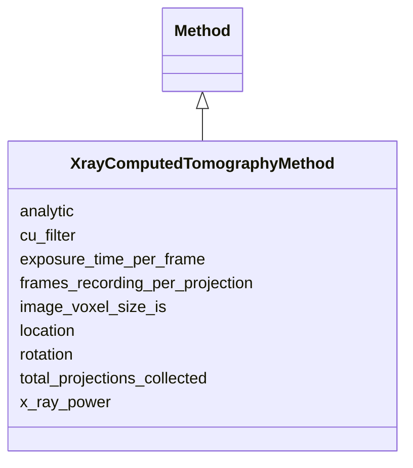

# Class: XrayComputedTomographyMethod 


URI: [basalt_schema:XrayComputedTomographyMethod](https://w3id.org/MONet/basalt-schema/XrayComputedTomographyMethod)





## Inheritance
* [Method](Method.md)
    * **XrayComputedTomographyMethod**


## Slots

| Name | Cardinality and Range | Description | Inheritance |
| ---  | --- | --- | --- |
| [location](location.md) | 1 <br/> [String](String.md) |  | direct |
| [x_ray_power](x_ray_power.md) | 1 <br/> [String](String.md) |  | direct |
| [cu_filter](cu_filter.md) | 1 <br/> [String](String.md) |  | direct |
| [total_projections_collected](total_projections_collected.md) | 1 <br/> [Double](Double.md) |  | direct |
| [rotation](rotation.md) | 1 <br/> [String](String.md) |  | direct |
| [frames_recording_per_projection](frames_recording_per_projection.md) | 1 <br/> [Double](Double.md) |  | direct |
| [exposure_time_per_frame](exposure_time_per_frame.md) | 1 <br/> [String](String.md) |  | direct |
| [image_voxel_size_is](image_voxel_size_is.md) | 1 <br/> [String](String.md) |  | direct |
| [analytic](analytic.md) | 1 <br/> [String](String.md) |  | [Method](Method.md) |


## Identifier and Mapping Information


### Schema Source


* from schema: https://w3id.org/MONet/basalt-schema


## Mappings

| Mapping Type | Mapped Value |
| ---  | ---  |
| self | basalt_schema:XrayComputedTomographyMethod |
| native | basalt_schema:XrayComputedTomographyMethod |


## LinkML Source

<!-- TODO: investigate https://stackoverflow.com/questions/37606292/how-to-create-tabbed-code-blocks-in-mkdocs-or-sphinx -->

### Direct

<details>
```yaml
name: XrayComputedTomographyMethod
from_schema: https://w3id.org/MONet/basalt-schema
is_a: Method
slots:
- location
attributes:
  x_ray_power:
    name: x_ray_power
    from_schema: https://w3id.org/MONet/basalt-schema/methods
    rank: 1000
    domain_of:
    - XrayComputedTomographyMethod
    range: string
    required: true
  cu_filter:
    name: cu_filter
    from_schema: https://w3id.org/MONet/basalt-schema/methods
    rank: 1000
    domain_of:
    - XrayComputedTomographyMethod
    range: string
    required: true
  total_projections_collected:
    name: total_projections_collected
    from_schema: https://w3id.org/MONet/basalt-schema/methods
    rank: 1000
    domain_of:
    - XrayComputedTomographyMethod
    range: double
    required: true
  rotation:
    name: rotation
    from_schema: https://w3id.org/MONet/basalt-schema/methods
    rank: 1000
    domain_of:
    - XrayComputedTomographyMethod
    range: string
    required: true
  frames_recording_per_projection:
    name: frames_recording_per_projection
    from_schema: https://w3id.org/MONet/basalt-schema/methods
    rank: 1000
    domain_of:
    - XrayComputedTomographyMethod
    range: double
    required: true
  exposure_time_per_frame:
    name: exposure_time_per_frame
    from_schema: https://w3id.org/MONet/basalt-schema/methods
    rank: 1000
    domain_of:
    - XrayComputedTomographyMethod
    range: string
    required: true
  image_voxel_size_is:
    name: image_voxel_size_is
    from_schema: https://w3id.org/MONet/basalt-schema/methods
    rank: 1000
    domain_of:
    - XrayComputedTomographyMethod
    range: string
    required: true

```
</details>

### Induced

<details>
```yaml
name: XrayComputedTomographyMethod
from_schema: https://w3id.org/MONet/basalt-schema
is_a: Method
attributes:
  x_ray_power:
    name: x_ray_power
    from_schema: https://w3id.org/MONet/basalt-schema/methods
    rank: 1000
    alias: x_ray_power
    owner: XrayComputedTomographyMethod
    domain_of:
    - XrayComputedTomographyMethod
    range: string
    required: true
  cu_filter:
    name: cu_filter
    from_schema: https://w3id.org/MONet/basalt-schema/methods
    rank: 1000
    alias: cu_filter
    owner: XrayComputedTomographyMethod
    domain_of:
    - XrayComputedTomographyMethod
    range: string
    required: true
  total_projections_collected:
    name: total_projections_collected
    from_schema: https://w3id.org/MONet/basalt-schema/methods
    rank: 1000
    alias: total_projections_collected
    owner: XrayComputedTomographyMethod
    domain_of:
    - XrayComputedTomographyMethod
    range: double
    required: true
  rotation:
    name: rotation
    from_schema: https://w3id.org/MONet/basalt-schema/methods
    rank: 1000
    alias: rotation
    owner: XrayComputedTomographyMethod
    domain_of:
    - XrayComputedTomographyMethod
    range: string
    required: true
  frames_recording_per_projection:
    name: frames_recording_per_projection
    from_schema: https://w3id.org/MONet/basalt-schema/methods
    rank: 1000
    alias: frames_recording_per_projection
    owner: XrayComputedTomographyMethod
    domain_of:
    - XrayComputedTomographyMethod
    range: double
    required: true
  exposure_time_per_frame:
    name: exposure_time_per_frame
    from_schema: https://w3id.org/MONet/basalt-schema/methods
    rank: 1000
    alias: exposure_time_per_frame
    owner: XrayComputedTomographyMethod
    domain_of:
    - XrayComputedTomographyMethod
    range: string
    required: true
  image_voxel_size_is:
    name: image_voxel_size_is
    from_schema: https://w3id.org/MONet/basalt-schema/methods
    rank: 1000
    alias: image_voxel_size_is
    owner: XrayComputedTomographyMethod
    domain_of:
    - XrayComputedTomographyMethod
    range: string
    required: true
  location:
    name: location
    todos:
    - used on many method classes. no description. what was this meant to mean?
    from_schema: https://w3id.org/MONet/basalt-schema
    rank: 1000
    alias: location
    owner: XrayComputedTomographyMethod
    domain_of:
    - Instrument
    - EnzymeActivityMethod
    - GravimetricWaterContentMethod
    - HydraulicPropertiesMethod
    - KuoMethod
    - MicrobialBiomassMethod
    - PH_Method
    - TOC_TN_Method
    - TextureMethod
    - XrayComputedTomographyMethod
    range: string
    required: true
  analytic:
    name: analytic
    todos:
    - what does this mean
    from_schema: https://w3id.org/MONet/basalt-schema
    rank: 1000
    alias: analytic
    owner: XrayComputedTomographyMethod
    domain_of:
    - Method
    range: string
    required: true

```
</details>